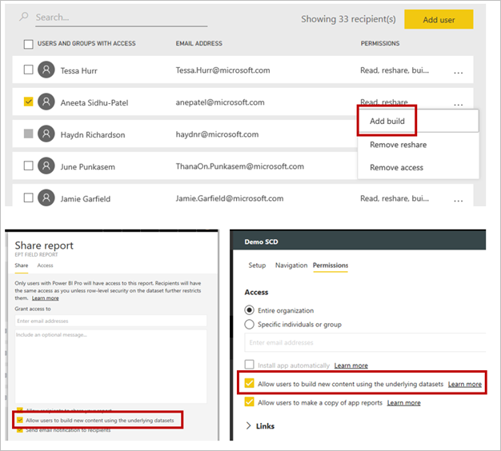

# Build permissions for shared datasets (Preview)

Learn how you can share a dataset with users across your organization. Then they can build reports based on your dataset in their own workspaces.

As a dataset owner, you can certify or promote your datasets so others can discover them easily. You can keep control of who has access to the data by using the [Build permission](#build-permission-for-datasets). 

The datasets you see in this list meet at least one of the following conditions:

- The dataset is in one of the new workspace experience workspaces, and you're a member of that workspace (see [Considerations and limitations](#considerations-and-limitations)).
- You have Build permission for the dataset, which is in a new workspace experience workspace.
- The dataset is in your My Workspace.

> [!NOTE]
> Free users only see datasets in their My Workspace, or datasets for which they have Build permission that are in Premium-capacity workspaces.

## Build permission for datasets

The Build permission type is only relevant for datasets. With it, users can build new content on a dataset, such as reports, dashboards, pinned tiles from Q&A, and Insights Discovery. They can also build new content on the dataset outside Power BI, such as Excel sheets via Analyze in Excel, XMLA, and export.

Users can get the permission in different ways:

- A member of the workspace where the dataset resides can assign the permission to specific users or security groups in the Permission Center. Click the ellipsis (…) next to a dataset > **Manage Permissions**.
- An admin or member of the workspace where the dataset resides can decide during app publishing that all users with permission for the app also get Build permission for the underlying datasets.
- Say you have Reshare and Build permissions on a dataset. When you share a report or dashboard built on top of that dataset you can specify that the recipients also get Build permission for the underlying dataset.

Power BI introduced this permission in April 2019 as a complement to the existing permissions Read and Reshare. All users who already had Read permission for datasets via app permissions, sharing, or workspace access at that time also get Build permissions for those same datasets. They get Build permission automatically because Read permission already granted them the right to build new content on top of the dataset, by using Analyze in Excel, or Export. 

With this more granular Build permission, you can choose who can only view the content in the existing report or dashboard and who can create content connected to the underlying datasets.

## Next steps

- [Promote datasets](service-datasets-promote.md)
- [Certify datasets](service-datasets-certify.md)
- [Govern the use of datasets across workspaces](service-datasets-admin-across-workspaces.md)
- Questions? [Try asking the Power BI Community](http://community.powerbi.com/)
