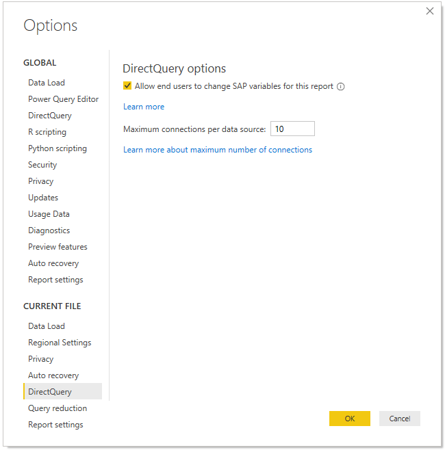
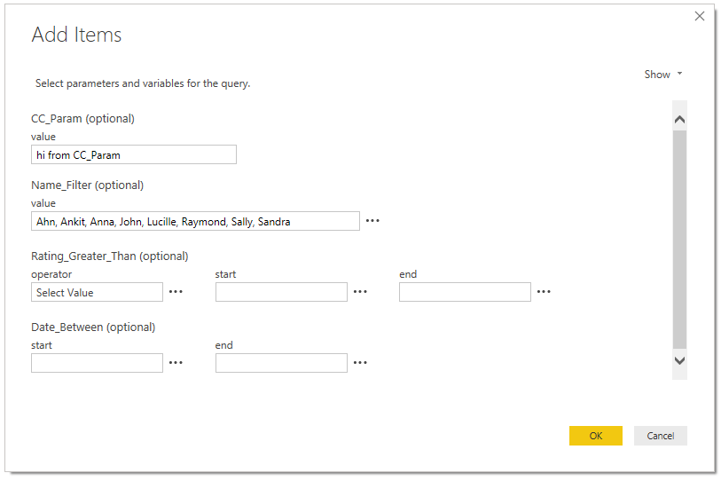
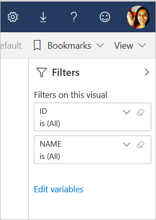

# Edit SAP variables in the Power BI service

When using SAP Business Warehouse or SAP HANA with DirectQuery, report authors can now allow end users to edit SAP variables in the **Power BI Service** for Premium and shared workspaces. Note that this feature does NOT work for reports in the Shared with me tab of My Workspace. 

This document describes the requirements for editing variables in Power BI, how to enable this feature, and where to edit variables in the Power BI service.

## Requirements for SAP edit variables

There are a few requirements for using the SAP edit variables feature. The following list describes these requirements.

**New Filter Experience required** – you must have the [new filter experience](power-bi-report-filter.md) enabled for your report. Here's how you can enable it for your report in Power BI Desktop:
- In Power BI Desktop, select **File** > **Options and Settings** > **Options**
- In the left navigation bar, under **Current file**, select **Report settings**.
- Under **Filtering experience**, select **Enable the updated filter pane**.

**DirectQuery connections required** – you must be connecting to the SAP data source using DirectQuery. Import connections aren't supported.

**Power BI Premium subscription required** – the SAP edit variables feature currently only works in Power BI Premium subscriptions.

**SSO set-up required** – for this feature to work, single sign-on (SSO) must be configured. See [overview of single sign-on (SSO)](service-gateway-sso-overview.md) for more information.

**New Gateway bits required** - Download latest gateway and update your existing gateway. See [service gateway](service-gateway-onprem.md) for more information.

**Multidimensional only for SAP HANA** – for SAP HANA, the SAP edit variables feature only works with multidimensional models and doesn't work on relational sources.

**Not supported in Sovereign clouds** – Currently Power Query Online isn't available in Sovereign clouds; therefore, this feature is also not supported in Sovereign clouds.

## How to enable the feature

To enable the **SAP edit variables** feature, in Power BI Desktop connect to an SAP HANA or SAP BW data source. Then go to **File > Options and settings > Options** and then, in the Current File section in the left pane, select **DirectQuery**. When you select that, in the right pane you see DirectQuery options, and a checkbox where you can **Allow end users to change SAP variables in the report**, as shown in the following image.

## Use SAP edit variables in Power BI Desktop

When using SAP edit variables in Power BI Desktop, you can edit the variables by selecting the Edit variables link from **Edit Queries** menu in the ribbon. From there, the following dialog appears. This feature has been available in Power BI Desktop for a while. Report creators can select variables for the report using the following dialog.

## Use SAP edit variables in the service

Once the report is published to the Power BI service, users can see the **Edit variables** link in the new Filter pane. If you're publishing the report for the first time, it may take up to 5 minutes before the Edit variable link appears. If the link hasn't appeared, you will need to manually refresh the dataset.
You can do so by:

1. In the Power BI service, select the **Datasets** tab in the content list for a workspace.

2. Find the dataset you need to refresh, and select the **Refresh** icon.

    

3. Selecting the Edit variables link brings up the **Edit variables** dialog, where users can override variables. Selecting the **Reset** button resets the variables to the original values that appeared when this dialog was opened.

    

4. Any changes in the **Edit variables** dialog persist only for this user (similar to other persistence behaviors in Power BI). Selecting **Reset to default**, shown in the following image, resets the report to the report creator's original state, including the variables.

    

When working on a published report in the Power BI service that uses SAP HANA or SAP BW with the **Edit variables** feature enabled, the report owner can change those defaults. The owner of the report can change the variables in edit mode, and save the report to enable those settings to become the *new default settings* for that report. Any other users who access the report after such changes are made by the report owner will see those new settings as the defaults.

## Next steps

For more information about SAP HANA, SAP BW, or DirectQuery, read the following articles:

- [Use SAP HANA in Power BI Desktop](desktop-sap-hana.md)
- [DirectQuery and SAP Business Warehouse (BW)](desktop-directquery-sap-bw.md)
- [DirectQuery and SAP HANA](desktop-directquery-sap-hana.md)
- [Using DirectQuery in Power BI](desktop-directquery-about.md)
