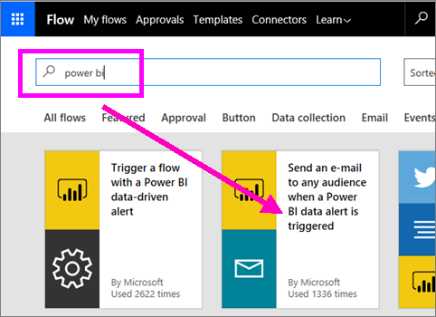
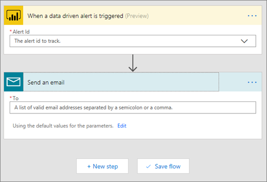
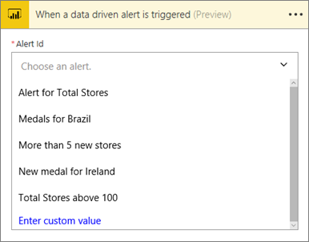
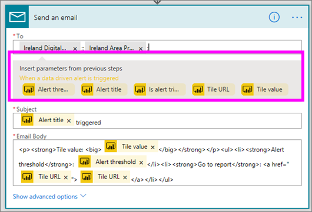
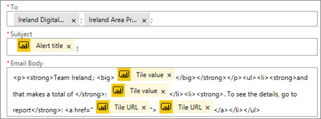
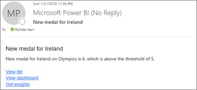
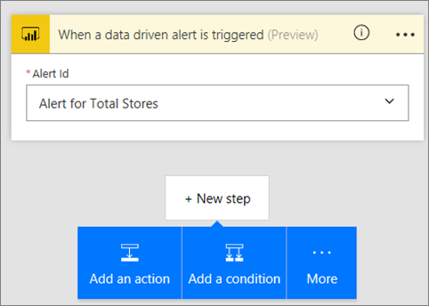
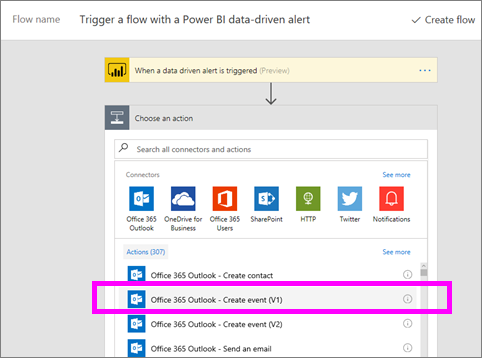

# Microsoft Flow and Power BI

[Microsoft Flow](https://flow.microsoft.com/en-us/documentation/getting-started) is a SaaS offering for automating workflows across the growing number of applications and SaaS services that business users rely on. With Flow you can automate tasks by integrating your favorite apps and services (including Power BI) to get notifications, synchronize files, collect data, and more. Repetitive tasks become easy with workflow automation.

[Get started using Flow now.](https://flow.microsoft.com/documentation/getting-started)

Watch Sirui create a Flow that sends a detailed email to colleagues when a Power BI alert is triggered. Then follow the step-by-step instructions below the video to try it out yourself.

<iframe width="560" height="315" src="https://www.youtube.com/embed/YhmNstC39Mw" frameborder="0" allowfullscreen></iframe>

## Create a flow that is triggered by a Power BI data alert

### Prerequisites
This tutorial will show you how to create two different flows; one from a template and one from scratch. To follow along, [create a data alert in Power BI](service-set-data-alerts.md), create a free Slack account, and [sign up for Microsoft Flow](https://flow.microsoft.com/en-us/#home-signup) (it's free!).

## Create a flow that uses Power BI - from a template
In this task we'll use a template to create a simple flow that is triggered by a Power BI data alert (notification).

1. Sign in to Microsoft Flow (flow.microsoft.com).
2. Select **My flows**.
   
   
3. Select **Create from template**.
   
    
4. Use the Search box to find Power BI templates and select **Send an e-mail to any audience when a Power BI data alert is triggered > Continue**.
   
    

### Build the flow
This template has one trigger (Power BI data alert for new Olympic medals for Ireland) and one action (send an email). As you select a field, Flow displays dynamic content that you can include.  In this example we'll included the tile value and the tile URL in the message body.

1. From the trigger dropdown, select a Power BI data alert. Select **New medal for Ireland**. To learn how to create an alert, see [Data alerts in Power BI](service-set-data-alerts.md).
   
   
2. Enter one or more valid email addresses and then select **Edit** (shown below) or **Add dynamic content**. 
   
   

3. Flow creates a title and message for you which you can keep or modify. All the values you set when you created the alert in Power BI are available for your use -- just place your cursor and select from the grey highlighted area. 

   

1.  For example, if you created an alert title in Power BI of **We won another medal**, you can select **Alert title** to add that text to your email Subject field.

    

    And, you can accept the default Email body or create your own. The example above contains a few modifications to the message.

1. When you're done, select **Create flow** or **Save flow**.  The flow is created and evaluated.  Flow lets you know if it finds errors.
2. If errors are found, select **Edit flow** to fix them, otherwise, select **Done** to run the new flow.
   
   
5. When the data alert is triggered, an email will be sent to the addresses you indicated.  
   
   

## Create a Flow that uses Power BI - from scratch (blank)
In this task we'll create a simple flow from scratch that is triggered by a Power BI data alert (notification).

1. Sign in to Microsoft Flow.
2. Select **My flows** > **Create from blank**.
   
   
3. Use the Search box to find a Power BI trigger and select **Power BI - when a data driven alert is triggered**.

### Build your flow
1. From the dropdown, select the name of your alert.  To learn how to create an alert, see [Data alerts in Power BI](service-set-data-alerts.md).
   
    
2. Select **New step** > **Add an action**.
   
   
3. Search for **Outlook** and select **Create event**.
   
   
4. Fill in the event fields. As you select a field, Flow displays dynamic content that you can include.
   
   
5. Selet **Create flow** when done.  Flow saves and evaluates the flow. If there are no errors, select **Done** to run this flow.  The new flow is added to your **My flows** page.
   
   
6. When the flow is triggered by your Power BI data alert, you'll receive an Outlook event notification similar to this one.
   
    

## Next steps
* [Get started with Microsoft Flow](https://flow.microsoft.com/en-us/documentation/getting-started/)
* [Set data alerts in Power BI service](service-set-data-alerts.md)
* [Set data alerts on your iphone](mobile-set-data-alerts-in-the-mobile-apps.md)
* [Set data alerts in the Power BI mobile app for Windows 10](mobile-set-data-alerts-in-the-mobile-apps.md)
* More questions? [Try the Power BI Community](http://community.powerbi.com/)

