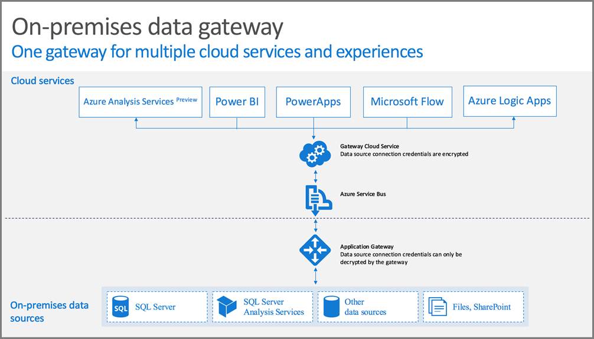
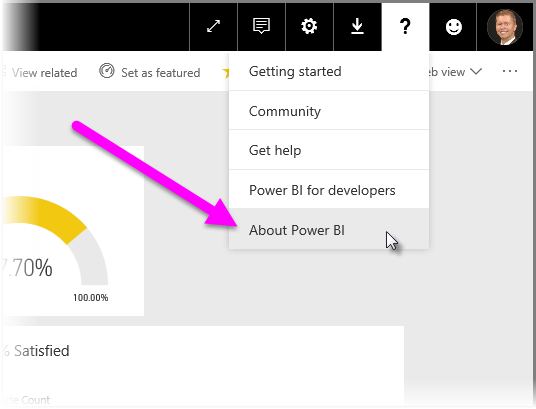
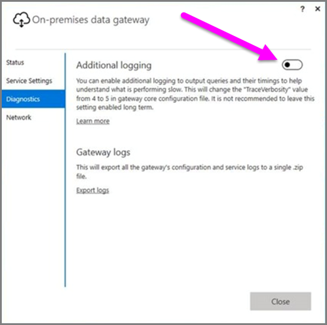
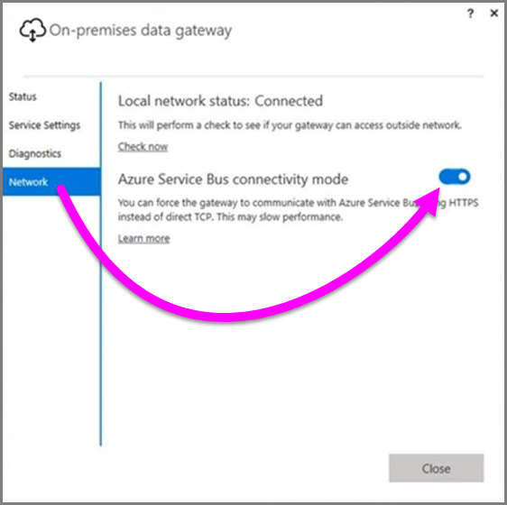
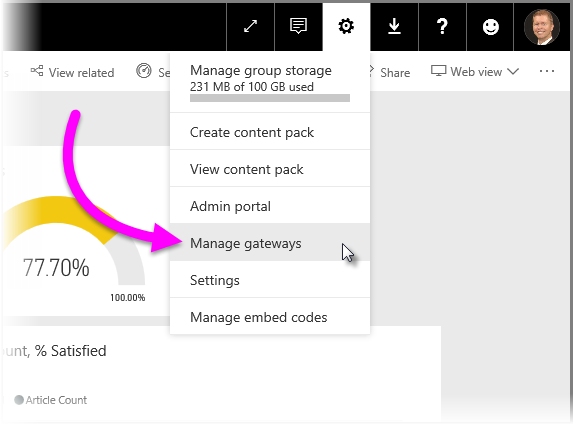

# Guidance for deploying a data gateway for Power BI
This article provides guidance and considerations for deploying a data gateway in your network environment. A **gateway** is software that facilitates access to data that resides on a private, on-premises network, for subsequent use in a cloud service like Power BI. This article walks you through the deployment, and provides guidance for, the **On-premises data gateway** setup.

For more about **On-premises data gateway**, including a link to install it, take a look at the [blog post](https://powerbi.microsoft.com/blog/power-bi-gateways-march-update/).

## Installation considerations for the On-premises data gateway
Before getting too far into the details of installation and deployment, there are a handful of considerations you should keep in mind. The following sections describe important things to keep in mind.

### Number of users
The number of users consuming a report that's using the gateway is an important metric in deciding where to install the gateway. Here are some questions to consider:

* Are users using these reports at different times of the day?
* What types of connections are they using (DirectQuery or Import)?
* Are all users using the same report?

If users are all accessing a given report at the same time each day, you'll want to make sure you install the gateway on  a machine that's capable of handling all those requests (see following sections for performance counters and minimum requirements that can help you determine this).

There is a constraint in **Power BI** that allows only *one* gateway per *report*, so even if a report is based on multiple data sources, all such data sources must go through a single gateway. However, if a dashboard is based on *multiple* reports, you can use a dedicated gateway for each contributing report, and thereby distribute the gateway load among those multiple reports that contribute to that single dashboard.

### Connection type
**Power BI** offers two types of connections, **DirectQuery** and **Import**. Not all data sources support both connection types, and many reasons may contribute to choosing one over the other, such as security requirements, performance, data limits, and data model sizes. You can learn more about connection type and supported data sources in the *list of available data source types* section of the [On-premises data gateway article](service-gateway-onprem.md).

Depending on which type of connection are use, gateway usage can be different. For example, you should try to separate **DirectQuery** data sources from **Scheduled Refresh** data sources whenever possible (assuming they're in different reports and can be separated). Doing so prevents the gateway from having thousands of DirectQuery requests queued up, at the same time as the morning's scheduled refresh of a large size data model that's used for the company's main dashboard. Here's what to consider for each:

* For **Scheduled Refresh**: depending on your query size and the number of refreshes occurring per day, you can choose to stay between the recommended minimum hardware requirements or upgrade to a higher performance machine. If a given query is not folded, transformations occur on the gateway machine, and as such, the gateway machine benefits from having more available RAM.
* For **DirectQuery**: a query is be sent each time any user opens the report or looks at data. So if you anticipate more than 1,000 users accessing the data concurrently, you'll want to make sure your computer has robust and capable hardware components. More CPU cores will result in better throughput for a **DirectQuery** connection.

The requirements for a machine on which you install an **On-premises data gateway** are the following:

**Minimum:**

* .NET 4.5 Framework
* 64-bit version of Windows 7 / Windows Server 2008 R2 (or later)

**Recommended:**

* 8 Core CPU
* 8 GB Memory
* 64-bit version of Windows 2012 R2 (or later)

### Location
The location of the gateway installation can have significant impact on your query performance, so try to make sure your gateway, data source locations, and the Power BI tenant are as close as possible to each other to minimize network latency. To determine your Power BI tenant location, in the Power BI service select the **?** icon in the upper-right corner, and then select **About Power BI**.

### Monitoring gateways
There are a few tools that you can use to monitor the use and performance of your installed gateways.

#### Performance counters
There are many performance counters that can be used to evaluate and assess activity occurring on the gateway. The counters can help you understand whether you have large volume of activities by the specific type, which may prompt you to deploy a new gateway.

> [!NOTE]
> These counters will not capture specific task duration time.
> 
> 

The *gateway counter*, in addition to your machine's counters, provide you with an idea of how much load your machine is handling, and can provide an indication of whether the server resource capacity is becoming stretched or exceeded.

These counters can be accessed from **Windows Performance Monitor**, and can be consumed by any reporting tools you use for this purpose. For a detailed walk-through of how to use the gateway performance monitor with Power BI, take a look at the following community-create blog post.

* [Monitor On-premises data gateways](https://insightsquest.com/2016/08/08/monitor-on-premises-data-gateways/)

#### Logs
Configuration and service logs provide another dimension on what's happening with your gateway. Always check your gateway logs when your connection is not working as expected, as not all error messages are surfaced on the Power BI service.

An easy way to view all the log files on your local machine is to use the *Export Logs* button on the **On-premises data gateway** when you re-open the gateway after the initial installation is complete, and then select **Diagnostics > Export Logs**.

#### Additional logging
By default the gateway performs basic logging. If you're investigating gateway issues, and need more information about query connection details, you can temporarily enable *verbose logging* to gather additional log information. To do this, in the installed gateway select **Diagnostics > Additional logging**.

Enabling this setting likely will increase the log size significantly, based on gateway usage. It's recommended that once you're done reviewing the logs, you disable **Additional logging**. It's not recommended to leave this setting enabled during normal gateway usage.

#### Network configuration
The gateway creates an outbound connection to the **Azure Service Bus**. The gateway communicates on the following outbound ports:

* TCP 443 (default)
* 5671
* 5672
* 9350 thru 9354

The gateway does *not* require inbound ports. All required ports are listed in the above list.

It is recommended that you whitelist the IP addresses, for your data region, in your firewall. You can download list of IP addresses, which are found in the [Microsoft Azure Datacenter IP list](https://www.microsoft.com/download/details.aspx?id=41653). That list is updated weekly. The gateway will communicate with **Azure Service Bus** using the specified IP address, along with the fully qualified domain name (FQDN). If you're forcing the gateway to communicate using HTTPS, the gateway strictly uses FQDN only, and no communication will occur using IP addresses.

#### Forcing HTTPS communication with Azure Service Bus
You can force the gateway to communicate with the **Azure Service Bus** by using HTTPS, instead of direct TCP. Doing so will slightly reduce performance. You can also force the gateway to communicate with the **Azure Service Bus** by using HTTPS by using the gateway's user interface (beginning with the March 2017 release of the gateway).

To do so, in the gateway select **Network**, then turn the **Azure Service Bus connectivity mode** **On**.

### Additional guidance
This section provides additional guidance for deploying and managing gateways.

* Avoid having a single point of failure. If possible, distribute your on-premises data sources across several gateways; in this case, if one machine becomes unavailable, you'll still be able to refresh portions of your data, and not lose that functionality completely.
* The gateway cannot be installed on a domain controller, so don't plan or try to do so.
* Don't install a gateway on a computer that may be turned off, go into the sleep mode, or not be connected to the Internet (for example, a laptop computer), because the gateway can't run under any of those circumstances.
* Avoid installing a gateway on a wireless network, since performance might suffer over a wireless network.

#### Gateway Recovery
You can recover your existing gateway, or move it to a new machine, using the **recovery key**. The recovery key is provided to the user who installs the gateway, and it *cannot* be changed later. The recovery key is used for both data encryption and gateway recovery.

To recover your gateway, make sure you're an admin on the gateway, make sure you know the gateway name, ensure you have the correct recovery key, and that you have a new machine available with similar performance characteristics.

After you sign in, select the **Migrate an existing gateway** option. Next, you need to choose the gateway you'd like to recover or migrate, and finally provide the recovery key and hit configure. Once that step is done, the old gateway will be replaced by the new gateway, and the new gateway will inherit its name and all data sources previously configured. All data sources will now go through the new machine, without the need to re-publish anything. Automatic failover is not yet supported, but it is a feature that the gateway team is actively considering.

#### Administrators
You can find a list of gateway administrators in the **Power BI service**. When signed into the **Power BI** service, select **Settings** (the gear icon) **> Manage Gateways > Gateway UI**.  

From there, you can select a gateway and see the list of gateway administrators. The administrators listed can access, recover, and delete the gateway. They can also add and delete data sources in the gateway. To make sure all administrators in the organization have access to all gateways in their group, the following is recommended:

* Create an **AAD** security group and add other users to it, then add this security group to the list of the respective gateway administrators. This ensures that more than one person has access to the gateway in case of a failure, or when you need to recover or migrate the gateway. This also gives other administrators a view of what gateways are being used in their groups, and which data sources exist on each gateway.

## Next steps
[Configuring proxy settings](service-gateway-proxy.md)  
[Troubleshooting the On-premises data gateway](service-gateway-onprem-tshoot.md)  
[On-premises data gateway FAQ](service-gateway-onprem-faq.md)  

More questions? [Try the Power BI Community](http://community.powerbi.com/)

