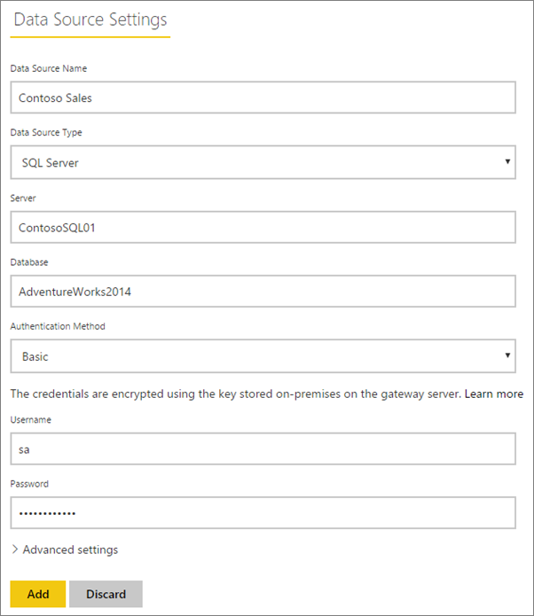

# Manage your data source - SQL Server

Once you've [installed the on-premises data gateway](/data-integration/gateway/service-gateway-install), you can [add data sources](service-gateway-data-sources.md#add-a-data-source) that can be used with the gateway. This article looks at how to work with gateways and SQL Server data sources that are used either for scheduled refresh or for DirectQuery.

## Add a data source

For information about how to add a data source, see [Add a data source](service-gateway-data-sources.md#add-a-data-source).

> [!NOTE]
> When using DirectQuery, the gateway only supports **SQL Server 2012 SP1** and subsequent versions.

You'll then want to fill in the information for the data source, which includes the **Server** and the **Database**.  

You'll also need to choose an **Authentication Method**. This can either be **Windows** or **Basic**. You'll want to choose **Basic** if you are going to use SQL Authentication instead of Windows Authentication. Then enter the credentials that will be used for this data source.

> [!NOTE]
> All queries to the data source will run using these credentials, unless Kerberos Single Sign On (SSO) is configured and enabled for the data source. With SSO, import datasets use the stored credentials, but DirectQuery datasets use the current Power BI user to execute the queries using SSO. To learn more about how credentials are stored, see [Storing encrypted credentials in the cloud](service-gateway-data-sources.md#storing-encrypted-credentials-in-the-cloud), or the article describing how to [use Kerberos for SSO (single sign-on) from Power BI to on-premises data sources](service-gateway-sso-kerberos.md).

Select **Add** after you have everything filled in. You can now use this data source for scheduled refresh, or DirectQuery, against a SQL Server that is on-premises. You'll see *Connection Successful* if it succeeded.

### Advanced settings

Optionally, you can configure the privacy level for your data source. This controls how data can be combined. This is only used for scheduled refresh. It does not apply to DirectQuery. To learn more about privacy levels for your data source, see [Privacy levels (Power Query)](https://support.office.com/article/Privacy-levels-Power-Query-CC3EDE4D-359E-4B28-BC72-9BEE7900B540).

## Using the data source

After you've created the data source, it will be available to use with either DirectQuery connections, or through scheduled refresh.

> [!NOTE]
> The server and database name have to match between Power BI Desktop and the data source within the on-premises data gateway.

The link between your dataset and the data source within the gateway is based on your server name and database name. These have to match. For example, if you supply an IP Address for the server name, within **Power BI Desktop**, you'll need to use the IP Address for the data source within the gateway configuration. If you use *SERVER\INSTANCE*, in Power BI Desktop, you'll need to use the same within the data source configured for the gateway.

This is the case for both DirectQuery and scheduled refresh.

### Using the data source with DirectQuery connections

You'll need to make sure the server and database name matches between **Power BI Desktop** and the configured data source for the gateway. You'll also need to make sure your user is listed in the **Users** tab of the data source in order to publish DirectQuery datasets. The selection, for DirectQuery, occurs within Power BI Desktop when you first import data. For more information about using DirectQuery, see [Use DirectQuery in Power BI Desktop](desktop-use-directquery.md).

After you publish, either from Power BI Desktop or **Get Data**, your reports should start working. It may take several minutes, after creating the data source within the gateway, for the connection to be usable.

### Using the data source with scheduled refresh

If you're listed in the **Users** tab of the data source configured within the gateway, and the server and database name match, you'll see the gateway as an option to use with scheduled refresh.

## Next steps

* [Connect to on-premises data in SQL Server](service-gateway-sql-tutorial.md)
* [Troubleshooting the on-premises data gateway](/data-integration/gateway/service-gateway-tshoot)
* [Troubleshoot gateways - Power BI](service-gateway-onprem-tshoot.md)
* [Use Kerberos for SSO (single sign-on) from Power BI to on-premises data sources](service-gateway-sso-kerberos.md)

More questions? [Try the Power BI Community](http://community.powerbi.com/)

