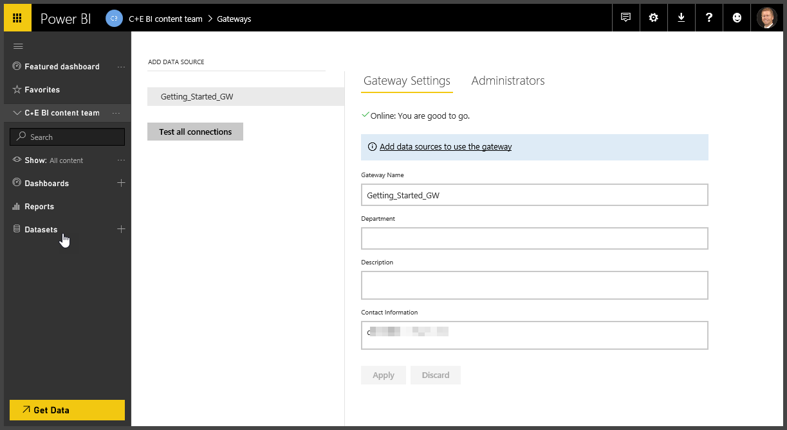
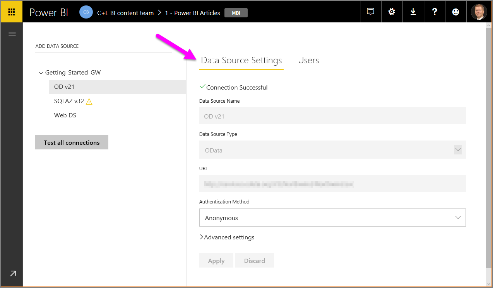
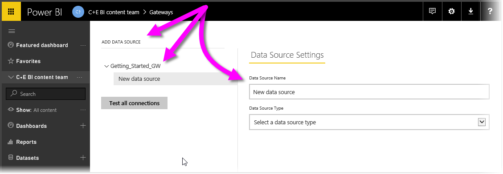

# Install a gateway for Power BI

A Power BI gateway is software that you install within an on-premises network; it facilitates access to data in that network. In this article, you install a gateway and add a data source and users to that gateway.

If you're not signed up for Power BI, [sign up for free](https://app.powerbi.com/signupredirect?pbi_source=web) before you begin.

## Download and install a gateway

The first step is to download the gateway from the Power BI service, and install it on your local computer.

1. In the Power BI service, select the **download icon** in the upper right corner, and select **Data Gateway**.

    

2. On the download page, where click the **Download gateway** button.

3. Read the information about gateways, then click **Next**.     

    

4. Select **On-premises data gateway**, then click **Next**.

5. Keep the default install path, and click **Install**.

    

6. Enter the account the username and password you use to sign in to Power BI. The gateway is associated with your Power BI account, and you configure gateways from within the Power BI service.

    

    You’ll be signed in, as shown in the following image.

    

7. Enter a **Recovery key**. You need this key if you ever want to recover or move your gateway. [TODO] - give some guidance on recovery key and gateway naming

    

8. Review the information in the fianl window, then click **Close**.

    

## Add users to the gateway

Now that you have a gateway installed, you add users from the Power BI service.

1. In the Power BI service select the Gear icon in the upper-right corner, then select **Manage gateways**.

    

2. Click or tap **Administrators** to see which users can *administer* the gateway. Right now, it should show only your Power BI account. [TODO] - need to figure out data source first.

    

3. Select **Users**, and enter a user from your organization who you want to grant access to the selected data source. In the following screen, you can see that I’ve added Maggie and Adam.

    

4. Select **Add**, and the added member shows up in the box.

    

And that’s all there is to it. Remember that you need to add users to each data source to which you want to grant access. Each data source has a separate list of users, and you must add users to each data source separately.

## Next steps
[TODO] - add links for adding a data source and refreshing data 

More questions? [Try the Power BI Community](http://community.powerbi.com/)

## Install the gateway
To install a gateway, open the Power BI service (you can use this link to launch the Power BI service in your browser, and log on) and log in with your Power BI account. In the Power BI service, select the **download icon** in the upper right corner, as shown in the following image, and select **Data Gateway**.

That takes you to a download page, where you click the **Download gateway** button to initiate the download.

This screen gives you the ultra-condensed explanation of what a gateway does. It also provides a couple important **warnings** – when you install a gateway, it actually runs on the computer on which you perform the installation. And if that computer is turned off, so is the gateway (so it won’t work when it’s not running). Also, installing on a computer using a wireless network is not best, so you should use a computer connected to a wired network.

When you’re ready, select **Next** to continue with the setup.

Here’s where you decide which gateway you’ll install – on-premises gateway, or a personal gateway. In this guide, we’ll install the **On-premises data gateway**.

There are a few things to note at this decision point:

* Both gateways require 64-bit Windows operating systems.
* Gateways can’t be installed on a domain controller.
* You can install up to two On-premises data gateways on the same computer, one running in each mode (personal and standard). 
* You cannot have more than one gateway running in the same mode on the same computer.
* You can install multiple On-premises data gateways on different computers, and manage them all from the same Power BI gateway management interface (excluding personal, see the following bullet point).
* You can only have one personal mode gateway running for each Power BI user. If you install another personal mode gateway for the same user, even on a different computer, the most recent installation replaces the existing previous installation.

When we select **Next**, the gateway installation begins. You need to specify where it will be installed, and the default location is usually best.

The installation process goes quickly, and you’re provided with a status bar.

Once you’re almost complete, you need to identify the account to use with the gateway. This should be the account (the username and password) you use to log on to Power BI; the gateway is associated with your Power BI account, and you configure gateways from within the Power BI service.

You’ll be signed in, as shown in the following image.

Once you’re signed in, you need to create a **Recovery key**. We’ll discuss those more in depth in another article, but for now, know that you’ll need it to recover or move your gateway.

When all goes well, you’ll see a window that tells you that your gateway is ready.

That’s it for the installation of an on-premises gateway. As promised, it was a pretty easy process. The next step, then, is to either **add users** or **add data sources** – you can do either first, and add either after your initial configuration.

The next section describes adding users to the gateway, and after that, we’ll discuss where to go next to add data sources to the gateway.

## Add users to a gateway
Now that we have a gateway installed, we manage the gateway from the **Power BI service**. To get to the management screen for gateways, in the Power BI service select the Gear icon in the upper-right corner, then select **Manage gateways**.

A page inside the Power BI service canvas appears, where you can manage your gateways. The **Gateway Settings** page looks like the following.

If you tap or click on **Administrators**, you see the following administrators’ management page. Note that this is just which users can *administer* the gateway, and that users of the gateway are added (or removed) from each individual data source, using a different page – which we review in the next few paragraphs.

Once you install and validate (successfully connect to) a data source, it shows up under its associated gateway in the left side of this **Manage gateways** screen, as shown in the following image. Notice that in the right pane, there are two sections you can toggle between: **Data Source Settings** and **Users**. The screen directly following is the **Data Source Settings** section.

When you select **Users**, you get a text box into which you can type users from your organization who you want to grant access to the selected data source. In the following screen, you can see that I’ve added Maggie and Adam.

When you begin typing an email address into the text box, Power BI shows a list of users whose email matches what you’re typing, enabling you to click the name and add them to the list.

You can also add email groups (aliases) to allow groups of people access, as well as individuals.

Once you select **Add**, the added members show up in the box, and you can add more if you want. Removing users is just as easy. Simply check the checkbox next to their name, and then select the **Remove** button below the box.

And that’s all there is to it. Remember that you need to add users to each data source to which you want to grant access. Each data source has a separate list of users, and you must add users to each data source separately.

## Adding data sources
Of course, to make your gateway useful you’ll want to add data sources. This is where some of the complexity of Power BI gateways is introduced – there are many different data sources available, and each has its own requirements (and often, its own required driver).

But before we send you off to another article, here’s a look at how you go about adding a data source. While you’re in the **Manage gateways** page of the **Power BI service**, select the gateway to which you want to add a data source, and select **Add Data Source** in the upper-left corner of the page, just above the list of your gateways.

When you do, the **Data Source Settings** panel appears in the right pane, as shown in the following image. There, you can name your data source (entered in the **Data Source Name** text box), and select its type from the **Data Source Type** drop-down list.

Okay, you now have a gateway installed, and you’re ready to add data sources. Great! See the resources in the following section for information about data sources, more details about using gateways, and other useful information.

## Next steps
[Using the On-premises data gateway](service-gateway-onprem.md)  
[On-premises data gateway in-depth](service-gateway-onprem-indepth.md)  
[On-premises data gateway (personal mode)](service-gateway-personal-mode.md)
[Troubleshooting the On-premises data gateway](service-gateway-onprem-tshoot.md)  

More questions? [Try the Power BI Community](http://community.powerbi.com/)

