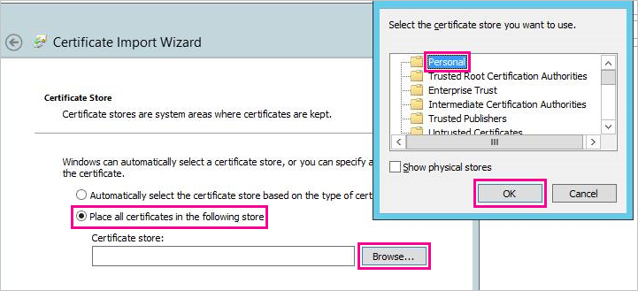

# Use Security Assertion Markup Language (SAML) for single sign-on (SSO) from Power BI to on-premises data sources

Use [Security Assertion Markup Language (SAML)](https://www.onelogin.com/pages/saml) to enable seamless single sign-on connectivity. Enabling SSO makes it easy for Power BI reports and dashboards to refresh data from on-premises sources.

## Supported data sources

We currently support SAP HANA with SAML. For more information about setting up and configuring single sign-on for SAP HANA using SAML, see the topic [SAML SSO for BI Platform to HANA](https://wiki.scn.sap.com/wiki/display/SAPHANA/SAML+SSO+for+BI+Platform+to+HANA) in the SAP HANA documentation.

We support additional data sources with [Kerberos](service-gateway-sso-kerberos.md).

## Configuring the gateway and data source

To use SAML, you first generate a certificate for the SAML identity provider, then map a Power BI user to the identity.

1. Generate a certificate. Make sure you use the FQDN of the SAP HANA server when filling out *common name*. The certificate expires in 365 days.

    ```
    openssl req -newkey rsa:2048 -nodes -keyout samltest.key -x509 -days 365 -out samltest.crt
    ```

1. In SAP HANA Studio, right-click your SAP HANA server, then navigate to **Security** > **Open Security Console** > **SAML Identity Provider** > **OpenSSL Cryptographic Library**.

    It is also possible to use the SAP Cryptographic Library (also known as CommonCryptoLib or sapcrypto) instead of OpenSSL to complete these setup steps. Please refer to the official SAP documentation for further information.

1. Select **Import** , navigate to samltest.crt,and import it.

    

1. In SAP HANA Studio, select the **Security** folder.

    

1. Expand **Users** then select the user you want to map your Power BI user to.

1. Select **SAML** then **Configure**.

    

1. Select the identity provider you created in step 2. For **External Identity** , enter the Power BI user's UPN, then select **Add**.

    

Now that you have the certificate and identity configured, you convert the certificate to a pfx format and configure the gateway machine to use the certificate.

1. Convert the certificate to the pfx format by running the following command.

    ```
    openssl pkcs12 -inkey samltest.key -in samltest.crt -export -out samltest.pfx
    ```

1. Copy the pfx file to the gateway machine:

    1. Double-click samltest.pfx, then select **Local Machine** > **Next**.

    1. Enter the password, then select **Next**.

    1. Select **Place all certificates in the following store,** then **Browse** > **Personal** > **OK**.

    1. Select **Next** , then **Finish**.

    

1. Grant the gateway service account access to the private key of the certificate:

    1. On the gateway machine, run the Microsoft Management Console (MMC).

        

    1. Under **File** , select **Add/Remove Snap-in**.

        

    1. Select **Certificates** > **Add** , then select **Computer account** > **Next**.

    1. Select **Local Computer** > **Finish** > **OK**.

    1. Expand **Certificates** > **Personal** > **Certificates** , and find the certificate.

    1. Right-click the certificate and navigate to **All Tasks** > **Manage Private Keys**.

        

    1. Add the gateway service account to the list. By default, the account is **NT SERVICE\PBIEgwService.** You can find out what account is running gateway service by running **services.msc** and find **On-premises data gateway service**.

        

Finally, follow these steps to add the certificate thumbprint to the gateway configuration.

1. Run the following PowerShell command to list the certificates on your machine.

    ```powershell
    Get-ChildItem -path cert:\LocalMachine\My
    ```
1. Copy the thumbprint for the certificate you created.

1. Navigate to the gateway directory, which defaults to C:\Program Files\On-premises data gateway.

1. Open PowerBI.DataMovement.Pipeline.GatewayCore.dll.config, and find the \*SapHanaSAMLCertThumbprint\* section. Paste in the thumbprint you copied.

1. Restart the gateway service.

## Running a Power BI report

Now you can use the **Manage Gateway** page in Power BI to configure the data source, and under its **Advanced Settings** , enable SSO. Then you can publish reports and datasets binding to that data source.


## Troubleshooting

After configuring SSO, you might see the following error in the Power BI portal: "The credentials provided cannot be used for the SapHana source." This error indicates that the SAML credential was rejected by SAP HANA.

Authentication traces provide detailed information for troubleshooting credential issues on SAP HANA. Follow these steps to configure tracing for your SAP HANA server.

1. On the SAP HANA server, turn on the authentication trace by running the following query.

    ```
    ALTER SYSTEM ALTER CONFIGURATION ('indexserver.ini', 'SYSTEM') set ('trace', 'authentication') = 'debug' with reconfigure 
    ```

1. Reproduce the issue you have been facing.

1. In HANA Studio, open the administration console, and go to the **Diagnosis Files** tab.

1. Open the latest indexserver trace and search for SAMLAuthenticator.cpp.

    You should find a detailed error message that indicates the root cause, like the following example.

    ```
    [3957]{-1}[-1/-1] 2018-09-11 21:40:23.815797 d Authentication   SAMLAuthenticator.cpp(00091) : Element '{urn:oasis:names:tc:SAML:2.0:assertion}Assertion', attribute 'ID': '123123123123123' is not a valid value of the atomic type 'xs:ID'.
    [3957]{-1}[-1/-1] 2018-09-11 21:40:23.815914 i Authentication   SAMLAuthenticator.cpp(00403) : No valid SAML Assertion or SAML Protocol detected
    ```

1. Once the troubleshooting is complete, turn off the authentication trace by running the following query.

    ```
    ALTER SYSTEM ALTER CONFIGURATION ('indexserver.ini', 'SYSTEM') UNSET ('trace', 'authentication');
    ```

## Next steps

For more information about the **On-premises data gateway** and **DirectQuery**, check out the following resources:

* [On-premises data gateway](service-gateway-onprem.md)
* [DirectQuery in Power BI](desktop-directquery-about.md)
* [Data sources supported by DirectQuery](desktop-directquery-data-sources.md)
* [DirectQuery and SAP BW](desktop-directquery-sap-bw.md)
* [DirectQuery and SAP HANA](desktop-directquery-sap-hana.md)
