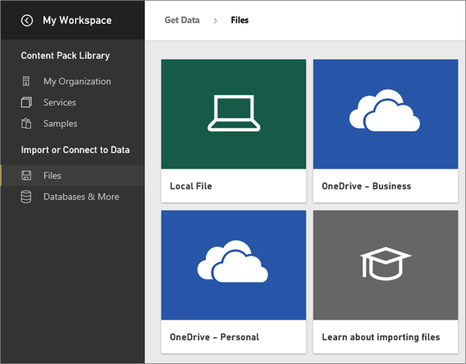
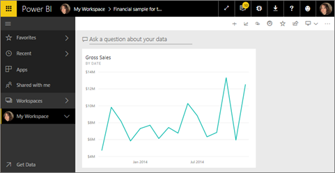

# Get started with Power BI service
## Getting Started
This tutorial helps you get started with ***Power BI service***. For an understanding of how Power BI service fits in with the other Power BI offerings, we highly recommend that you start by reading [What is Power BI](guided-learning/gettingstarted.yml#step-1).

Power BI service has a free version and a Pro version. No matter which version you're using, open a browser and type www.powerbi.com to get started. If you've already signed up, select the **Sign in** link that you'll see in the top right corner. If you haven't yet signed up for Power BI service, select the **Sign up free** link instead.

If you're looking for help with Power BI Desktop, see [Get started with Desktop](desktop-getting-started.md). If you're looking for help with Power BI mobile, see [Power BI apps for mobile devices](powerbi-power-bi-apps-for-mobile-devices.md).

> [!TIP]
> Prefer a free self-paced training course instead? [Enroll in our Analyzing and Visualizing Data course on EdX](http://aka.ms/edxpbi) or visit our [playlist on YouTube](https://www.youtube.com/playlist?list=PL1N57mwBHtN0JFoKSR0n-tBkUJHeMP2cP). A good video to start with is Introduction to Power BI service:
> 
> <iframe width="560" height="315" src="https://www.youtube.com/embed/B2vd4MQrz4M" frameborder="0" allowfullscreen></iframe>
> 
> 
> 

Microsoft Power BI helps you stay up to date with the information that matters to you.  With Power BI service, ***dashboards*** help you keep a finger on the pulse of your business.  Your dashboards display ***tiles*** that you can click to open ***reports*** for exploring further.  Connect to multiple ***datasets*** to bring all of the relevant data together in one place. Need help understanding the building blocks that make up Power BI?  See [Power BI - Basic Concepts](service-basic-concepts.md).

If you have important data in Excel or CSV files, you can create a Power BI dashboard to stay informed anywhere and share insights with others.  Do you have a subscription to a SaaS application like Salesforce?  Get a head start by [connecting to Salesforce](service-connect-to-salesforce.md) to automatically create a dashboard from that data, or [check out all the other SaaS apps](service-get-data.md) you can connect to. If you are part of an organization, see if any [apps](service-create-distribute-apps.md) have been published for you.

Read about all the other ways to [get data for Power BI](service-get-data.md).

## Step 1: Get data
Here's an example of getting data from a CSV file. Want to follow along with this tutorial? [Download this sample CSV file](http://go.microsoft.com/fwlink/?LinkID=521962).

1. [Sign in to Power BI](http://www.powerbi.com/). Don’t have an account? No worries, you can sign up for free.
2. Power BI opens in your browser. Select **Get Data** at the bottom of the left navigation pane.
   
   
3. Select **Files**. 
   
   
4. Select **Local File**, browse to the file on your computer, and choose **Open**.
   
   
5. For this tutorial we're going to select **Import** to add the Excel file as a dataset that we can then use to create reports and dashboards.  
   
   > **NOTE**: If you select **Upload**, the entire Excel workbook is uploaded to Power BI where you can open and edit it in Excel online.
   > 
   > 
   
   
6. When your dataset is ready, select **View dataset** to open it in the report editor. .
   
   > **TIP**: A great way to get familiar with the report editor is to [take a tour](service-the-report-editor-take-a-tour.md)
   > 
   > 

## Step 2: Start exploring your dataset
Now that you have connected to data, explore to find insights.  When you've found something you want to monitor, you can create a dashboard to keep up-to-date with changes.

1. Select the dataset image on the dashboard to explore the data you just connected to or, under the **Datasets** heading, select the dataset name to open it. This opens the dataset as a blank report.
   
   
   
   > NOTE: Another way to explore your data is **Quick Insights**.  For more information, see [Introduction to Quick Insights](service-insights.md)
   > 
   > 
2. In the **Fields** list on the right side of the page, select fields to build a visualization.  Select the checkbox beside **Gross Sales** and  **Date**.
   
   
3. Power BI analyzes the data and creates a visual.  If you selected **Date** first, you'll see a table.  If you selected **Gross Sales** first, you'll see a chart. Switch to a different way of displaying your data. Try changing to a line chart by selecting the line chart option.
   
   
4. When you have a visualization you want on your dashboard, hover over the visualization and select the **Pin** icon.  When you pin this visualization, it will be stored on your dashboard so you can track the latest value at a glance.
   
   
5. Because this is a new report, you need to save it before you can pin a visualization from it to the dashboard. Give your report a name (e.g., *Sales Over Time*) and select **Save and Continue**. 
   
   
   
   The new report appears in the navigation pane under the **Reports** heading.
6. Pin the tile to an existing dashboard or to a new dashboard. 
   
   
   
   * **Existing dashboard**: select the name of the dashboard from the dropdown.
   * **New dashboard**: type the name of the new dashboard.
7. Select **Pin**.
   
   A Success message (near the top right corner) lets you know the visualization was added, as a tile, to your dashboard.
   
   
8. Select **Go to dashboard** to see your new dashboard with the pinned til. The line chart is pinned, as a tile, to the dashboard. Make your dashboard even better by [renaming, resizing, linking, and repositioning tiles](service-dashboard-edit-tile.md).
   
   
   
   Select the new tile on your dashboard to return to the report any time.

## Step 3: Continue exploring with Q&A (natural language querying)
1. For a quick exploration of your data, try asking a question in the Q&A box. The Q&A question box is located at the top of your dashboard. For example, try typing "**what segment had the most revenue**".
   
   
2. Select the pin icon  to show this visualization on your dashboard too.
3. Pin the visualization to the Financial Sample dashboard.
   
    
4. Select the back arrow for **Exit Q&A**  to return to your dashboard where you'll see the new tile.

Ready to try more?  Here are some great ways to explore more of Power BI.

* [Connect to another dataset](service-get-data.md).
* [Share your dashboard](service-share-dashboards.md) with your colleagues.
* Read [tips for designing dashboards](service-dashboards-design-tips.md).
* View your dashboards with a [Power BI app on a mobile device](powerbi-power-bi-apps-for-mobile-devices.md)

Not quite ready to jump right in? Start with these topics designed to help you feel comfortable with Power BI.

* [Learn how reports, datasets, dashboards, and tiles all fit together](service-basic-concepts.md)
* [Power BI videos](videos.md)
* [See what samples we have available for you to use](sample-datasets.md)

### Stay in touch with Power BI
* Follow [@MSPowerBI on Twitter](https://twitter.com/mspowerbi)
* Subscribe to our [YouTube video channel](https://www.youtube.com/channel/UCy--PYvwBwAeuYaR8JLmrfg)
* Watch our [Power BI Getting Started webinars](webinars.md) on demand
* Not sure where to go for help? See our [10 tips for getting help](service-tips-for-finding-help.md) page

More questions? [Try asking the Power BI Community](http://community.powerbi.com/)

