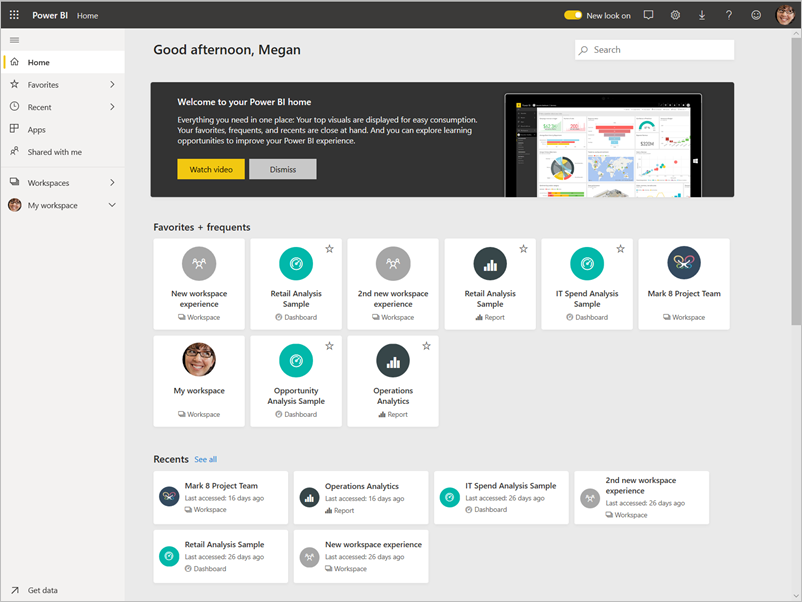
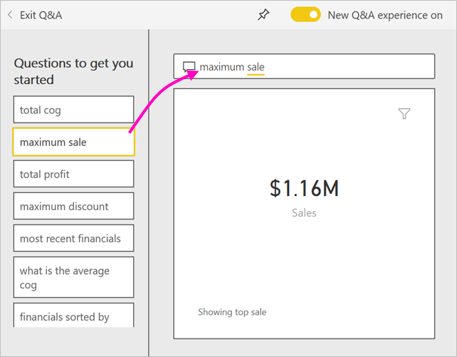
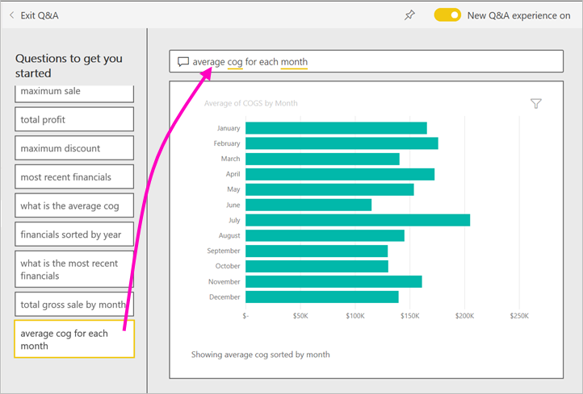
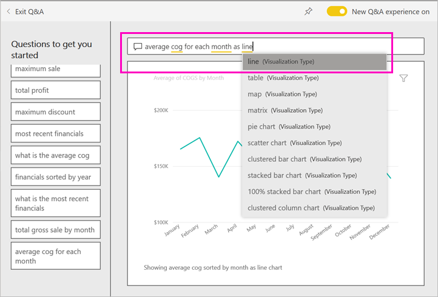

# Tutorial: Get started with the Power BI service
This tutorial is an introduction to some of the features of the *Power BI service*. In it, you connect to data, create a report and a dashboard, and ask questions of your data. You can do much more in the Power BI service; this tutorial is just to whet your appetite. For an understanding of how the Power BI service fits in with the other Power BI offerings, we recommend reading [What is Power BI](power-bi-overview.md).

In this tutorial, you complete the following steps:

> [!div class="checklist"]
> * Sign in to your Power BI online account, or sign up, if you don't have an account yet.
> * Open the Power BI service.
> * Get some data and open it in report view.
> * Use that data to create visualizations and save it as a report.
> * Create a dashboard by pinning tiles from the report.
> * Add other visualizations to your dashboard by using the Q&A natural-language tool.
> * Resize, rearrange, and interact with the tiles on the dashboard.
> * Clean up resources by deleting the dataset, report, and dashboard.

> [!TIP]
> Prefer a free self-paced training course instead? [Enroll in our Analyzing and Visualizing Data course on EdX](http://aka.ms/edxpbi).

## Sign up for the Power BI service
If you don't have a Power BI account, [sign up for a free Power BI Pro trial](https://app.powerbi.com/signupredirect?pbi_source=web) before you begin.

After you have an account, enter *app.powerbi.com* in your browser to open the Power BI service. 

## Step 1: Get data

Often when you want to create a Power BI report, you start in Power BI Desktop. This time, we're going to start from scratch creating a report in the Power BI service.

In this tutorial, we get data from a CSV file. Want to follow along? [Download the Financial Sample CSV file](http://go.microsoft.com/fwlink/?LinkID=521962).

1. [Sign in to Power BI](http://www.powerbi.com/). Don’t have an account? No worries, you can sign up for a free trial.
2. Power BI opens in your browser. Select **Get data** at the bottom of the left navigation bar.

    The **Get Data** page opens.   

3. Under the **Create new content** section, select **Files**. 
   
   
4.  Select **Local file**.
   
    

5. Browse to the file on your computer, and choose **Open**.

5. For this tutorial, we select **Import** to add the Excel file as a dataset, which we can then use to create reports and dashboards. If you select **Upload**, the entire Excel workbook is uploaded to Power BI, where you can open and edit it in Excel online.
   
   
6. When your dataset is ready, select **Datasets**, then select **Create report** next to the dataset **Financial sample** to open the report editor. 

    

    The report canvas is blank. We see the **Filters**, **Visualizations**, and **Fields** panes on the right.

    

7. Notice there's an option for **Reading view** on the top navigation bar. Because you have this option, that means you're currently in Editing view. A great way to get familiar with the report editor is to [take a tour](service-the-report-editor-take-a-tour.md).

    

    While in Editing view, you can create and modify your reports, because you're the *owner* of the report. That is, you're a *creator*. When you share your report with colleagues, they can only interact with the report in Reading view; your colleagues are *consumers*. Learn more about [Reading view and Editing view](consumer/end-user-reading-view.md).

## Step 2: Create a chart in a report
Now that you've connected to data, start exploring.  When you've found something interesting, you can create a dashboard to monitor it and see how it changes over time. Let's see how that works.
    
1. In the report editor, we start in the **Fields** pane on the right side of the page to build a visualization. Select the  **Gross Sales** and **Date** checkboxes.
   
   

    Power BI analyzes the data and creates a visualization. If you selected **Date** first, you see a table. If you selected **Gross Sales** first, you see a column chart. 

2. Switch to a different way of displaying your data. Let's see this data as a line chart. Select the line chart icon from the **Visualizations** pane.
   
   

3. This chart looks interesting, so let's *pin* it to a dashboard. Hover over the visualization and select the pin icon. When you pin this visualization, it's stored on your dashboard and kept up-to-date so you can track the latest value at a glance.
   
   

4. Because this report is new, you're prompted to save it before you can pin a visualization to a dashboard. Give your report a name (for example, *Sales over time*), and then select **Save**. 

5. Select **New dashboard** and name it *Financial sample for tutorial*. 
   
   
   
6. Select **Pin**.
   
    A success message (near the top-right corner) lets you know the visualization was added as a tile to your dashboard.
   
    

7. Select **Go to dashboard** to see your new dashboard with the line chart that you pinned to it as a tile. 
   
   
   
8. Select the new tile on your dashboard to return to the report. Power BI returns you to the report in Reading view. 

1. To switch back to Editing view, select the ellipsis (...) in the the top navigation bar > **Edit**. Back in Editing view, you can continue to explore and pin tiles.

    

## Step 3: Explore with Q&A

For a quick exploration of your data, try asking a question in the Q&A question box. Q&A creates natural-language queries about your data. In a dashboard, the Q&A box is located at the top (**Ask a question about your data**), and in a report, it's in the top navigation bar (**Ask a question**).

1. To go back to the dashboard, select **My workspace** in the black **Power BI** bar.

    

1. On the **Dashboards** tab, select your dashboard.

    

1. Select **Ask a question about your data**. Q&A automatically offers a number of suggestions.

    

    > [!NOTE]
    > If you don't see the suggestions, turn on **New Q&A experience**.

2. Some of the suggestions return a single value. For example, select **maximum sale**.

    Q&A searches for an answer and presents it in the form of a *card* visualization.

    

3. Select the pin icon  to show this visualization on the Financial sample for tutorial dashboard.

1. Scroll down in the **Questions to get you started** list and select **average cog for each month**. 

    

1. Pin the bar chart to the **Financial Sample for tutorial** dashboard, too.

1. Place the cursor after *by month* in the Q&A box and type *as line*. Select **line (Visualization Type)**. 

    

4. Select **Exit Q&A** to return to your dashboard, where you see the new tiles you created. 

   

   You see that even though you changed the chart to a line chart, the tile remained a bar chart because that's what it was when you pinned it. 

## Step 4: Reposition tiles

The dashboard is wide. We can rearrange the tiles to make better use of the dashboard space.

1. Drag the lower-right corner of the *Gross Sales* line chart tile upward, until it snaps at the same height as the Sales tile, and release it.

    

    Now the two tiles are the same height.

    

1. Drag the *Average of COGS* bar chart tile until it fits under the *Gross Sales* line chart.

    That looks better.

    

## Step 5: Interact with tiles

Here's one last interaction to observe, before you start making your own dashboards and reports. Selecting the different tiles delivers different results. 

1. First select the *Gross Sales* line chart tile you pinned from the report. 

    Power BI opens the report in Reading view. 

2. Select the browser back button. 

1. Now select the *Average of COGS* bar chart tile you created in Q&A. 

    Power BI doesn't open the report. Q&A opens instead, because you created this chart there.

## Clean up resources
Now that you've finished the tutorial, you can delete the dataset, report, and dashboard. 

1. In the left navigation bar, make sure you're in **My Workspace**.
2. Select the **Datasets** tab and locate the dataset you imported for this tutorial.  
3. Select the ellipsis (...) > **Delete**.

    

    When you delete the dataset, you see a warning that **All reports and dashboard tiles containing data from this dataset will also be deleted**.

4. Select **Delete**.

## Next steps

Make dashboards even better by adding more visualization tiles and [renaming, resizing, linking, and repositioning them](service-dashboard-edit-tile.md).

