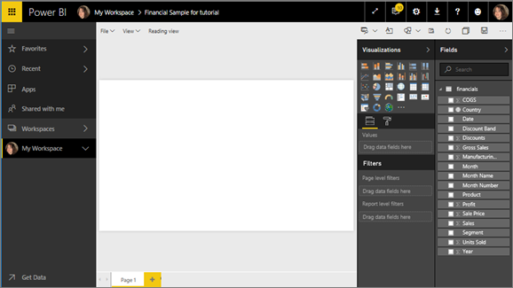
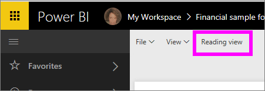
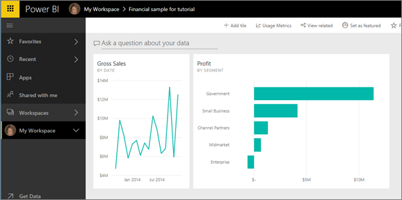
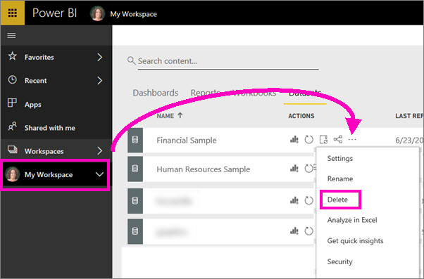

# Tutorial: Get started with Power BI service (app.powerbi.com)
This tutorial helps you get started with ***Power BI service***. For an understanding of how Power BI service fits in with the other Power BI offerings, we highly recommend that you start by reading [What is Power BI](power-bi-overview.md).

In this tutorial, you complete the following steps:

> [!div class="checklist"]
> * Find other getting started content for Power BI service
> * Sign in to your Power BI online account, or sign up, if you don't have one yet
> * Open the Power BI service
> * Get some data and open it in report view
> * Use that data to create visualizations and save as a report
> * Create a dashboard by pinning tiles from the report
> * Add another visualization to your dashboard using the Q&A natural language tool
> * Clean up resources by deleting the dataset, report, and dashboard

## Sign up for Power BI service
If you're not signed up for Power BI, [sign up for a free Power BI Pro trial](https://app.powerbi.com/signupredirect?pbi_source=web) before you begin.

If you already have an account, open a browser and type app.powerbi.com to open Power BI service. 

If you're looking for help with Power BI Desktop, see [Get started with Desktop](desktop-getting-started.md). If you're looking for help with Power BI mobile, see [Power BI apps for mobile devices](mobile-apps-for-mobile-devices.md).

> [!TIP]
> Prefer a free self-paced training course instead? [Enroll in our Analyzing and Visualizing Data course on EdX](http://aka.ms/edxpbi).

Visit our [playlist on YouTube](https://www.youtube.com/playlist?list=PL1N57mwBHtN0JFoKSR0n-tBkUJHeMP2cP). A good video to start with is Introduction to Power BI service:
> 
> <iframe width="560" height="315" src="https://www.youtube.com/embed/B2vd4MQrz4M" frameborder="0" allowfullscreen></iframe>
> 

## What is Power BI service?
Microsoft Power BI service is sometimes referred to as Power BI online or app.powerbi.com. Power BI helps you stay up to date with the information that matters to you.  With Power BI service, ***dashboards*** help you keep a finger on the pulse of your business.  Your dashboards display ***tiles*** that you can click to open ***reports*** for exploring further.  Connect to multiple ***datasets*** to bring all of the relevant data together in one place. Need help understanding the building blocks that make up Power BI?  See [Power BI - Basic Concepts](service-basic-concepts.md).

If you have important data in Excel or CSV files, you can create a Power BI dashboard to stay informed anywhere and share insights with others.  Do you have a subscription to a SaaS application like Salesforce?  Get a head start by connecting to Salesforce to automatically create a dashboard from that data, or [check out all the other SaaS apps](service-get-data.md) you can connect to. If you are part of an organization, see if any [apps](service-create-distribute-apps.md) have been published for you.

Read about all the other ways to [get data for Power BI](service-get-data.md).

## Step 1: Get data
Here's an example of getting data from a CSV file. Want to follow along with this tutorial? [Download this sample CSV file](http://go.microsoft.com/fwlink/?LinkID=521962).

1. [Sign in to Power BI](http://www.powerbi.com/). Don’t have an account? No worries, you can sign up for a free trial.
2. Power BI opens in your browser. Select **Get Data** at the bottom of the left navigation bar.
   
   
3. Select **Files**. 
   
   
4. Browse to the file on your computer, and choose **Open**. If you saved it in  OneDrive for Business, select that option. If you saved it locally, select **Local file**. 
   
   
5. For this tutorial we're going to select **Import** to add the Excel file as a dataset that we can then use to create reports and dashboards. If you select **Upload**, the entire Excel workbook is uploaded to Power BI where you can open and edit it in Excel online.
   
   
6. When your dataset is ready, select **View dataset** to open it in the report editor. 

    

    Since we haven't yet created any visualizations, the report canvas will be blank.

    

6. Take a look at the top menubar and notice that there is an option for **Reading view**. Since you have an option for Reading view, that means you are currently in **Editing view**. 

    

    While in Editing view you can create and modify your reports because you are the *owner* of the report; you are a *creator*. When you share your report with colleagues, they'll only be able to interact with the report in Reading view; they are *consumers*. Learn more about [Reading view and Editing view](service-reading-view-and-editing-view.md).
    
    A great way to get familiar with the report editor is to [take a tour](service-the-report-editor-take-a-tour.md)
   > 
 

## Step 2: Start exploring your dataset
Now that you've connected to data, start exploring.  When you've found something interesting, you can create a dashboard to monitor it and see how it changes over time. Let's see how that works.
    
1. In the report editor, we'll use the **Fields** pane on the right side of the page to build a visualization.  Select the checkbox beside **Gross Sales** and  **Date**.
   
   

2. Power BI analyzes the data and creates a visualization.  If you selected **Date** first, you'll see a table.  If you selected **Gross Sales** first, you'll see a chart. Switch to a different way of displaying your data. Let's see this data as a line chart. Select the line chart icon (also known as a template) from the **Visualizations pane**.
   
   

3. This looks interesting, so let's *pin* it to a dashboard. Hover over the visualization and select the **Pin** icon.  When you pin this visualization, it is stored on your dashboard and kept up-to-date so you can track the latest value at a glance.
   
   

4. Because this is a new report, you'll be prompted to save it before you can pin a visualization to a dashboard. Give your report a name (e.g., *Sales over time*) and select **Save and Continue**. 
   
   
   
5. Let's pin the line chart to new dashboard and name it "Financial sample for tutorial". 
   
   
   
   1. Select **Pin**.
   
      A Success message (near the top right corner) lets you know the visualization was added, as a tile, to your dashboard.
   
      

6. Select **Go to dashboard** to see the line chart pinned, as a tile, to your brand new dashboard. Make your dashboard even better by adding more visualization tiles and [renaming, resizing, linking, and repositioning tiles](service-dashboard-edit-tile.md).
   
   
   
   Select the new tile on your dashboard to return to the report any time. Power BI returns you to the report editor in Reading view. To switch back to Editing view, select **Edit report** from the top menubar. Once in Editing view, continue exploring and pinning tiles. 

## Step 3:  Continue the exploration with Q&A (natural language querying)
1. For a quick exploration of your data, try asking a question in the Q&A box. The Q&A question box is located at the top of your dashboard (**Ask a question about your data**) and in the top menubar in your report (**Ask a question**). For example, try typing "what segment had the most revenue".
   
   

2. Q&A searches for an answer and presents it in the form of a visualization. Select the pin icon  to show this visualization on your dashboard too.
3. Pin the visualization to the "Financial Sample for tutorial" dashboard.
   
    

4. Return to your dashboard where you'll see the new tile.

   

## Clean up resources
Now that you've finished the tutorial, you can delete the dataset, report, and dashboard. 

1. In the left navigation bar, select **My Workspace**.
2. Select the **Datasets** tab and locate the dataset you imported for this tutorial.  
3. Select the ellipses (...) > **Delete**.

    

    Deleting the dataset will also delete the report and the dashboard. 

## Next steps
Ready to try more?  Here are some great ways to explore Power BI.

> [!div class="nextstepaction"]
> [Connect to the online services you use](./service-connect-to-services.md)

