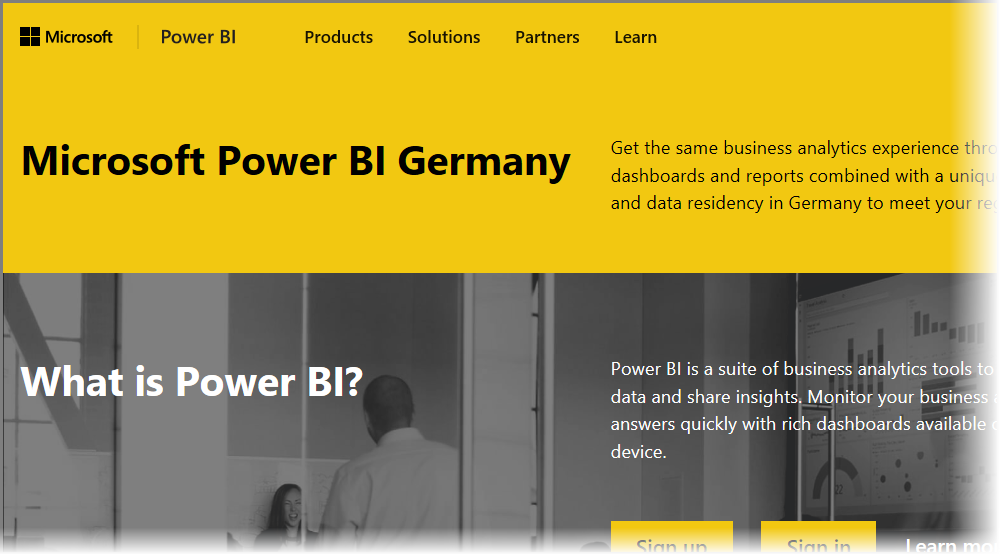

# Frequently Asked Questions for Power BI for Germany Cloud customers
The **Power BI service** has a version available for European Union/European Free Trade Agreement (EU/EFTA) customers, often referred to as Microsoft Cloud Deutschland (MCD). The **Power BI service** version discussed in this article is specific to EU/EFTA customers, and is separate and different from the commercial version of the **Power BI service**, or Power BI services provided to government customers.

The following questions and answers provide important information for Power BI Pro Service in Microsoft Cloud Deutschland (MCD), which is the Power BI service cloud specifically provided for EU/EFTA customers.

1. **What is the Power BI service for Germany Cloud?**
   
   The Power BI service for EU/EFTA customers, also referred to as Microsoft Cloud Deutschland (MCD), is an EU/EFTA compliant cloud with the Power BI service delivered from German datacenters. All customer data in the Power BI service for EU/EFTA cloud is stored at rest in Germany with T-Systems working as the independent German data trustee, and with physical and logical access to data controlled by German law. The Power BI service for EU/EFTA cloud requires a distinct and separate account from the commercial version of the Power BI service. Learn more about Microsoft Cloud Deutschland [here](https://www.microsoft.com/trustcenter/cloudservices/nationalcloud).
2. **Where can I find pricing and sign up information for the Power BI Germany Cloud?**
   
   You can find lots of information on the [Power BI Germany Cloud home page](https://powerbi.microsoft.com/power-bi-germany/), including pricing information. On that page you can also find a link to sign up for **Power BI Pro service** 30-Day trial with 25 user licenses. As part of trial sign up, you have an option to purchase or add additional licenses as needed. We also offer Enterprise Agreement (EA), Government, and non-profit pricing. Please reach to your Microsoft customer representative for more details.
3. **I have a Germany Cloud tenant as part of Azure Germany and/or Office 365 Germany subscriptions. Can I use the existing tenant to sign up for Power BI Germany?**
   
   Yes. As part of the sign up process, you'll have an option to login with an existing Germany Cloud tenant administrator account, and add the Power BI Pro service licenses to your existing tenant in the Germany Cloud. Please note that Germany Cloud tenants and user accounts are different from the Power BI service for Germany cloud.
4. **Is there a free service in the Power BI service for Germany cloud?**
   
   No. We don't offer free license versions in the Power BI service for Germany cloud. However, we encourage you to sign up for [Power BI free offering in our public cloud](https://powerbi.microsoft.com/get-started/) if your business needs are met with the Power BI free offering.
5. **Can I use Power BI Desktop, Power BI Mobile, On-premises data gateway and Publisher for Excel with the Power BI service for Germany cloud?**
   
   Yes. We've updated our Power BI client products to seamlessly work with the Power BI service for Germany cloud. Please login with your Power BI service for Germany cloud account to start using the same client products with Power BI service for Germany cloud. You can download the latest version of client products from the following locations:
   
   * [Power BI Desktop](https://powerbi.microsoft.com/desktop/)
   * [Power BI Mobile](https://powerbi.microsoft.com/mobile/)
   * [On-premises data gateway](https://powerbi.microsoft.com/gateway/)
   * [Power BI Publisher for Excel](https://powerbi.microsoft.com/excel-dashboard-publisher/)
6. **Are there any feature limitations of the Power BI service for Germany cloud?**
   
   The following service features are currently not available in Power BI service for Germany cloud:
   
   * Publish to Web
   * ArcGIS maps by Esri
   * Power BI Embedded (separate metered ISV licensing, will be offered through [Microsoft Azure Germany](https://azure.microsoft.com/overview/clouds/germany/) in the future)
7. **Where can I find the Power BI service for Germany cloud specific configuration information for use and integration in my applications?**
   
   We updated our [SaaS Embedding developer samples](https://github.com/Microsoft/PowerBI-Developer-Samples) with Germany and other Power BI clouds specific configuration information. Please look at the **Cloud Configs** folder in samples for cloud specific configuration end points. The following table lists  various configuration end points for the Power BI service for Germany cloud (and Public Cloud for cross-reference).

| **Endpoint name and/or Usage** | **Power BI service for Germany cloud URL** | **Equivalent URL in Public Cloud (for cross-reference)** |
| --- | --- | --- |
| Home Page, Sign Up and Sign In |[https://powerbi.microsoft.com/power-bi-germany/](https://powerbi.microsoft.com/power-bi-germany/) |[https://powerbi.microsoft.com/](https://powerbi.microsoft.com/) |
| Power BI Service direct sign in |[https://app.powerbi.de/?noSignUpCheck=1](https://app.powerbi.de/?noSignUpCheck=1) |[https://app.powerbi.com/?noSignUpCheck=1](https://app.powerbi.com/?noSignUpCheck=1) |
| Service API |[https://api.powerbi.de/](https://api.powerbi.de/) |[https://api.powerbi.com/](https://api.powerbi.com/) |
| Office Portal for user license management, service health status and support requests by administrators |[https://portal.office.de/](https://portal.office.de/) |[https://portal.office.com/](https://portal.office.com/) |
| AAD Authority Uri |[https://login.microsoftonline.de/common/oauth2/authorize/](https://login.microsoftonline.de/common/oauth2/authorize/) |[https://login.microsoftonline.com/common/oauth2/authorize/](https://login.microsoftonline.com/common/oauth2/authorize/) |
| Power BI Service Resource Uri |[https://analysis.cloudapi.de/powerbi/api](https://analysis.cloudapi.de/powerbi/api) |[https://analysis.windows.net/powerbi/api](https://analysis.windows.net/powerbi/api) |
| Custom Visuals Library |[https://app.powerbi.de/visuals/](https://app.powerbi.de/visuals/) |[https://app.powerbi.com/visuals/](https://app.powerbi.com/visuals/) |
| Register an Application for Power BI (For Embedded) |[https://app.powerbi.de/apps](https://app.powerbi.de/apps) |[https://app.powerbi.com/apps](https://app.powerbi.com/apps) |
| Azure Portal (For Embedded) |[https://portal.microsoftazure.de/](https://portal.microsoftazure.de/) |[https://portal.azure.com/](https://portal.azure.com/) |
| Community |[https://community.powerbi.com/](https://community.powerbi.com/) |[https://community.powerbi.com/](https://community.powerbi.com/) |

### Next steps
There are all sorts of things you can do with Power BI. For more information and learning, including an article that shows you how to sign up for the service, check out the following resources:

* [Guided Learning for Power BI](guided-learning/gettingstarted.yml?tutorial-step=1)
* [Get started with the Power BI service](service-get-started.md)
* [What is Power BI Desktop?](desktop-what-is-desktop.md)

