# Automated Machine Learning in Power BI 

Automated machine learning (AutoML) for dataflows enables business analysts to train, validate and invoke Machine Learning (ML) models directly in Power BI. It includes a simple experience for creating a new ML model where analysts can use their dataflows to specify the input data for training the model. The service automatically extracts the most relevant features, selects an appropriate algorithm and tunes and validates the ML model. After a model is trained, Power BI automatically generates a report that includes the results of validation that explains the performance and results to analysts. The model can then be invoked on any new or updated data within the dataflow.

Automated machine learning is available for dataflows that are hosted on Power BI Premium and Embedded capacities only. 

## Working with AutoML

[Power BI dataflows](service-dataflows-overview.md) offers self-serve data prep for big data. AutoML is integrated into dataflows and enables you to leverage your data prep effort for building machine learning models, right within Power BI.

AutoML in Power BI enables data analysts to use dataflows to build machine learning models with a simplified experience, using just Power BI skills. Most of the data science behind the creation of the ML models is automated by Power BI, with guardrails to ensure that the model produced has good quality, and visibility to provide you with full insight into the process used to create your ML model.

AutoML supports the creation of Binary Prediction, Classification, and Regression models for dataflows. These are types of supervised machine learning techniques, which means that they learn from the known outcomes of past observations to predict the outcomes of other observations. The input dataset for training an AutoML model is a set of records that are labeled with the known outcomes.

AutoML in Power BI integrates [automated ML](https://docs.microsoft.com/azure/machine-learning/service/concept-automated-ml) from the [Azure Machine Learning service](https://docs.microsoft.com/azure/machine-learning/service/overview-what-is-azure-ml) to create your ML models. However, you don't need an Azure subscription to use AutoML in Power BI. The process of training and hosting the ML models is managed entirely by the Power BI service.

After an ML model is trained, AutoML automatically generates a Power BI report that explains the likely performance of your ML model. AutoML emphasizes explainability by highlighting the key influencers among your inputs that influence the predictions returned by your model. The report also includes key metrics for the model.

Other pages of the generated report show the statistical summary of the model and the training details. The statistical summary is of interest to users who would like to see the standard data science measures of performance for the model. The training details summarize all the iterations that were run to create your model, with the associated modeling parameters. It also describes how each input was used to create the ML model.

You can then apply your ML model to your data for scoring. When the dataflow is refreshed, your data is updated with predictions from your ML. Power BI also includes an individualized explanation for each specific prediction that the ML model produces.

## Creating a machine learning model

This section describes how to create an AutoML model. 

### Data prep for creating an ML model

To create a machine learning model in Power BI, you must first create a dataflow for the data containing the historical outcome information, which is used for training the ML model. For details on configuring your dataflow, see [Self-service data prep in Power BI](service-dataflows-overview.md).

In the current release, Power BI uses data from only a single entity to train the ML model. So, if your historical data consists of multiple entities, you must manually join the data into a single dataflow entity. You should also add calculated columns for any business metrics that may be strong predictors for the outcome you're trying to predict.

AutoML has specific data requirements for training a machine learning model. These requirements are described in sections below, based on respective model types.

### Configuring the ML model inputs

To create an AutoML model, select the ML icon in the **Actions** column of the dataflow entity with the historical data, and select **Add a machine learning model**.

A simplified experience is launched, consisting of a wizard that guides you through the process of creating the ML model. The wizard includes the following simple steps.

1.	Select the entity with the historical data, and the outcome field for which you want a prediction

The outcome field identifies the label attribute for training the ML model, shown in the following image.

2.	Choose a model type 

When you specify the outcome field, AutoML analyzes the label data to identify the types of ML model that can be trained for that data and suggests the most likely ML model type that can be trained. You can pick a different model type as shown below by clicking on “Select a different model”.  

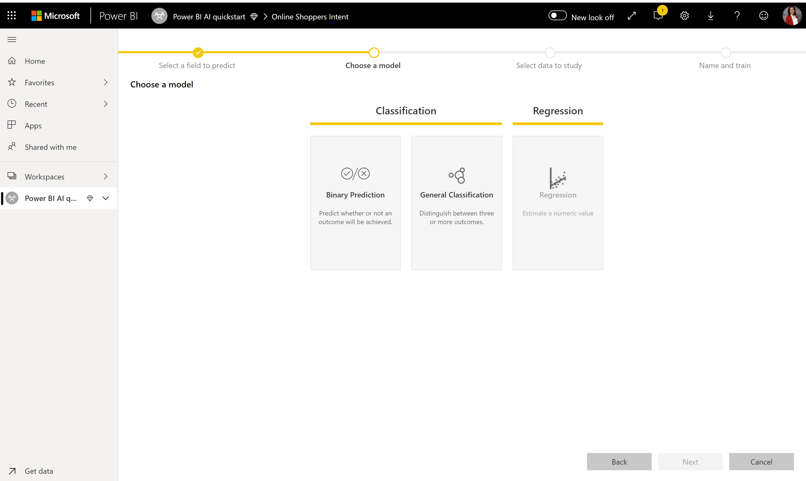

> [!NOTE]
> Some model types may not be supported for the data that you have selected and hence would be disabled, like the example above, where Regression is disabled as a text column is selected as outcome field.

3.	Select the inputs you want the model to use as predictive signals

AutoML analyzes a sample of the selected entity to suggest the inputs that can be used for training the ML model. Explanations would be provided next to fields that are not selected. If certain field has very high cardinality (too many distinct values) or very low cardinality (only one value) or low/high correlation with the output field, it would not be recommended. 

Any inputs that are dependent on the outcome field (or the label field) should not be used for training the ML model, since they will affect its performance. Such fields would be flagged as having “suspiciously high correlation with output field”. Introducing these fields into the training data causes label leakage, where the model performs well on the validation or test data but cannot match that performance when used in production for scoring. Label leakage could be a possible concern in AutoML models, when training model performance is too good to be true.

This process is approximate as it is based on a sample of a data, so you should review the inputs used. You have the option to change the selections to include only the fields you want the model to study, or you can select all the fields by selecting the checkbox next to the entity name. 

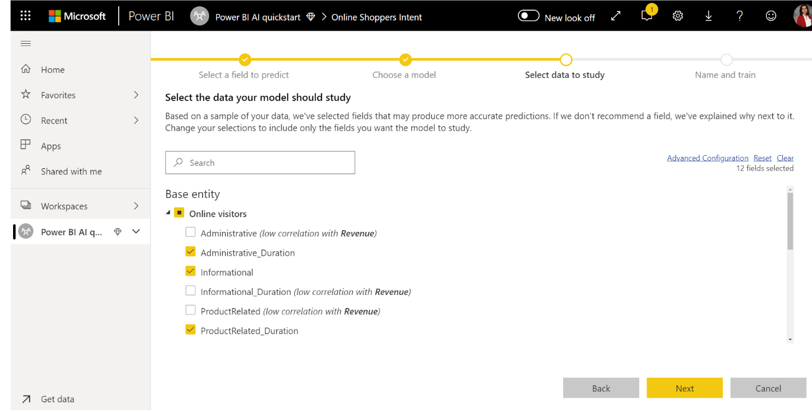

4.	Name your model and save your configuration

In the final step, you can name the model and select Save and train which begins training the ML model. You can choose to reduce the training time to see quick results or increase the amount of time spent in training to get the best model. 

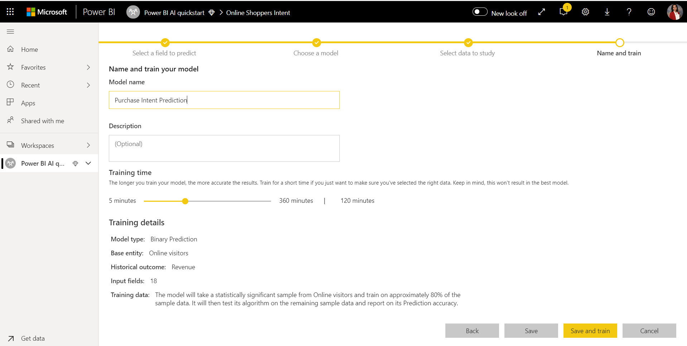

### ML model training

Training of AutoML models is a part of the dataflow refresh. AutoML first prepares your data for training.
AutoML splits the historical data you provide into training and testing datasets. The test dataset is a holdout set that is used for validating the model performance after training. These are realized as Training and Testing entities in the dataflow. AutoML uses cross-validation for the model validation.

Next, each input field is analyzed and imputation is applied, which replaces any missing values with substituted values. A couple of different imputation strategies are used by AutoML. For input attributes treated as numeric features, the mean of the column values is used for imputation. For input attributes treated as categorical features, AutoML uses the mode of the column values for imputation. The mean and mode of values used for imputation are calculated by the AutoML framework on the sub-sampled training dataset. 

Then, sampling and normalization are applied to your data as required. For classification models, Auto ML runs the input data through stratified sampling and balances the classes to ensure the row counts are equal for all.

AutoML applies several transformations on each selected input field based on its data type, and its statistical properties. AutoML uses these transformations to extract features for use in training your ML model. 

The training process for AutoML models consists of up to 50 iterations with different modeling algorithms and hyperparameter settings to find the model with the best performance. The performance of each of these models is assessed by validation with the holdout test dataset. Note that training can end early with lesser iterations if Auto ML notices that there is no performance improvement being observed. During this training step, AutoML creates several pipelines for training and validation of these iterations. The process of assessing the performance of the models can take time, anywhere from several minutes to a couple of hours up-to the training time configured in the wizard, depending on the size of your dataset and the dedicated capacity resources available.

In some cases, the final model generated may use ensemble learning, where multiple models are used to deliver better predictive performance.

### AutoML model explainability

After the model has been trained, AutoML analyzes the relationship between the input features and the model output. It assesses the magnitude of change to the model output for the holdout test dataset for each input feature. This is known as the *feature importance*. Note that this happens as a part of the refresh once training is complete. Hence your refresh may take longer than the training time configured in the wizard.

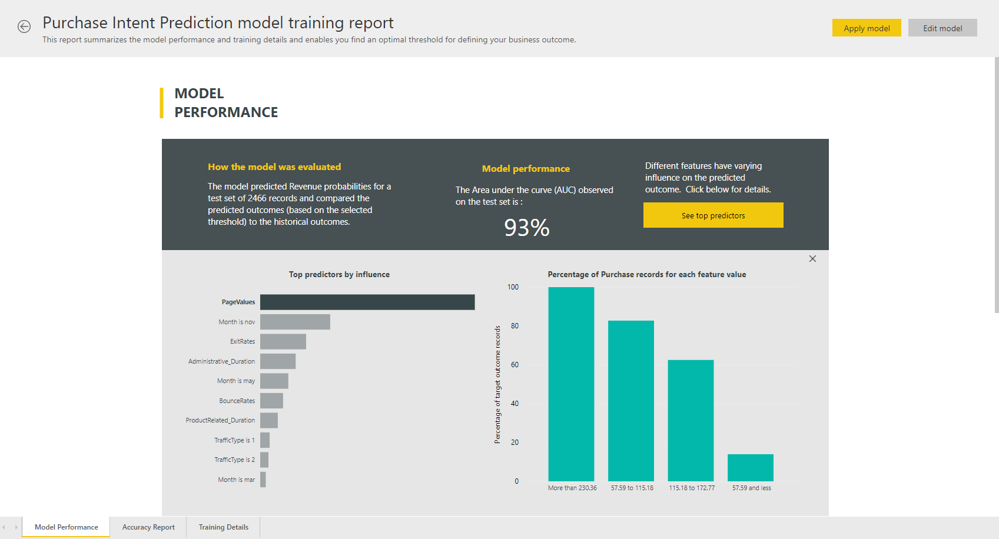

### AutoML model report

AutoML generates a Power BI report that summarizes the performance of the model during validation, along with the global feature importance. This report can be accessed from the Machine Learning Model tab once the dataflow refresh is successful. The report summarizes the results from applying the ML model to the holdout test data and comparing the predictions with the known outcome values.

You can review the model report to understand its performance. You can also validate that the key influencers of the model align with the business insights about the known outcomes.

The charts and measures used to describe the model performance in the report depend on the model type. These performance charts and measures are described in the following sections.

Additional pages in the report may describe statistical measures about the model from a data science perspective. For instance, the **Binary Prediction** report includes a gain chart and the ROC curve for the model.

The reports also include a **Training Details** page that includes a description of how the model was trained, and includes a chart describing the model performance over each of the iterations run.

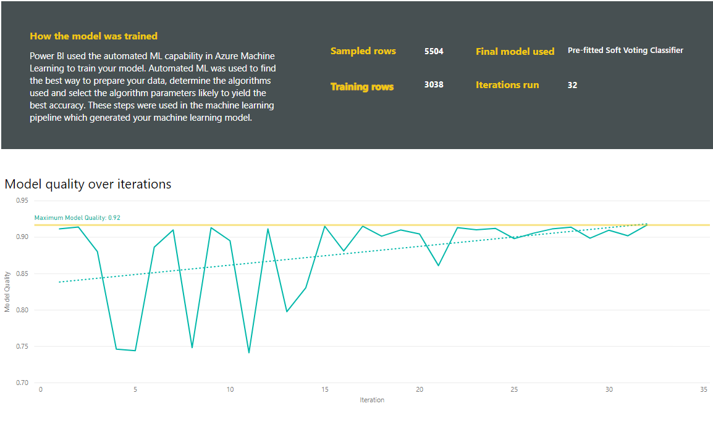

Another section on this page describes the detected type of the input field and imputation method used for filling missing values.  It also includes the parameters used by the final model.

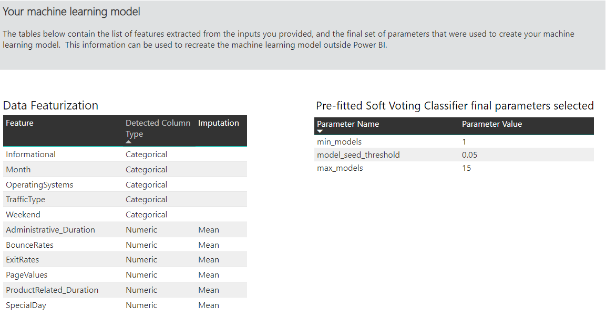

If the model produced uses ensemble learning, then the **Training Details** page also includes a chart showing the weight of each constituent model in the ensemble, as well as its parameters.

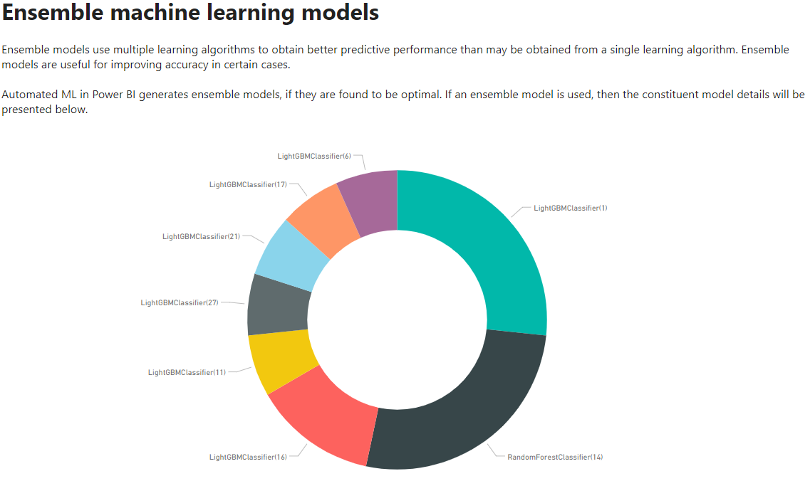

## Applying the AutoML model

If you're satisfied with the performance of the ML model created, you can apply it to new or updated data when your dataflow is refreshed. You can do this from the model report, by selecting the Apply button in the top-right corner or the Apply ML Model button under actions in the Machine Learning Models tab.

To apply the ML model, you must specify the name of the entity to which it must be applied, and a prefix for the columns that will be added to this entity for the model output. The default prefix for the column names is the model name. The Apply function may include additional parameters specific to the model type.

Applying the ML model creates a new dataflow entity with the suffix enriched <model_name>. For instance, if you apply the PurchaseIntent model to the OnlineShoppers entity, the output will generate the OnlineShoppers enriched PurchaseIntent.

Currently, the output entity cannot be used to preview the ML model results in the Power Query editor. 

You must refresh the dataflow, to preview the results in the Query Editor.

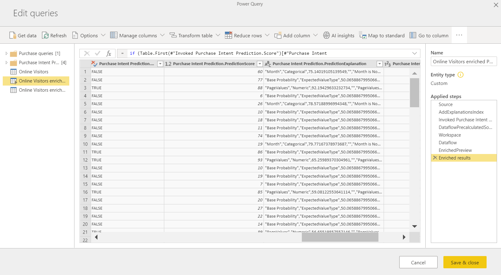

After you apply the model, AutoML always keeps your predictions up-to-date whenever the dataflow is refreshed.

AutoML also includes an individualized explanation for each row that it scores in the output entity.

To use the insights and predictions from the ML model in a Power BI report, you can connect to the output entity from Power BI Desktop using the **dataflows** connector.

## Binary Prediction Models

Binary Prediction models, more formally known as *binary classification* models, are used to classify a dataset into two groups. They're used to predict events that can have a binary outcome, such as whether a sales opportunity will convert, whether an account will churn, whether an invoice will be paid on time; whether a transaction is fraudulent, and so on.

The output of a Binary Prediction model is a probability score, which identifies the likelihood that the target outcome will be achieved.

### Training a Binary Prediction model

Pre-requisites:

* A minimum of 50 rows of historical data is required for each class of outcomes

The process of creation for a Binary Prediction model follows the same steps as other AutoML models, described in the section **Configuring the ML model inputs** above. The only difference is in the “Choose a model” step. You can select the target outcome value that you’re most interested in and provide friendly labels for the outcomes to be used in the automatically generated report that will summarize the results of the model validation.

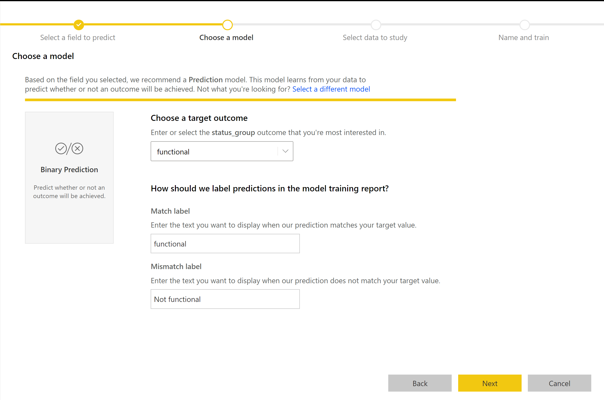

### Binary Prediction model report

The Binary Prediction model produces as an output a probability that a record will achieve the target outcome. The report includes a slicer for the probability threshold, which influences how the scores above and below the probability threshold are interpreted.

The report describes the performance of the model in terms of True Positives, False Positives, True Negatives and False Negatives. True Positives and True Negatives are correctly predicted outcomes for the two classes in the outcome data. False Positives are records that were predicted to have Target outcome but actually did not. Conversely, False Negatives are records that had Target outcome but were predicted as not having it.

Measures, such as Precision and Recall, describe the effect of the probability threshold on the predicted outcomes. You can use the probability threshold slicer to select a threshold that achieves a balanced compromise between Precision and Recall.

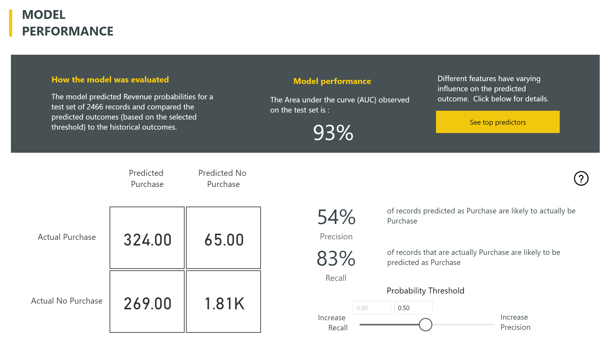

The report also includes a Cost-Benefit analysis tool to help identify the subset of the population that should be targeted to yield the highest profit. Given an estimated unit cost of targeting and a unit benefit from achieving a target outcome, Cost-Benefit analysis attempts to maximize profit. You can use this tool to pick your probability threshold based on the maximum point in the graph to maximize profit or use the graph to compute the profit or cost for your choice of probability threshold.

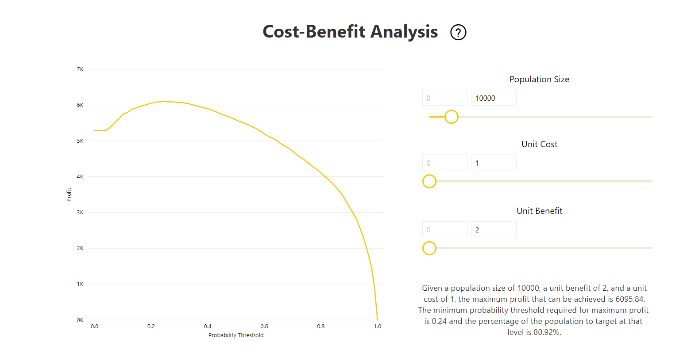

The **Accuracy Report** page of the model report includes the *Cumulative Gains* chart and the ROC curve for the model. These are statistical measures of model performance. The reports include descriptions of the charts shown.

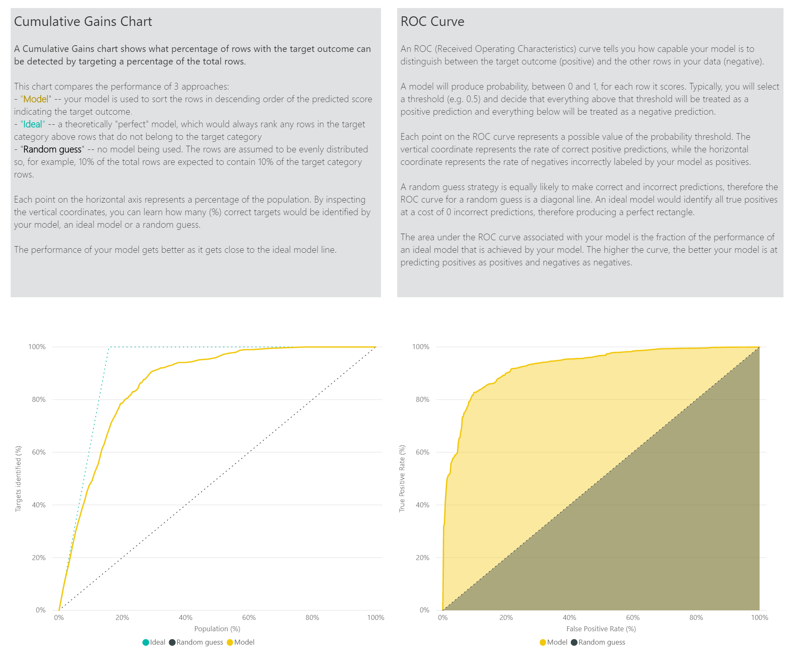

### Applying a Binary Prediction model

To apply a Binary Prediction model, you must specify the entity with the data to which you want to apply the predictions from the ML model. Other parameters include the output column name prefix and the probability threshold for classifying the predicted outcome.

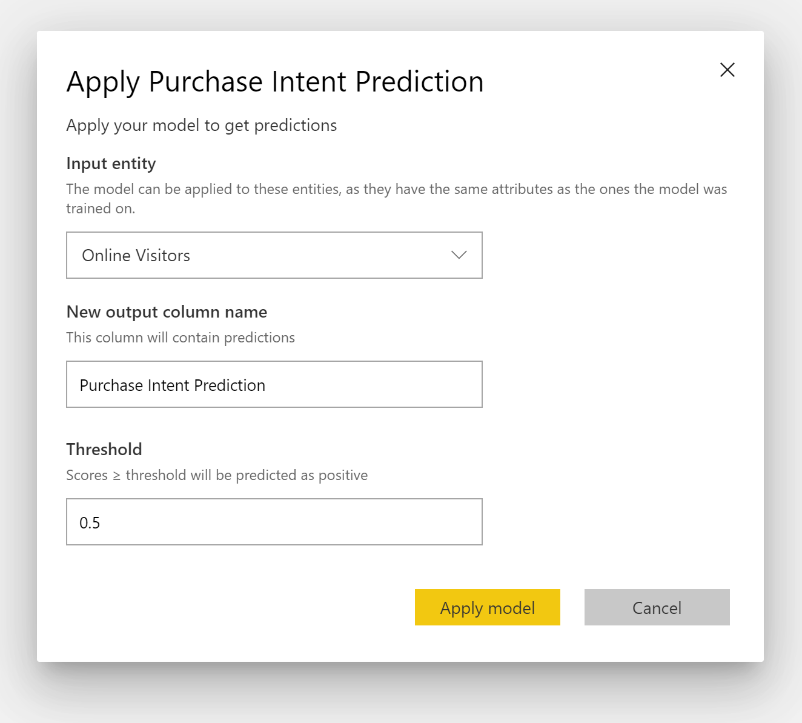

When a Binary Prediction model is applied, it adds four output columns to the enriched output entity. These are the **Outcome**, **PredictionScore**, **PredictionExplanation**, and **ExplanationIndex**. The column names in the entity have the prefix specified when the model is applied.

**PredictionScore**  is a percentage probability, which identifies the likelihood that the target outcome will be achieved.

The **Outcome** column contains the predicted outcome label. Records with probabilities exceeding the threshold are predicted as likely to achieve the target outcome and are labelled as True, and those below are predicted as unlikely to achieve the outcome and are labelled as False.

The **PredictionExplanation** column contains an explanation with the specific influence that the input features had on the **PredictionScore**. 

## Classification models

Classification models are used to classify a dataset into multiple groups or classes. They're used to predict events that can have one of multiple possible outcomes, such as whether a customer is likely to have a very high, high, medium, or low Lifetime Value; whether the risk of default is High, Moderate, Low or Very Low; and so on.

The output of a Classification model is a probability score, which identifies the likelihood that a record will achieve the criteria for a given class.

### Training a Classification model

The input entity containing your training data for a Classification model must have a string or whole number field as the outcome field, which identifies the past known outcomes.

Pre-requisites:
*	A minimum of 50 rows of historical data is required for each class of outcomes

The process of creation for a Classification model follows the same steps as other AutoML models, described in the section **Configuring the ML model inputs** above.

### Classification model report

The Classification model report is produced by applying the ML model to the holdout test data and comparing the predicted class for a record with the actual known class.

The model report includes a chart that includes the breakdown of the correctly and incorrectly classified records for each known class.

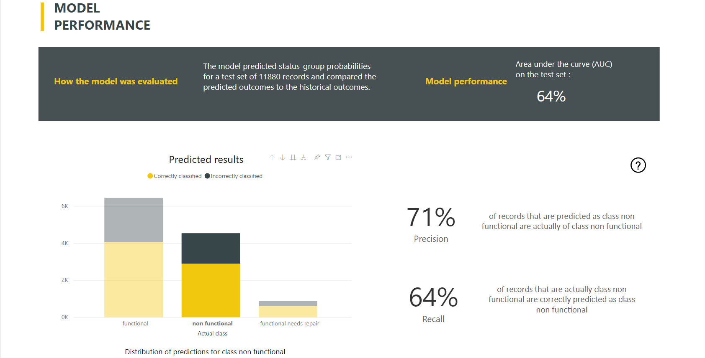

A further class-specific drilldown enables an analysis of how the predictions for a known class are distributed. This includes the other classes in which records of that known class are likely to be misclassified.

The model explanation in the report also includes the top predictors for each class.

The Classification model report also includes a Training Details page similar to the pages for other model types, as described in the section **AutoML model report** earlier in this article.

### Applying a classification model

To apply a Classification ML model, you must specify the entity with the input data and the output column name prefix.

When a Classification model is applied, it adds five output columns to the enriched output entity. These are the **ClassificationScore, ClassificationResult, ClassificationExplanation, ClassProbabilities, ExplanationIndex**. The column names in the entity have the prefix specified when the model is applied.

The **ClassProbabilities** column contains the list of probability scores for the record for each possible class.
ClassificationScore is the percentage probability, which identifies the likelihood that a record will achieve the criteria for a given class.

The **ClassificationResult** column contains the most likely predicted class for the record. 

The **ClassificationExplanation** column contains an explanation with the specific influence that the input features had on the **ClassificationScore**. 

## Regression models

Regression models are used to predict a value, such as the revenue likely to be realized from a sales deal, the lifetime value of an account, the amount of a receivable invoice that is likely to be paid, the date on which an invoice may be paid, and so on.

The output of a Regression model is the predicted value.

### Training a Regression model

The input entity containing the training data for a Regression model must have a numeric field as the outcome field, which identifies the known outcome values.

Pre-requisites:
*	A minimum of 100 rows of historical data is required for a Regression model

The process of creation for a Regression model follows the same steps as other AutoML models, described in the section **Configuring the ML model inputs** above.

### Regression model report

Like the other AutoML model reports, the Regression report is based on the results from applying the model to the holdout test data.

The model report includes a chart that compares the predicted values to the actual values. In this chart, the distance from the diagonal indicates the error in the prediction.

The residual error chart shows the distribution of the percentage of average error for different values in the holdout test dataset. The horizontal axis represents the mean of the actual value for the group, with the size of the bubble showing the frequency or count of values in that range. The vertical axis is the average residual error.

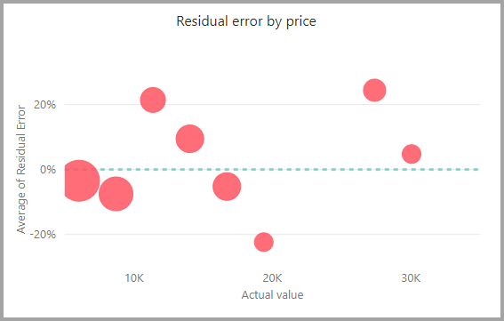

The Regression model report also includes a Training Details page like the reports for other model types, as described in the section **AutoML model report** above.

### Applying a regression model

To apply a Regression ML model, you must specify the entity with the input data and the output column name prefix.

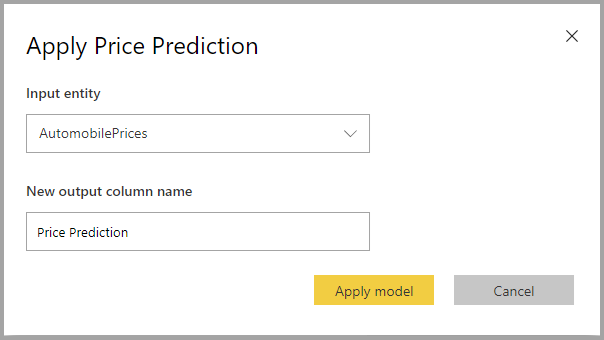

When a Regression model is applied, it adds three output columns to the enriched output entity. These are the **RegressionResult**, **RegressionExplanation**, and **ExplanationIndex**. The column names in the entity have the prefix specified when the model is applied.

The **RegressionResult** column contains the predicted value for the record based on the input fields. The **RegressionExplanation** column contains an explanation with the specific influence that the input features had on the **RegressionResult**.

## Next steps

This article provided an overview of Automated Machine Learning for Dataflows in the Power BI service. The following articles may also be useful.

* [Tutorial: Build a Machine Learning model in Power BI ](service-tutorial-build-machine-learning-model.md)
* [Tutorial: Using Cognitive Services in Power BI](service-tutorial-use-cognitive-services.md)
* [Tutorial: Invoke a Machine Learning Studio model in Power BI (Preview)](service-tutorial-invoke-machine-learning-model.md)
* [Cognitive Services in Power BI](service-cognitive-services.md)
* [Azure Machine Learning integration in Power BI](service-machine-learning-integration.md)

For more information about dataflows, you can read these articles:
* [Create and use dataflows in Power BI](service-dataflows-create-use.md)
* [Using computed entities on Power BI Premium](service-dataflows-computed-entities-premium.md)
* [Using dataflows with on-premises data sources](service-dataflows-on-premises-gateways.md)
* [Developer resources for Power BI dataflows](service-dataflows-developer-resources.md)
* [Dataflows and Azure Data Lake integration (Preview)](service-dataflows-azure-data-lake-integration.md)

