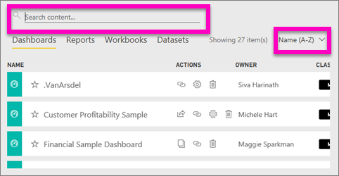
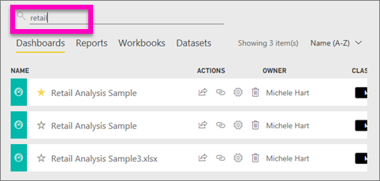

# Navigation: searching, finding, and sorting content in Power BI service
There are many ways to navigate your content in Power BI service. The content is organized within workspaces by type: dashboards, reports, workbooks, and datasets.  And the content is also organized by usage: favorites, recent, apps, shared with me, and featured. These different pathways into your content allow you to quickly find what you need in Power BI service.  

>[!NOTE] 
>This article applies to Power BI service (app.powerbi.com) and not to Power BI Desktop.

## Navigation within workspaces

Power BI service separates your workspace content by type: dashboards, reports, workbooks, and datasets. You'll see this organization when you select a workspace. In this example, the app workspace is named "Sales and marketing app sample" and it contains 2 dashboards, 6 reports, 1 workbook, and 5 datasets.

________________________________________

## Searching and sorting in workspaces
A workspace has four content tabs: Dashboards, Reports, Workbooks, and Datasets.  Each of these tabs contains a search field and a sort button.  When you're starting out with Power BI service, you might not find these helpful because you'll have only one or two items per tab.  However, over time you may end up with long lists of content.  Use searching and sorting to easily find what you need.

* Enter a search term to find a match on the current screen
  
   
* Select the sort button to display options for the current page. The options are to sort by name or by owner.
  
   

## Navigation using the left navbar
The left navpane classifies your content in ways that make it even easier to find what you need, quickly.  

Content that you create for your own use is available in **My workspace**, content that you create and share with a group is available in an **Apps** workspace, content that is shared with you is available in **Shared with me**, and your last-viewed content is available in **Recent**.

Additionally, you can tag content as [favorite](service-dashboard-favorite.md) and [featured](service-dashboard-featured.md). Pick the one dashboard that you expect to view most often, and set it as your *featured* dashboard. Each time you open Power BI service, this is the dashboard that will display first. Do you have a number of dashboards and apps that you visit often? By setting them as favorites, they'll always be available from your left navbar.

.

## Considerations and troubleshooting
* For datasets, **Sort by** is not available by owner.

## Next steps
[Power BI - Basic Concepts](service-basic-concepts.md)

More questions? [Try the Power BI Community](http://community.powerbi.com/)