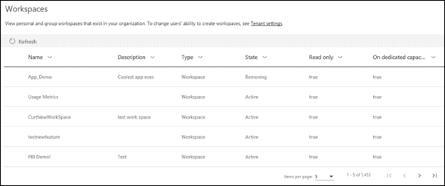
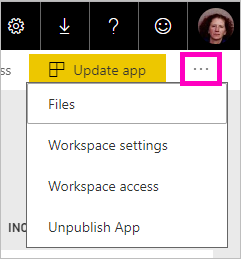
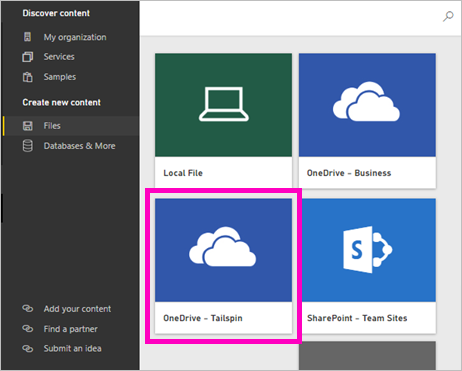

# Organize work in the new workspaces in Power BI

Workspaces are places to collaborate with colleagues to create collections of dashboards and reports. You can bundle those collections into *apps* with their own table of contents. Then you can distribute them to your whole organization or to specific people or groups. Power BI is introducing a new workspace experience to better help you manage access to content in workspaces. 

The new workspace experience has reached general availability (GA), and is now the default workspace experience. Classic workspaces that are based on Office 365 Groups are still supported. You can continue to create and use [classic workspaces](service-create-workspaces.md). 

> [!NOTE]
> To enforce row-level security (RLS) for Power BI Pro users browsing content in a workspace, continue to use [classic workspaces](service-create-workspaces.md). Select the **Members can only view Power BI content** option. Alternatively, publish an Power BI app to those users, or use sharing to distribute content. The forthcoming Viewer Role will enable this scenario in future in new workspace experience workspaces.

With the new workspaces, you can:

- Assign workspace roles to user groups: security groups, distribution lists, Office 365 groups, and individuals.
- Create a workspace in Power BI without creating an Office 365 group.
- Use more granular workspaces roles for more flexible permissions management in a workspace.

Read about how to [create one of the new workspaces](service-create-the-new-workspaces.md).

When you create one of the new workspaces, you're not creating an underlying, associated Office 365 group. All the workspace administration is in Power BI, not in Office 365. In the new workspace experience, you can now add an Office 365 group in the workspace access list to continue managing user access to content through Office 365 groups.

## Administering new workspace experience workspaces
Administration for new workspace experience workspaces is now in Power BI, Power BI admins decide who in an organization can create workspaces. They can also manage and recover workspace. To to this they need to use use the Power BI admin portal or the PowerShell CmdLets. For classic workspaces based on Office 365 Groups, administration continues to occur in Office 365 admin portal and Azure Active Directory.

In **Workspace settings** in the admin portal, admins can use the Create workspaces (new workspace experience) setting to allow everybody or nobody in an organization to create new workspace experience workspaces. They can also limit creation to members of specific security groups.

> [!NOTE]
> The Create workspaces (new workspace experience) setting defaults to only allow users who can create Office 365 Groups to create the new workspaces in Power BI. Be sure to set a value in the Power BI admin portal to ensure appropriate users can create new workspace experience workspaces.

In the Power BI admin portal, the [workspaces list is available](service-admin-portal.md#workspaces). 

Read more about the [Power BI admin portal](service-admin-portal.md).

## New workspaces side by side with classic workspaces

New, upgraded workspaces, and existing classic workspaces coexist side by side, and you can create either. The new workspace experience is the default workspace type. Power BI continues to list all Office 365 Groups the user is a Member of in Power BI to avoid changing existing workflows. To learn how to create a new workspace, read [Create new workspaces](service-create-the-new-workspaces.md). To learn how to create a classic workspace, read [Create the classic workspaces](service-create-workspaces.md).

## Roles in the new workspaces

To grant access to a new workspaces, add user groups or individuals to one of the of the workspace roles: members, contributors, or admins. Everyone in a user group gets the role you’ve defined. If an individual is in several user groups, they get the highest level of permission provided by the roles they are assigned.

Roles let you manage who can do what in a workspace, so teams can collaborate. New workspaces allow you to assign roles to individuals, and to user groups: security groups, Office 365 groups, and distribution lists. 

When you assign roles to a user group, the individuals in the group have access to content. If you nest user groups, all the contained users have permission. A user who's in several user groups with different roles gets the highest level of permission granted them. 

The new workspaces offer three roles: admins, members, and contributors.

|Capability   | Admin  | Member  | Contributor  | 
|---|---|---|---|
| Update and delete the workspace.  | X  |   |   |
| Add/remove people, including other admins.  | X  |   |   |
| Add members or others with lower permissions.  |  X | X  |   |
| Publish and update an app. |  X | X  |   |
| Share an item or share an app. |  X | X  |   |
| Allow others to reshare items. |  X | X  |   |
| Create, edit, and delete content in the workspace.  |  X | X  | X  |
| Publish reports to the workspace, delete content. |  X | X  | X  |
 
 
## Licensing
Everyone you add to a workspace needs a Power BI Pro license. In the workspace, these users can all collaborate on dashboards and reports that you plan to publish to a wider audience, or even to your entire organization. If you want to distribute content to others inside your organization, you can assign Power BI Pro licenses to those users or place the workspace in a Power BI Premium capacity.

> [!NOTE]
> Publishing reports to new workspace experience has stricter enforcement existing licensing rules. Users who try to publish from Power BI Desktop or other clients tools without a Pro license see the error "Only users with Powre BI Pro licenses can publish to this workspace."

## How are the new workspaces different from current workspaces?

With the new workspaces, we're redesigning some features. Here are the changes you can expect to be permanent. 

* Creating these workspaces won't create Office 365 groups like classic workspaces do. However, you can now use an Office 365 group to give users access to your workspace by assigning it a role. 
* In classic workspaces, you can add only individuals to the members and admin lists. In the new workspaces, you can add multiple AD security groups, distribution lists, or Office 365 groups to these lists to allow for easier user management. 
- You can create an organizational content pack from a classic workspace. You can't create one from the new workspaces.
- You can consume an organizational content pack from a classic workspace. You can’t consume one from the new workspaces.

## Workspace contact list
The new **Contact list** feature available under **Advanced** in **Workspace settings** or when creating workspaces allows you to specify which users receive notification about issues occurring in the workspace. By default, any user or group specified as a workspace admin is notified, but you can customize the list. Be aware that users or groups listed in the contact list will be shown in UI experiences in the future to help users get help related to the workspace. 

## Workspace OneDrive
The Workspace OneDrive feature allows you to configure the OneDrive file storage of an existing Office 365 group to be available to workspace users. Power BI doesn't synchronize permissions of users or groups who are configured to have workspace access with the Office 365 Group membership. The best practice is to manage workspace access through the same Office 365 Group whose OneDrive you configure in this setting. After you've configured the OneDrive, you can get to it from a few different places in the workspace:

- Select **Workspaces** > *workspace name* > the ellipsis (**...**) menu > **Files**. 

    

- Select the ellipsis (**...**) menu in the upper-right corner of the workspace > **Files**.

    
    
- In the **Get Data** > **Files** experience. The **OneDrive – Business** entry is your own OneDrive for Business. The second OneDrive is the one you added.

    

## Limitations and considerations

Limitations to be aware of:

- Workspaces can contain a maximum of 1,000 datasets, or 1,000 reports per dataset. 
- A person with a Power BI Pro license can be a member of a maximum 250 workspaces.
- Power BI publisher for Excel isn't supported.

## Workspace features that work differently

Some features work differently from current workspaces in the new workspaces. These differences are intentional, based on feedback we’ve received from customers, and enable a more flexible approach to collaboration with workspaces:

- Licensing enforcement: Publishing reports to new workspace experience enforces existing licensing rules that require a Power BI Pro license for users collaborating in workspaces or sharing content to others in the Power BI service. Users without a Pro license see the error "Only users with Powre BI Pro licenses can publish to this workspace."
- Members can or can't reshare: replaced by the Contributor role
- Read-only workspaces: Instead of granting users read-only access to a workspace, you'll assign users to a forthcoming Viewer role, which allows similar read-only access to the content in a workspace.
- No **Leave workspace** button.

## Frequently asked questions

**Are links to existing content affected by the new workspace experience GA**

No. Links to existing items in classic workspaces aren't affected by the new workspace experience. The general availability (GA) of the new workspace experience changes the default workspace you create, but doesn't change existing workspaces. 

**Are existing workspaces upgraded to the new workspace experience with GA**

No. The new workspace experience GA only change the default workspace type to the new workspace experience. Existing classic workspaces that are based on Office 365 Groups remain unchanged.

**Are workspaces still automatically created for Office 365 Groups**

Yes. Since we support both types of workspaces side by side, we continue to list all Office 365 Groups the user has access to in the workspaces list.

**How will the announced Viewer role work**

The Viewer role will give read-only access to workspace content. Users with Read-only access will have row-level security (RLS) enforced. The Viewer role will become available at after GA.

## Next steps
* [Create the new workspaces in Power BI](service-create-the-new-workspaces.md)
* [Create the classic workspaces](service-create-workspaces.md)
* [Install and use apps in Power BI](service-create-distribute-apps.md)
* Questions? [Try asking the Power BI Community](http://community.powerbi.com/)
