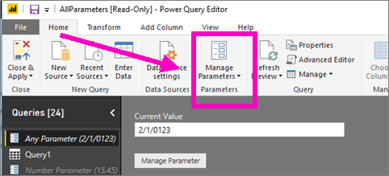
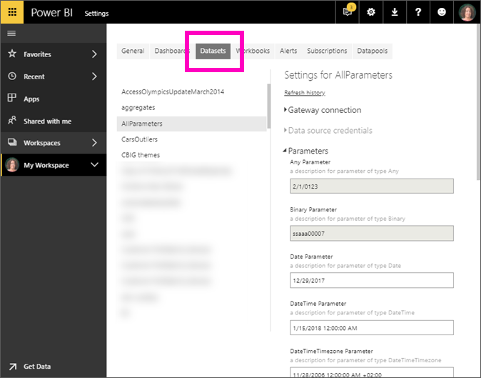

# What is a query parameter?
Query parameters are added in Power BI Desktop by report creators. Parameters allow them to make parts of reports depend on one or more parameter *value*. For example, a report creator may create a parameter that restricts the data to a single countryregion or a parameter that defines acceptable formats for fields like dates, time, and text.

## Review and edit parameters in Power BI service

Once the parameters are defined in Desktop, when that [report is published to Power BI service](desktop-upload-desktop-files.md), the parameter settings and selections travel with that report. Some parameter settings can be reviewed and edited in Power BI service -- not the parameters that restrict the available data, but the parameters that define and describe acceptable values.

1. In Power BI service, select the cog icon  to open **Settings**.

2. Select the tab for **Datasets** and highlight a dataset in the list. 
    
    

3. Expand **Parameters**.  If the selected dataset has no parameters, you'll see a message with a link to Learn more about query parameters. But if the dataset does have parameters, expanding the **Parameters** heading will reveal those parameters. 

    

    Review the parameter settings and make changes if needed. Greyed out fields are not editable. 

## Next steps
An ad-hoc way to add simple parameters is by [modifying the URL](service-url-filters.md).