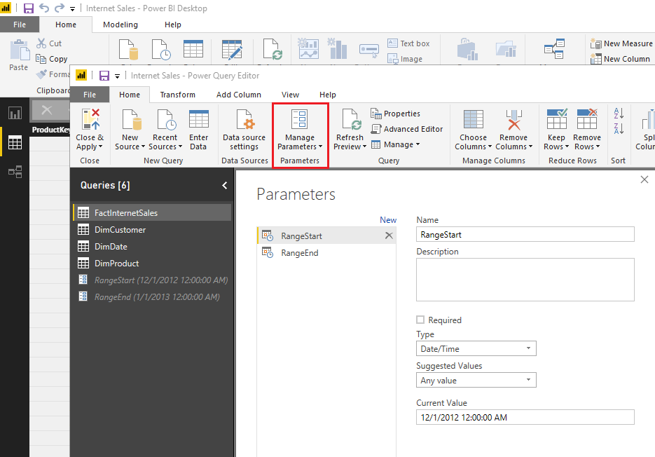

# Incremental refresh in Power BI Premium

Incremental refresh enables very large datasets in the Power BI Premium service with the following benefits:

- **Refreshes are faster.** Only data that has changed needs to be refreshed. For example, refresh only the last 5 days of a 10-year dataset.

- **Refreshes are more reliable.** For example, it is not necessary to maintain long-running connections to volatile source systems.

- **Resource consumption is reduced.** Less data to refresh reduces overall consumption of memory and other resources.

## How to use incremental refresh

Incremental refresh polices are defined in Power BI Desktop and applied once published to the Power BI service.

Start by enabling incremental refresh in preview features.


### Filter large datasets in Power BI Desktop

Large datasets with potentially billions of rows may not fit into Power BI Desktop because it's normally limited by the resources available on the user's desktop PC. Such datasets are therefore commonly filtered upon import to fit into Power BI Desktop. This continues to be the case whether using incremental refresh or not.

#### RangeStart and RangeEnd parameters

To leverage incremental refresh in the Power BI service, filtering needs to be done using Power Query date/time parameters with the reserved, case-sensitive names **RangeStart** and **RangeEnd**.

Once published, the parameter values are overriden automatically by the Power BI service. There is no need to set them in dataset settings in the service.
 
It is important that the filter is pushed to the source system when queries are submitted for refresh operations. This means the data source should support "query folding". Most data sources that support SQL queries support query folding. Data sources such as flat files, blobs, web and OData feeds typically do not. Given the various levels of query-folding support for each data source, it is recommended that you verify the filter logic is included in the source queries. In cases where the filter is not supported by the data source backend, it cannot be pushed down. In such cases, the Mashup Engine will compensate and apply the filter locally, which may require retrieving the full dataset from the data source. This can cause incremental refresh to be very slow, and can run out of resources either in the Power BI service or in the on-premises data gateway if used.

The filter will be used to partition the data into ranges in the Power BI service. It is not designed to support updating this the filtered date column. An update will be interpreted as an insertion and a deletion (not an update). If the deletion occurs in the historical range and not the incremental range, it won’t get picked up. This can cause data refresh failures due to partition-key conflicts.

In the Power Query Editor, select **Manage Parameters** to define the parameters with default values.



With the parameters defined, you can apply the filter by selecting the **Custom Filter** menu option for a column.


Ensure rows are filtered where the column value *is after or equal to* **RangeStart** and *before* **RangeEnd**.


> [!TIP]
> While the data type of the parameters must be date/time, it is possible to convert them to match the requirements of the data source. For example, the following Power Query function converts a date/time value to resemble an integer surrogate key of the form *yyyymmdd*, which is common for data warehouses. The function can be called by the filter step.
>
> `(x as datetime) => Date.Year(x)*10000 + Date.Month(x)*100 + Date.Day(x)`

Select **Close and Apply** from the Power Query Editor. You should have a subset of the dataset in Power BI Desktop.

### Define the refresh policy

Incremental refresh is available on the context menu for tables, except for Live Connection models.


#### Incremental refresh dialog

The incremental refresh dialog is displayed. Use the toggle to enable the dialog.


> [!NOTE]
> If the Power Query expression for the table doesn't refer to the parameters with reserved names, the toggle is disabled.

The header text explains the following:

-   Incremental refresh is supported only for workspaces on Premium capacity. Refresh policies are defined in Power BI Desktop; they are applied by refresh operations in the service.

-   If you are able to download the PBIX file containing an incremental-refresh policy from the Power BI service, it will not open in Power BI Desktop. You will soon be unable to download it at all. While this may be supported in the future, bear in mind that these datasets can grow to be so large that they are impractical to download and open on a typical desktop PC.

#### Refresh ranges

The following example defines a refresh policy to store data for 5 full calendar years plus data for the current year up to the current date, and incrementally refresh 10 days of data. The first refresh operation will load historical data. Subsequent refreshes will be incremental, and (if scheduled to run daily) carry out the following operations.

-   Add a new day of data.

-   Refresh 10 days up to the current date.

-   Remove calendar years that are older than 5 years prior to the current date. For example, if the current date is January 1st 2019, the year 2013 is removed.

The first refresh in the Power BI service may take longer to import all 5 years. Subsequent refreshes may be finished in a fraction of the time.


**Definition of these ranges might be all you need, in which case you can go straight to the publishing step below. The additional dropdowns are for advanced features.**

### Advanced policy options

#### Detect data changes

Incremental refresh of 10 days is of course much more efficient than full refresh of 5 years. However, we may be able to do even better. If you select the **Detect data changes** checkbox, you can select a date/time column used to identify and refresh only the days where the data has changed. This assumes such a column exists in the source system, which is typically for auditing purposes. **This should not be the same column used to partition the data with the RangeStart/RangeEnd parameters.** The maximum value of this column is evaluated for each of the periods in the incremental range. If it has not changed since the last refresh, there is no need to refresh the period. In the example, this could further reduce the days incrementally refreshed from 10 to perhaps 2.


> [!TIP]
> The current design requires that the column to detect data changes is persisted and cached into memory. You may want to consider one of the following techniques to reduce cardinality and memory consumption.
>
> Persist only the maximum value of this column at time of refresh, perhaps using a Power Query function.
>
> Reduce the precision to a level that is acceptable given your refresh-frequency requirements.
>
> We plan to allow the definition of custom queries for data-change detection at a later date. This could be used to avoid persisting the column value altogether.

#### Only refresh complete periods

Let's say your refresh is scheduled to run at 4:00 AM every morning. If data appears in the source system during those 4 hours, you may not want to account for it. Some business metrics -- such as barrels per day in the oil and gas industry -- make no sense with partial days.

Another example is refreshing data from a financial system where data for the previous month is approved on the 12th calendar day of the month. You could set the incremental range to 1 month and schedule the refresh to run on the 12th day of the month. With this option checked, it would for example refresh January data on February 12th.


> [!NOTE]
> Refresh operations in the service run under UTC time. This can determine the effective date and affect complete periods. We plan to add the ability to override the effective date for a refresh operation.

## Publish to the service

Since incremental refresh is a Premium only feature, the publish dialog only allows selection of a workspace on Premium capacity.


You can now refresh the model. The first refresh may take longer to import the historical data. Subsequent refreshes can be much quicker because they use incremental refresh.

## Query timeouts

The [troubleshooting refresh](https://docs.microsoft.com/power-bi/refresh-troubleshooting-refresh-scenarios) article explains that refresh operations in the Power BI service are subject to timeouts. Queries can also be limited by the default timeout for the data source. Most relational sources allow overriding timeouts in the M expression. For example, the expression below uses the [SQL Server data-access function](https://msdn.microsoft.com/query-bi/m/sql-database) to set it to 2 hours. Each period defined by the policy ranges submits a query observing the command timeout setting.

```
let
    Source = Sql.Database("myserver.database.windows.net", "AdventureWorks", [CommandTimeout=#duration(0, 2, 0, 0)]),
    dbo_Fact = Source{[Schema="dbo",Item="FactInternetSales"]}[Data],
    #"Filtered Rows" = Table.SelectRows(dbo_Fact, each [OrderDate] >= RangeStart and [OrderDate] < RangeEnd)
in
    #"Filtered Rows"
```
