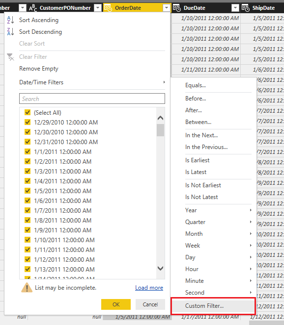
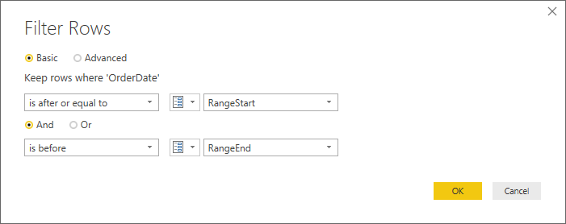

# Incremental refresh in Power BI Premium

Incremental refresh enables very large datasets in the Power BI Premium service with the following benefits:

- **Refreshes are faster.** Only data that has changed needs to be refreshed. For example, refresh only the last 5 days of a 10-year dataset.

- **Refreshes are more reliable.** For example, it is not necessary to maintain long-running connections to volatile source systems.

- **Resource consumption is reduced.** Data is not fully compressed when performing a refresh. Reducing the data to refresh reduces consumption of memory and other resources.

## How to use incremental refresh

Incremental refresh polices are defined in Power BI Desktop and applied once published to the Power BI service.

Start by enabling incremental refresh in preview features.

### Filter large datasets in Power BI Desktop

Large datasets with potentially billions of rows may not fit into Power BI Desktop because it's normally limited by the resources available on the user's desktop PC. Such datasets are therefore commonly filtered upon import to fit into Power BI Desktop. This continues to be the case whether using incremental refresh or not.

#### RangeStart and RangeEnd parameters

To leverage incremental refresh in the Power BI service, filtering needs to be done using Power Query date/time parameters with the reserved names RangeStart and RangeEnd.

In the Power Query Editor, click on Manage Parameters to define the parameters with default values.

With the parameters defined, you can apply the filter by selecting the Custom Filter menu option for a column.

Ensure rows are filtered where the column value *is after or equal to* RangeStart and *before* RangeEnd.

> [!TIP]
> While the data type of the parameters must be date/time, it is possible to convert them to match the specific requirements of the data source. For example, the following Power Query function converts a date/time value to resemble an integer surrogate key of the form *yyyymmdd*, which is common for data warehouses. The function can be called by the filter step.
>
> `(x as datetime) => Date.Year(x)*10000 + Date.Month(x)*100 + Date.Day(x)`

Close and Apply from the Power Query Editor. You should have a subset of the dataset in Power BI Desktop.

### Define the refresh policy.

#### Incremental refresh dialog

The incremental refresh dialog is displayed. Use the toggle to enable the dialog.

> [!NOTE]
> If the Power Query expression for the table doesn't refer to the parameters with reserved names, the toggle is disabled.

The header text explains the following:

-   Incremental refresh is supported only for workspaces on Premium capacity.

-   It is not possible to download the PBIX file containing an incremental-refresh policy from the Power BI service. While this may be supported in the future, bear in mind that these datasets can grow to be so large that they are impractical to download and open on a typical desktop PC.

#### Refresh ranges

The following example defines a refresh policy to store 5 years of data in total, and incrementally refresh 10 days of data. The first refresh may take longer to import all 5 years. Subsequent refreshes may be finished in seconds or minutes.

**Definition of these ranges might be all you need, in which case you can go straight to the publishing step below. The additional dropdowns are for advanced features.**

#### Detect data changes

Incremental refresh of 10 days is of course much more efficient than full refresh of 5 years. However, we may be able to do even better. If you check the Detect data changes checkbox, you can select a date/time column used to identify and refresh only the days where the data has changed. This assumes such a column exists in the source system, which is typically for auditing purposes. The maximum value of this column is evaluated for each of the periods in the incremental range. If it has not changed since the last refresh, there is no need to refresh the period. In the example, this could further reduce the days incrementally refreshed from 10 to perhaps 2.

> [!TIP]
> The current design requires that the column to detect data changes is persisted and cached into memory. You may want to consider one of the following techniques to reduce cardinality and memory consumption.
>
> - Persist only the maximum value of this column at time of refresh, perhaps using a Power Query function.
>
> - Reduce the precision to a level that is acceptable given your refresh-frequency requirements.
>
> - We plan to allow customized polling queries defined using XMLA-endpoint programmability at a later date. This may be used to avoid persisting the column value altogether.

#### Only refresh complete periods

Let's say your refresh is scheduled to run at 4:00 AM every morning. If data appears in the source system during those 4 hours, you may not want to account for it. Some business metrics -- such as barrels per day in the oil and gas industry -- make no sense with partial days.

Another example is refreshing data from a financial system where data for the previous month is approved on the 12th calendar day of the month. You could set the incremental range to 1 month and schedule the refresh to run on the 12th day of the month. With this option checked, it would for example refresh January on February 12th.

> [!NOTE]
> Refresh operations in the service run under UTC time. This can determine the effective date and affect complete periods. We plan to add the ability to override the effective date for a refresh operation.

## Publish to the service

Since incremental refresh is a Premium only feature, the publish dialog only allows selection of a workspace on Premium capacity.

You can now refresh the model. The first refresh may take longer to import the historical data. Subsequent refreshes can be much quicker.

## Related items coming soon

### Update metadata

Once the dataset is published and refreshed, if a change needs to be made to the model or reports, it needs to be republished from Power BI Desktop to the service. The current publish workflow detects when there is already a dataset with the same name and prompts if it should be overwritten. Overwriting a dataset in this way replaces the data within it. This could mean having to reload historical data when making minor changes, which can of course take a while.

We realize this is not the ideal situation, so we plan to provide the ability to update and retain the data if possible. Incremental refresh will stay in public preview until this feature is released.

### Increased dataset size

We plan to soon remove the 10 GB limit in the Power BI service allowing dataset size to be limited only by the Premium capacity. This will allow datasets in the service to grow to sizes comparative with Azure Analysis Services.

### Override effective date

We plan to allow setting the effective date for a refresh operation. This will be useful to use with datasets like Adventure Works that don't have data up to the current date, and for testing purposes.

## Deep dive: how incremental refresh works

This section provides detailed information on how incremental refresh works under the covers.

Like Analysis Services, Power BI uses partitioning for incremental refresh. Once XMLA-endpoints for Power BI Premium are available, the partitions will be visible like with Analysis Services. This [whitepaper](https://github.com/Microsoft/Analysis-Services/blob/master/AsPartitionProcessing/Automated%20Partition%20Management%20for%20Analysis%20Services%20Tabular%20Models.pdf) provides detailed information on partitioning in Analysis Services.

Incremental refresh in Power BI Premium retains the minimum number of partitions to meet refresh policy requirements. Old partitions that go out of range are dropped, maintaining a rolling window. Partitions are opportunistically merged reducing the total number of partitions required. This improves compression and, in some cases, can improve query performance.

The examples provided in this section all share the same refresh policy:

- Store rows in the last **1 Quarter**

- Refresh rows in the last **10 Days**

- Detect data changes = False

- Only refresh complete days = True

The Power BI [Timeline Storyteller](https://timelinestoryteller.com/) visual is used to visualize the partitions. Click through to roll forward the Run Date and see the state of partitions on each date.

### Merge partitions

This example shows that day partitions are automatically merged to the month level once they go outside the incremental range. Partitions in the incremental range need to be maintained at daily grain to allow only those days to be refreshed.

The refresh operation with Run Date 12/12/2016 merges the days in November because they fall outside the incremental range.

**Click on the image to load the Timeline Storyteller visual:**

### Drop old partitions

Old partitions that fall outside the total range, are removed.

The refresh operation with Run Date 1/2/2017 drops the partition for Q3 2016 because it falls outside the total range.

**Click on the image to load the Timeline Storyteller visual:**

### Recovery from prolonged failure

This example simulates how the system recovers gracefully from prolonged failure. Let's say refresh doesn't run successfully because data source credentials expired, and it takes 13 days to resolve. The incremental range is only 10 days.

The next successful refresh operation, with Run Date 1/15/2017, needs to backfill the missing 13 days and refresh them. It also needs to refresh the previous 9 days because they were not refreshed on the normal schedule. In other words, the incremental range is increased from 10 to 22 days.

The next refresh operation, with Run Date 1/16/2017, takes the opportunity to merge the days in December and the months in the Q4 2016.

**Click on the image to load the Timeline Storyteller visual:**

