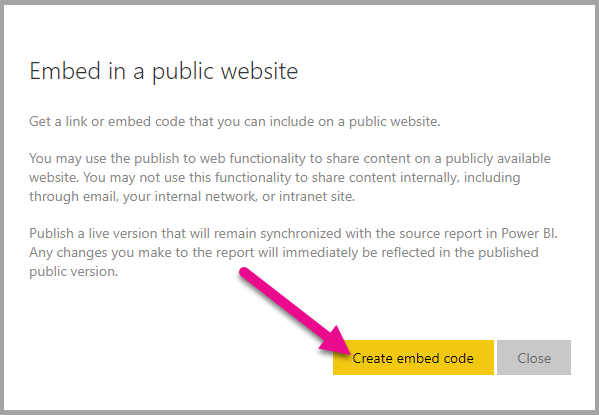
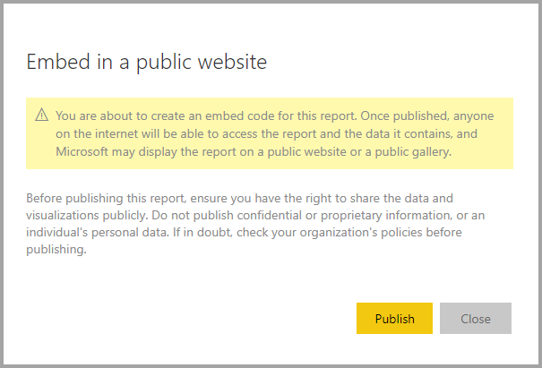
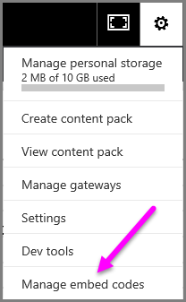
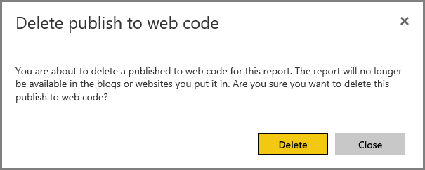

# Publish to web from Power BI

With Power BI's **Publish to web** option, you can easily embed interactive Power BI visualizations online, such as in blog posts, websites, through emails or social media, from any device.

You can also easily edit, update, refresh, or unshare your published visuals.

> [!WARNING]
> When you use **Publish to web**, anyone on the Internet can view your published report or visual. Viewing these reports requires no authentication. This includes detail level data your reports aggregate. Before publishing a report, make sure it is ok for you to share the data and visualizations publicly. Do not publish confidential or proprietary information. If in doubt, check your organization's policies before publishing.

>[!Note]
>To embed your content securely in an internal portal or website, use the [Embed](service-embed-secure.md) or [Embed in SharePoint Online](service-embed-report-spo.md) options. This ensures all permissions and data security is enforced when your users are viewing your internal data.

## How to use Publish to Web

**Publish to web** is available for reports in your personal or group workspaces you can edit.  It isn't available for reports shared with you, or ones relying on row level security to secure data. See the [**Limitations**](#limitations) section below for a complete list of cases where **Publish to web** isn't supported. Review the **Warning** earlier in this article before using **Publish to web**.

The following *short video* shows how this feature works. Then, try it yourself in the steps below.

<iframe width="560" height="315" src="https://www.youtube.com/embed/UF9QtqE7s4Y" frameborder="0" allowfullscreen></iframe>

The following steps describe how to use **Publish to web**.

1. Open a report in your workspace that you can edit and select **File  > Publish to web**.

   

2. Review the dialog content and select **Create embed code**.

   

3. Review the warning, as shown here, and confirm that the data is okay to embed in a public website. If it is, select **Publish**.

   

4. A dialog appears with a link. You can send this link in an email, embed it in code such as an iFrame, or paste it directly into a web page or blog.

   

5. If you previously created an embed code for a report and you select **Publish to web**, you won't see the dialogs in steps 2-4. Instead, the **Embed code** dialog appears:

   

   You can only create one embed code for each report.

## Tips and tricks for view modes

When you embed content within a blog post, you typically need to fit it within a specific screen size.  You can adjust the height and the width in the iFrame tag as needed. However, you need to ensure your report fits within the given iFrame area, so you also need to set an appropriate View Mode when editing the report.

The following table provides guidance about the View Mode, and how it will appear when embedded.

| View Mode | How it looks when embedded |
| --- | --- |
|  |**Fit to page** will respect your report's page height and width. If you set your page to 'Dynamic' ratios like 16:9 or 4:3 your content will scale to fit within the iFrame, you provided. When embedded in an iFrame, using **Fit to page** can result in **letterboxing**, where a gray background is shown in iFrame areas after the content as scaled to fit within the iFrame. To minimize letterboxing, set your iFrame height/width appropriately. |
|  |**Actual size** ensures the report preserves its size as set on the report page. This can result in scrollbars appearing in your iFrame. Set the iFrame height and width to avoid scrollbars. |
|  |**Fit to width** ensures the content fits within the iFrame's horizontal area. A border is still shown, but the content scales to use all the horizontal space available. |

## Tips and tricks for iFrame height and width

A **Publish to web** embed code looks like the following:

 
You can edit the width and height manually to ensure it's precisely how you want it to fit in the page where you're embedding it.

To achieve a more perfect fit, you can try adding 56 pixels to the height dimension of the iFrame. This accommodates the current size of the bottom bar. If your report page uses the Dynamic size, the table below provides some sizes you can use to achieve a fit without letterboxing.

| Ratio | Size | Dimension (Width x Height) |
| --- | --- | --- |
| 16:9 |Small |640 x 416 px |
| 16:9 |Medium |800 x 506 px |
| 16:9 |Large |960 x 596 px |
| 4:3 |Small |640 x 536 px |
| 4:3 |Medium |800 x 656 px |
| 4:3 |Large |960 x 776 px |

## Managing embed codes

Once you create a **Publish to web** embed code, you can manage your codes from the **Settings** menu in Power BI. Managing embed codes includes the ability to remove the destination visual or report for a code (rendering the embed code unusable), or getting the embed code again.

1. To manage your **Publish to web** embed codes, open the **Settings** gear and select **Manage embed codes**.

   

2. Your embed codes appear:

   

3. You can either retrieve or delete an embed code. Deleting it disables any links to that report or visual.

   

4. If you select **Delete**, you’re asked for a confirmation.

   

## Updates to reports, and data refresh

After you create your **Publish to web** embed code and share it, the report is updated with any changes you make. However, it’s important to know that it can take a while for the update to be visible to your users. Updates to a report or visual take approximately one hour to be reflected in **Publish to web** embed codes.

When you initially use **Publish to web** to get an embed code, the embed code link is immediately active and anyone who opens the link can view it.  After the initial **Publish to web** action, later updates to reports or visuals can take approximately one hour to be visible to your users.

To learn more, see the **How it works** section later in this article. If you need your updates to be immediately available, you can delete the embed code and create a new one.

## Data refresh

Data refreshes are automatically reflected in your embedded report or visual. It can take approximately 1 hour for refreshed data to be visible from embed codes. To disable automatic refresh, you can select **don't refresh** on the schedule for the dataset the report uses.  

## Custom visuals

Custom visuals are supported in **Publish to web**. When you use **Publish to web**, users with whom you share your published visual do not need to enable custom visuals to view the report.

## Limitations

**Publish to web** is supported for the vast majority of data sources and reports in the Power BI service, however, the following are **not currently supported or available** with **Publish to web**:

- Reports using row level security.
- Reports using any Live Connection data source, including Analysis Services Tabular hosted on-premises, Analysis Services Multidimensional, and Azure Analysis Services.
- Reports shared to you directly or through an organizational content pack.
- Reports in a group in which you are not an edit member.
- "R" Visuals are not currently supported in **Publish to web** reports.
- Exporting Data from visuals in a report, which has been published to the web.
- ArcGIS Maps for Power BI visuals.
- Reports containing report-level DAX measures.
- Single sign-on data query models.
- [Secure confidential or proprietary information](#publish-to-web-from-power-bi).
- The automatic authentication capability provided with the **Embed** option doesn't work with the Power BI JavaScript API. For the Power BI JavaScript API, use the [user owns data](developer/embed-sample-for-your-organization.md) approach to embedding. Learn more about [user owns data](developer/embed-sample-for-your-organization.md).

## Tenant setting

Power BI administrators can enable or disable the **Publish to web** feature. They can also restrict access to specific groups, which can impact your ability to create an embed code.

|Feature |Enabled for entire organization |Disabled for entire organization |Specific security groups   |
|---------|---------|---------|---------|
|**Publish to web** under report's **File** menu.|Enabled for all|Not visible for all|Only visible for authorized users or groups.|
|**Manage embed codes** under **Settings**|Enabled for all|Enabled for all|Enabled for all  * **Delete** option only for authorized users or groups. * **Get codes** enabled for all.|
|**Embed codes** within admin portal|Status will reflect one of the following: * Active * Not supported * Blocked|Status will display **Disabled**|Status will reflect one of the following: * Active * Not supported * Blocked  If a user is not authorized based on the tenant setting, status will display as **infringed**.|
|Existing published reports|All enabled|All disabled|Reports continue to render for all.|

## Understanding the embed code status column

The **Manage embed codes** page includes a status column. By default, embed codes are **Active**, but could also be one of the statuses listed below.

| Status | Description |
| --- | --- |
| **Active** |The report is available for Internet users to view and interact with. |
| **Blocked** |The report content violates the [Power BI Terms of Service](https://powerbi.microsoft.com/terms-of-service). Microsoft has blocked it. Contact support if you believe the content was blocked in error. |
| **Not supported** |The report's data set is using row level security, or another unsupported configuration. See the [**Limitations**](#limitations) section for a complete list. |
| **Infringed** |The embed code is outside the defined tenant policy. This typically occurs when an embed code was created and then the **Publish to web** tenant setting was changed to exclude the user owning the embed code. If the tenant setting is disabled, or the user is no longer allowed to create embed codes, existing embed codes show an **Infringed** status. |

## How to report a concern with Publish to web content

To report a concern related to **Publish to web** content embedded in a website or blog, use the **Flag** icon in the bottom bar, as shown in the following image. You’ll be asked to send an email to Microsoft explaining your concern. Microsoft will evaluate the content based on the Power BI Terms of Service and take appropriate action.

To report a concern, select the **flag** icon in the bottom bar of the **Publish to web** report you see.

## Licensing and Pricing

You need to be a Microsoft Power BI user to use **Publish to web**. Your report's viewers do not need to be Power BI users.

## How it works (technical details)

When you create an embed code using **Publish to web**, the report is made visible to Internet users. It’s publicly available, so you can expect viewers to easily share the report through social media in the future. As users view the report, either by opening the direct public URL or viewing it embedded in a web page or blog, Power BI caches the report definition and the results of the queries required to view the report. This ensures that thousands of concurrent users can view the report without impacting performance.

The cache is long-lived, so if you update the report definition (for example, if you change its View mode) or refresh the report data, it can take approximately one hour before changes are reflected in the version of the report your users view. It is therefore recommended that you stage your work ahead of time, and create the **Publish to web** embed code only when you’re satisfied with the settings.

## Next steps

- [SharePoint Online report web part](service-embed-report-spo.md) 

- [Embed report in a secure portal or website](service-embed-secure.md)

More questions? [Try the Power BI Community](http://community.powerbi.com/)
