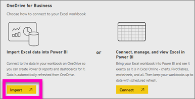
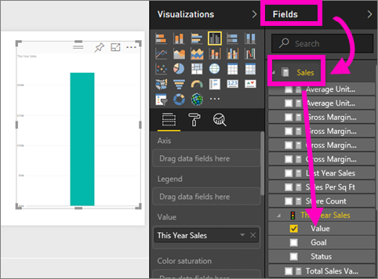

# Create a new report in Power BI service by importing a dataset
You've read [Reports in Power BI](service-reports.md) and now you want to create your own. There are many different ways to create a report, and in this article we'll start by creating a very basic report from an Excel dataset using Power BI service. Once you understand the basics of creating a report, the **Next steps** at the bottom will direct you to more-advanced report topics.  

> **TIP**: To create a report by copying an existing report, see [Copy a report](power-bi-report-copy.md)
> 
### Prerequisites
- Power BI service (for creating reports using Power BI Desktop, see [Desktop report view](desktop-report-view.md) )  
- Retail Analysis sample dataset

## Import the dataset
This method of creating a report starts with a dataset and a blank report canvas. To follow along, [download the Retail Analysis sample Excel dataset](http://go.microsoft.com/fwlink/?LinkId=529778) and save it to OneDrive for Business (preferred) or locally.

1. We'll create the report in a Power BI service workspace, so select an existing workspace or create a new one.
   
   
2. From the bottom of the left navpane, select **Get data**.
   
   
3. Select **Files** and navigate to the location where you saved the Retail Analysis sample.
   
    
4. For this exercise, select **Import**.
   
   
5. Once the dataset is imported, select **View dataset**.
   
   
6. Viewing a dataset actually opens the report editor.  You'll see a blank canvas and the report editing tools.
   
   

> **TIP**: If you're unfamiliar with the report editing canvas, or need a refresher, [Take a tour of the report editor ](service-the-report-editor-take-a-tour.md) before continuing.
> 
> 

## Add a Radial Gauge to the report
Now that our dataset is imported, let's start answering some questions.  Our Chief Marketing Officer (CMO) wants to know how close we are to meeting this year's sales goals. A Gauge is a [good visualization choice](power-bi-report-visualizations.md) for displaying this type of information.

1. In the Fields pane, select **Sales** > **This Year Sales** > **Value**.
   
    
2. Convert the visual to a Gauge by selecting the Gauge template  from the **VIsualizations** pane.
   
    
3. Drag **Sales** > **This Year Sales** > **Goal** to the **Target value** well. Looks like we're very close to our goal.
   
    
4. Now would be a good time to [save your report](service-report-save.md).
   
   

## Add an area chart and slicer to the report
Our CMO has some additional questions for us to answer. She'd like to know how sales this year compare to last year. And, she'd like to see the findings by district.

1. First, let's make some room on our canvas. Select the Gauge and move it into the top-right corner. Then grab and drag one of the corners and make it smaller.
2. Deselect the gauge. In the Fields pane, select **Sales** > **This Year Sales** > **Value** and select **Sales** > **Last Year Sales**.
   
    
3. Convert the visual to an Area chart by selecting the Area chart template  from the **VIsualizations** pane.
4. Select **Time** > **Period** to add it to the **Axis** well.
   
    
5. To sort the visualization by time period, select the ellipses and choose **Sort by Period**.
6. Now let's add the slicer. Select an empty area on the canvas and choose the Slicer     template. This adds an empty slicer to our canvas.
   
        
7. From the Fields pane, select **District** > **District**. Move and resize the slicer.
   
      
8. Use the slicer to look for patterns and insights by District.
   
     

Continue exploring your data and adding visualizations. When you find especially interesting insights, [pin them to a dashboard](service-dashboard-pin-tile-from-report.md).

## Next steps
* [Add a new page to the report](power-bi-report-add-page.md)  
* Learn how to [pin visualizations to a dashboard](service-dashboard-pin-tile-from-report.md)   
* More questions? [Try the Power BI Community](http://community.powerbi.com/)

