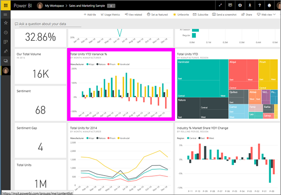
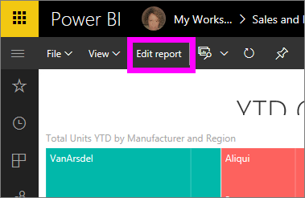
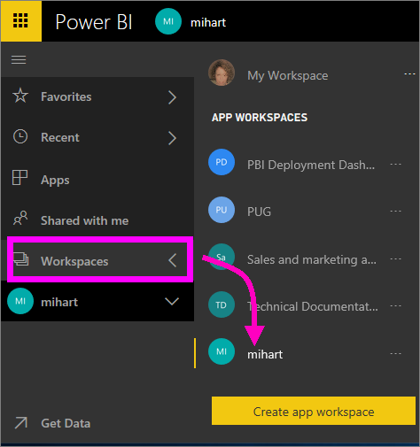
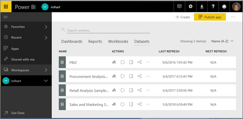
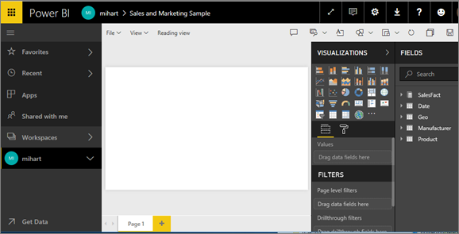

# Open a report in Power BI service (app.powerbi.com)
Reports are available in Power BI service, Power BI Desktop, Power BI mobile and even Power BI embedded. This article applies to opening reports in ***Power BI service***.

In Power BI service there are two modes for viewing and interacting with reports: [Reading view and Editing view](service-reading-view-and-editing-view.md). Reading view is available to all users and designed especially for report *consumers*, while Editing view is only available for report *creators* and owners. 

## Open a report from a workspace (via the **Reports** content view list)

1. Start in a workspace and select the **Reports** tab to display all reports in that workspace.  
   
   
2. Select the report name to open it in Reading view.  
   
    
3. There's [so much you can do in Reading View](service-reading-view-and-editing-view.md).  This sample report has multiple pages, so start exploring by selecting each tab at the bottom of the report canvas. 

## Open a report from a dashboard
There are plenty of other ways to open a report; for example, you could start on a dashboard and select a tile that was created from a report.  Selecting the tile opens the report in Reading view. To follow along, [open the Sales and Marketing sample dashboard](sample-datasets.md).

1. Open a dashboard and select a tile.

   If you select a tile that was [created with Q&A](service-dashboard-pin-tile-from-q-and-a.md), the Q&A screen will open. If you select a tile that was [created using the dashboard **Add tile** widget](service-dashboard-add-widget.md), you'll open the wizard to edit that widget.  

2.  In this example we've selected the "Total Units YTD..." column chart tile.

    

3.  The associated report opens in Reading view. Notice that we're on the "YTD Category" page. This is the report page that contains the column chart we selected from the dashboard.

    

4. Stay in Reading view or select **Edit report** to open the report in Editing view. Remember that only those with edit permissions for that report can open it in Editing view.

    

## Create a brand new report from a dataset
And one more way to open a report is from a dataset. When you start from a dataset, the report canvas will be blank, so this method is recommended for report *creators* who are interested in creating a new report based on a dataset they own. Like the example above, to follow along, download the [Sales and Marketing sample app](sample-datasets.md).

1. Start in the workspace that contains the dataset that you'd like to use as a basis for a report.

   

2. Select the **Datasets** tab to display the list of all datasets in that workspace. This is called the **Datasets** content view list.
   
   

1. Locate the dataset and select the **Create report** icon to open the dataset in Editing view. If you don't have edit permissions for a dataset, you will not be able to open it. 
   
    

3. The dataset opens in the report editor. You'll see the data fields displayed to the right, just waiting for you to start exploring and creating visualizations. 

   

##  Still more ways to open a report
As you get more comfortable navigating Power BI service, you'll figure out workflows that work best for you. A few other ways to access reports:
- From the left navpane using **Favorites**, **Recent**, **Apps**, and **Shared with me**. 
- Using [View related](service-related-content.md)
- In an email when someone [shares with you](service-share-reports.md) or you [set an alert](service-set-data-alerts.md).    
- From your [Notification center](service-notification-center.md)    
- and more

## Next steps
Read more about [reports in Power BI](service-reports.md)

More questions? [Try the Power BI Community](http://community.powerbi.com/)  

