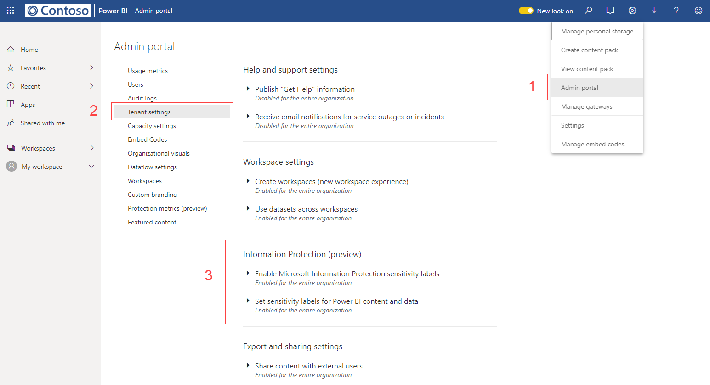
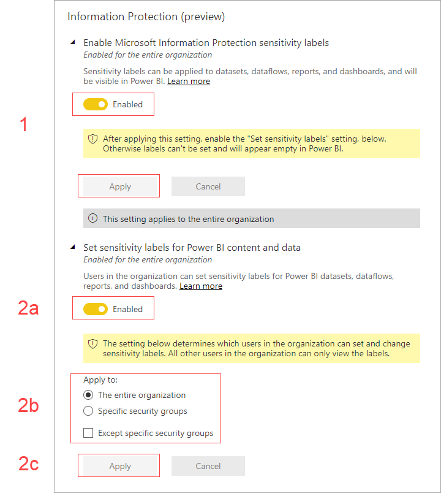

# Enable data sensitivity labels in Power BI (preview)

When [Microsoft Information Protection data sensitivity labels](https://docs.microsoft.com/microsoft-365/compliance/sensitivity-labels) are enabled in Power BI, the following applies:

* Certain users and security groups in an organization can classify and [apply sensitivity labels](service-security-apply-data-sensitivity-labels.md) to their Power BI dashboards, reports, datasets, and dataflows.
* All members of the organization can see those labels.

Data sensitivity labels promote data protection by making Power BI authors and consumers aware of data sensitivity, while providing them information about what the classification means and how data that has that classification should be handled.

When Power BI data that has a data sensitivity label is exported to an Excel, PowerPoint, or PDF file, its data sensitivity label goes with it. This means that a user who doesn’t have permission access to labeled data, because of sensitivity labels policies, won’t be able to open the files outside of Power BI (in Excel, PowerPoint, or PDF apps). 

## Enable data sensitivity labels

To enable the use of Microsoft Information Protection data sensitivity labels in Power BI, go to the Power BI Admin portal, open the Tenant settings pane, and find the Information protection section.

In the Information Protection section, perform the following steps:
1.	Enable the **Enable Microsoft Information Protection sensitivity labels** toggle and press **Apply**. This step *only* makes the sensitivity labels visible to your entire organization; it does not apply any labels. To define who can apply those labels in Power BI, you need to complete Step 2.
2.	Define who can apply and change sensitivity labels in Power BI artifacts. This step involves three actions:
    1.	Enable the **Set sensitivity labels for Power BI content and data** toggle.
    2.	Select the relevant security group(s). By default, everyone in your organization will be able to apply sensitivity labels. However, you can choose to enable setting sensitivity labels only for specific users or security groups.
    With either the entire organization or specific security groups selected, you can exclude specific subsets of users or security groups. When sensitivity labels are enabled for the entire organization, exceptions are typically security groups. When sensitivity labels are enabled only for specific users or security groups, exceptions are typically specific users. This approach makes it possible to prevent certain users from applying sensitivity labels in Power BI, even if they belong to a group that has permissions to do so.
    3.	Press **Apply**.

> [!IMPORTANT]
> Only Power BI pro users who have *create* and *edit* permissions on the artifact, and who are part of the relevant security group that was set in this section, will be able to set and edit the sensitivity labels. Users who are not part of this group won’t be able to set or edit the label. 

## Considerations and limitations

There are a few items to keep in mind when enabling data sensitivity labels. 

If you encounter an error message when trying to enable sensitivity labels, it may be caused by one of the following:

1.  No labels are available in the organization. To learn how to set labels and activate a policy for your organization, visit the [Microsoft security and compliance center](https://sip.protection.office.com/sensitivity?flight=EnableMIPLabels), or [learn more about sensitivity labels](https://docs.microsoft.com/Office365/SecurityCompliance/sensitivity-labels).

2.	Labels are not updated to the Microsoft Information Protection version that is supported by Power BI. You can [learn more](https://docs.microsoft.com/azure/information-protection/configure-policy-migrate-labels) about which version is supported in Power BI.

Licensing considerations:

1.	You must have one of the following Microsoft Information Protection license in order to have sensitivity labels in Power BI:
    * APPI1
    * APP2
    * OFFICE E3/ E5
    * M365 E3/ E5
    * EMS E3/ E5

2.	Users who can set labels on Power BI artifacts must have Power BI Pro license. 

## Next steps

This article described how to enable data sensitivity labels in Power BI. The following articles provide more details about data protection in Power BI. 

* [Overview of data protection in Power BI](service-security-data-protection-overview.md)
* [Apply data sensitivity labels in Power BI](service-security-apply-data-sensitivity-labels.md)
* [Using Microsoft Cloud App Security controls in Power BI](service-security-using-microsoft-cloud-app-security-controls.md)