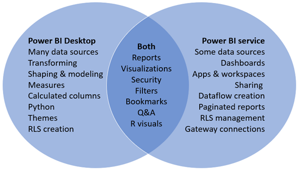

# Comparing Power BI Desktop and the service

In a Venn diagram comparing Power BI Desktop and the Power BI service, the area in the middle of that diagram would show how much the two overlap. Some tasks you can carry out either in Power BI Desktop or the service. But on the two sides of the Venn diagram, the application and the service each have unique features.  

**Power BI Desktop** is a full end-to-end data analysis and report creation tool. When you install the free application on your local computer, you can connect to multiple different sources of data, and combine them (often called modeling) into a data model. The [Power BI Desktop getting started guide](desktop-getting-started.md) walks through the process.

The **Power BI service** is a cloud-based, online service geared towards light report editing and collaboration for teams and corporations. You can connect to data sources in the Power BI service, too, but modeling is limited. 

Most report designers who work on business intelligence projects use **Power BI Desktop** to create reports, and then use the **Power BI service** to share their reports with others.

## Report editing

In both the application and the service, you can build and edit *reports*. A report can have one or many pages, with visuals and collections of visuals. You can add bookmarks, buttons, filters, and drillthrough, to enhance navigation in your reports.

The report editors in Power BI Desktop and in the service are similar. They're made up of three sections:  

1. The top navigation bars, different in Power BI Desktop and the service    
2. The report canvas     
3. The **Fields**, **Visualizations**, and **Filters** panes

This video shows the report editor in Power BI Desktop. 

<iframe width="560" height="315" src="https://www.youtube.com/embed/IkJda4O7oGs" frameborder="0" allowfullscreen></iframe>

## Collborating in the Power BI service

After you've created your reports, you can save them to a *workspace* in the **Power BI service**, where you and your colleagues can collaborate. You can build *dashboards* on top of those reports. Then you share those dashboards and reports with report consumers inside and outside your organization. Your report consumers view them in the Power BI service in [Reading view](consumer/end-user-reading-view.md), not Editing view. They don't have access all the features available to report creators. 

## Next Steps

[What is Power BI Desktop?](desktop-what-is-desktop.md)

[Create a report](service-report-create-new.md) in the Power BI service

[Basic concepts for report designers](service-basic-concepts.md)

More questions? [Try the Power BI Community](http://community.powerbi.com/)

