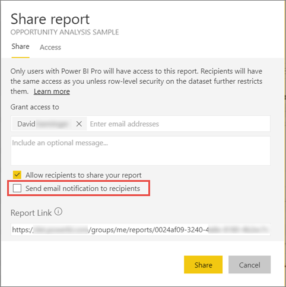

# Share a filtered Power BI report with your coworkers
*Sharing* is a good way to give a few people access to your dashboards and reports. Power BI also offers [several other ways to collaborate and distribute your reports](service-how-to-collaborate-distribute-dashboards-reports.md).

With sharing, you and your recipients need a [Power BI Pro license](service-free-vs-pro.md), or the content needs to be in a [Premium capacity](service-premium.md). Suggestions? The Power BI team is always interested in your feedback, so go to the [Power BI Community site](https://community.powerbi.com/).

You can share a report with coworkers in the same email domain as you, from most places in the Power BI service: your Favorites, Recent, Shared with me (if the owner allows it), My Workspace, or other workspaces. When you share a report, those you share it with can view it and interact with it, but can't edit it. They see the same data that you see in the report, unless [row-level security (RLS)](service-admin-rls.md) is applied. 

## Filter and share a report
What if you want to share a filtered version of a report? Maybe a report that only shows data for a specific city or salesperson or year. You do this by creating a custom URL.

1. Open the report in [Editing view](service-reading-view-and-editing-view.md), apply the filter, and save the report.
   
   In this example we're filtering the [Retail Analysis sample](sample-tutorial-connect-to-the-samples.md) to show only values where **Territory** equals **NC**.
   
   
2. Add the following to the end of the report page URL:
   
   ?filter=*tablename*/*fieldname* eq *value*
   
    The field must be of type **string** and neither *tablename* or *fieldname* can contain spaces.
   
   In our example, the name of the table is **Store**, the name of the field is **Territory**, and the value we want to filter on is **NC**:
   
    ?filter=Store/Territory eq 'NC'
   
   
   
   Your browser adds special characters to represent slashes, spaces, and apostrophes, so you end up with:
   
   app.powerbi.com/groups/me/reports/010ae9ad-a9ab-4904-a7a1-xxxxxxxxxxxx/ReportSection2?filter=Store%252FTerritory%20eq%20%27NC%27

3. [Share the report](service-share-dashboards.md), but clear the **Send email notificaton to recipients** check box. 

    

4. Send the link with the filter that you created earlier.

## Next steps
* Have feedback? Go to the [Power BI Community site](https://community.powerbi.com/) with your suggestions.
* [How should I collaborate on and share dashboards and reports?](service-how-to-collaborate-distribute-dashboards-reports.md)
* [Share a dashboard](service-share-dashboards.md)
* More questions? [Try the Power BI Community](http://community.powerbi.com/).

