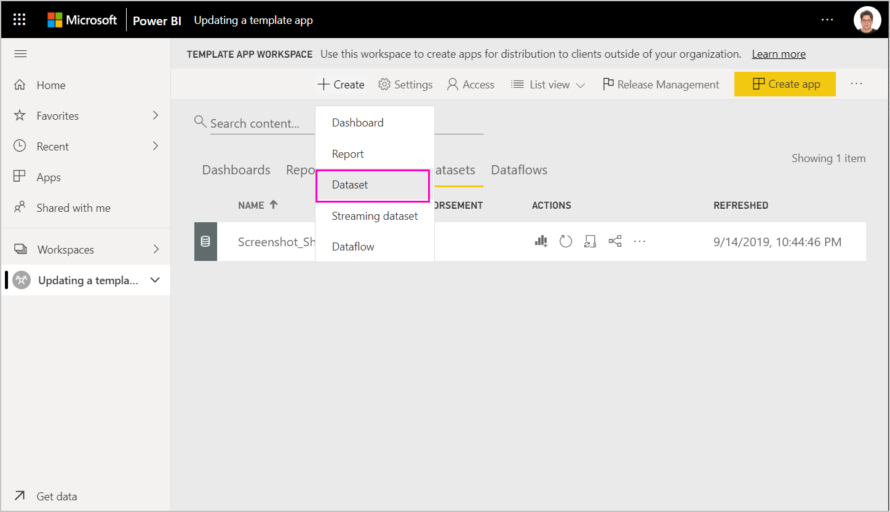
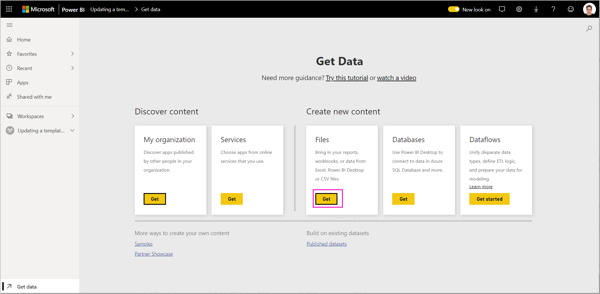
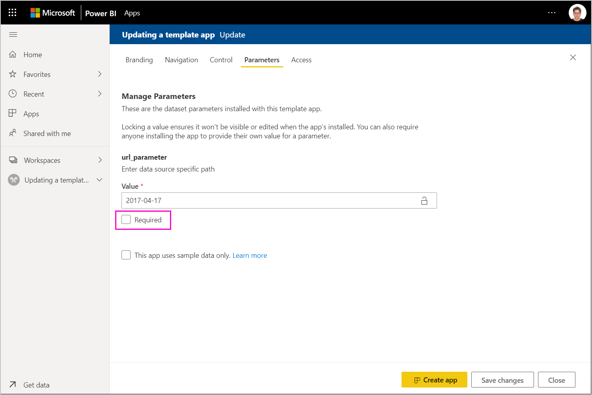
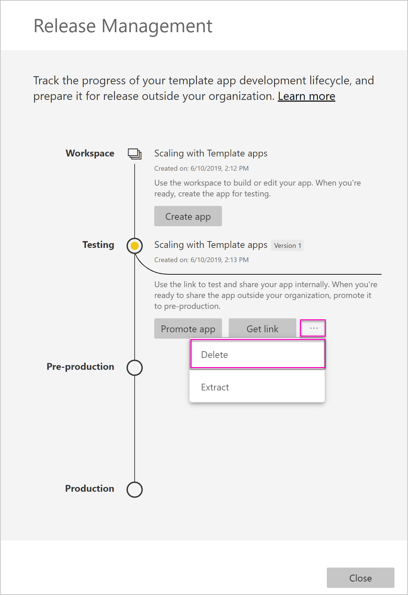

# Update, delete, and extract template app

Now that your app is in production, you can start over in the test phase, without disrupting the app in production.
## Update your app

1. In case you have made the changes in the Power BI desktop otherwise start from step (4), upload the updated dataset and overwrite the existing dataset. **Make sure to use the exact same dataset name** (using a different name will create a new dataset for users that are updating the app).

1. Import the pbix file from your computer.

1. Confirm overwrite.

1. In the **Release management** pane, select **Create app**.
1. Go back through the app creation process.
1. After you've set **Branding**, **Content**, **Control**, and **Access**, you again select **Create app**.
1. Select **Close** and go back to **Release management**.

   You see you have two versions now: The version in production, plus a new version in testing.

    

5. When you're ready to promote your app to pre-production for further testing outside your tenant, go back to the Release Management pane and select **Promote app** next to **Testing**.
6. Your link is now live. Submit it again to the Cloud Partner Portal (CPP) by following the steps at [Power BI App offer update](https://docs.microsoft.com/azure/marketplace/cloud-partner-portal/power-bi/cpp-update-existing-offer).
7. In Cloud Partner Portal, you must **publish** your offer again as well as have it validated again.

   >[!NOTE]
   >Promote your app to production stage only after your app is approved by Cloud Partner Portal and you publish it.

### Update behavior

1. Updating the app will allow the installer of the template app to [Update a template app](service-template-apps-install-distribute.md#update-a-template-app) the already installed workspace without losing the connection configuration.
1. See installer [overwrite behavior](service-template-apps-install-distribute.md#overwrite-behavior) to learn how changes in the dataset effects installed template app.
1. Updating a template app will attempt to automatically reconnect the app with user's configuration.
1. If you added a new query parameter to the updated dataset that requires users input - you must check the *required* check box to prompt input from the installer upon updating the app.
 

## Extract workspace
Rolling back to the previous version of a template app is now easier than ever with the extract capability. The following steps will extract a specific app version from various release stages into a new workspace:

1. In the release management pane, press more **(...)** and then **Extract**.

    
    
2. In dialog box, enter the name for extracted workspace. a new workspace will be added.

Your new workspace versioning resets and you can continue to develop and distribute the template app from the newly extracted workspace.

## Delete template app version
A template app workspace is the source of an active distributed template app. To protect the template app users, it's not possible to delete a workspace without first removing all the created app versions in the workspace.
Deleting an app version also deletes the app url that will no longer work.

1. In the release management pane, press select the ellipsis **(...)** and then **Delete**.
 
 

>[!NOTE]
>Make sure not to delete app version which are being used by customers or **AppSource** or they will no longer work.

## Next steps

See how your customers interact with your template app in [Install, customize, and distribute template apps in your organization](service-template-apps-install-distribute.md).

See the [Power BI Application offer](https://docs.microsoft.com/azure/marketplace/cloud-partner-portal/power-bi/cpp-power-bi-offer) for details on distributing your app.
