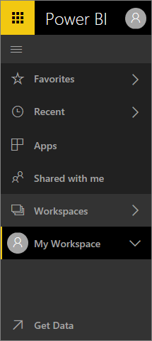
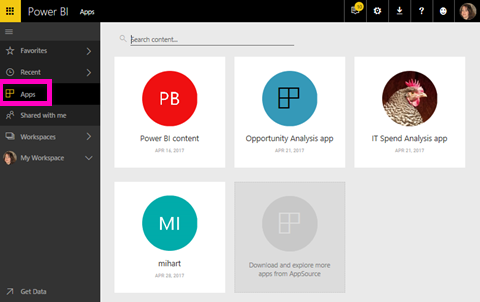
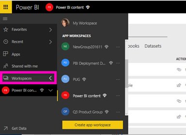

# Getting around in Power BI service
## The left navigation pane

**Quick reference guide**

| Action | New (current) path |
| --- | --- | --- |
| Favorite a dashboard or report |Workspace > Dashboards or Workspace > Reports and select the star icon to turn it yellow |
| Favorite an app | Select **Apps** from left navpane and select star next to app name
| View a list of your favorites |Select **Favorites** from left navpane |
| View a list of recently-visited dashboards and reports |Select **Recent** from left navpane |
| View a list dashboards that have been shared with you |Select **Shared with me** from left navpane |
| Share a dashboard |Open dashboard and select **Share** or create and publish an app |
| Delete a dashboard |My workspace > Dashboards > trashcan icon |
| Delete a report |My workspace > Reports > trashcan icon |
| Delete a dataset |My workspace > Datasets > ... > Delete |
| Open a dashboard |Workspace > Dashboards > and select the name of the dashboard |
| Open a report |Workspace > Reports > and select the name of the report |
| Open a dataset |Workspace > Datasets > and select the name of the dataset |
| Create a dashboard |From the top navbar select Create > Dashboard |
| Create a report |From the top navbar select Create > Report |
| Create a dataset |From the top navbar select Create > Dataset |
| Create an app |Workspaces > Create app workspace |
| View a list of all the dashboards, reports, and datasets that you own |Workspaces > My workspace |

## Common tasks

Watch Amanda take you on a tour of the Power BI service navigation experience.  Then follow the step-by-step instructions below the video to explore for yourself.

<iframe width="560" height="315" src="https://www.youtube.com/embed/G26dr2PsEpk" frameborder="0" allowfullscreen></iframe>

## View content (dashboards, reports, workbooks, datasets, workspaces, apps)
Let's start by looking at how the basic content (dashboards, reports, datasets, workbooks) is organized. Before this, all of your content was listed in the left navigation pane. Now, you still have that option, but the default is to display by content type within the context of a workspace. Select a workspace from the left navigation pane (left navpane) and the tabs for the associated content (dashboards, reports, workbooks, datasets) fill the Power BI canvas to the right.

If you have Power BI Free, you'll only see one workspace -- **My Workspace**.

### Favorite dashboards, reports, and apps
**Favorites** lets you quickly access content that is most important to you.  

1. With the dashboard or report open, select **Favorite** from the upper right corner.
   
   
   
   **Favorite** changes to **Unfavorite** and the star icon becomes yellow.
   
   

2. For an app, select **Apps** from the left navpane, hover over the app and choose the star to set it as a favorite.

2. To display a list of all the content that you have added as favorites, in the left navpane, select the arrow to the right of **Favorites**. Because the left navpane is a permanent feature of Power BI service, you have access to this list from anywhere in Power BI service.
   
    
   
    From here you can select a dashboard, report, or app to open it.

3. To open the **Favorites** pane, in the left navpane, select **Favorites** or select the Favorites icon .
   
   
   
   From here you can open, find the content, unfavorite, or share content with colleagues.

1. Another way to mark either a dashboard or report as a favorite is from the **Dashboards** or **Reports** workspace tab.  Just open the workspace to display the content view, and select the star icon to the left of the name.
   
   

To learn more, see [Favorites](service-dashboard-favorite.md)

### Recents
Quickly get to the content that you’ve most recently accessed by visiting the **Recents** pane. This includes content from across all of your workspaces.

  

Similar to Favorites, you can quickly access your recents from anywhere in Power BI service by selecting the arrow next to **Recents** in the left navpane.

  

To learn more, see [Recents in Power BI](service-recent.md)

### Apps
An app is a collection of dashboards and reports built to deliver key metrics, all in one place. You can have apps internal to your organization, and also [apps for external services](service-connect-to-services.md) such as Google Analytics and Microsoft Dynamics CRM. 

To learn more, see **App workspaces** (below) and [What are Power BI apps](service-install-use-apps.md).

### Shared with me
**Shared with me** is the location for all content that colleagues have shared with you.  Filter by dashboard owner, use the search field to find what’s relevant, and sort the items by date.  And for shared content you visit frequently, it's even easier to favorite it right from the **Shared with me** view.

To learn more, see [Shared with me](service-shared-with-me.md)

### Working with workspaces
Next in the left nav is *workspaces*. Workspaces can be thought of as *containers* for Power BI content. There are two types of workspaces: **My Workspace** and App workspaces.

If you are not a member of an app workspace or an admin, you may not see any app workspaces in your left nav. And if you are a Power BI Free customer, you will not see any app workspaces.

#### My Workspace
**My Workspace** stores all the content that you own. Think of it as your personal sandbox or work area for your own content. You can share content from My Workspace with colleagues. Within My Workspace, your content is organized into 4 tabs: Dashboards, Reports, Workbooks, and Datasets.

#### App workspaces
Apps and app workspaces are a feature of Power BI Pro. If you are someone who authors dashboards and reports for others, you'll use app workspaces to do this. An app workspace is the place where you'll create the app, so to create an app, you'll first need to create the app workspace. They’re the evolution of group workspaces – staging areas and containers for the content in the app.  You and your colleagues can collaborate on dashboards, reports, and other content that you plan to distribute to a wider audience, or even your entire organization.

To learn more, visit [Create and distribute an app in Power BI](service-create-distribute-apps.md#app-workspaces).

As with **My Workspace**, your content is organized into 4 tabs: Dashboards, Reports, Workbooks, and Datasets.

Switch workspaces by selecting **Workspaces** in the left navpane.

### Search and sort content
The content view makes it easier to search, filter and sort your content. To search for a dashboard, report or workbook, type in the search area. Power BI filters to only the content that has your search string as part of the name.

You can also sort the content by name or owner.  

To learn more, see [Power BI navigation: search, sort, filter](service-navigation-search-filter-sort.md)

## Next steps
Power BI service [Basic concepts](service-basic-concepts.md)    

Have questions or feedback? [Visit the Power BI community forum](http://community.powerbi.com/t5/Navigation-Preview-Forum/bd-p/NavigationPreview)

