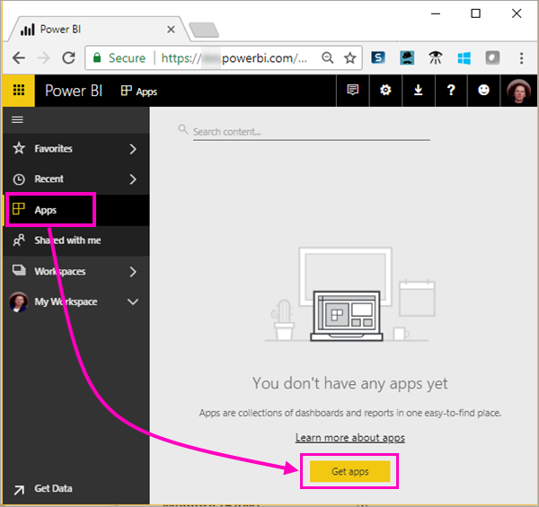
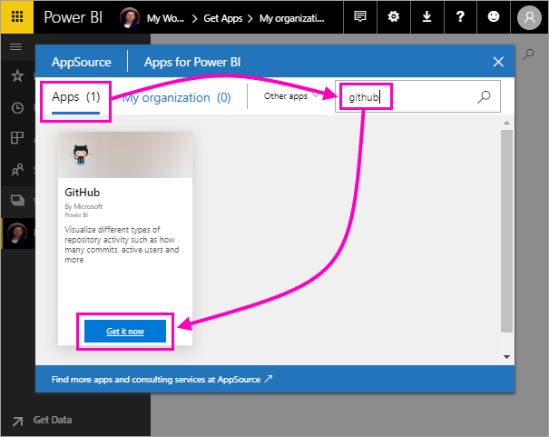
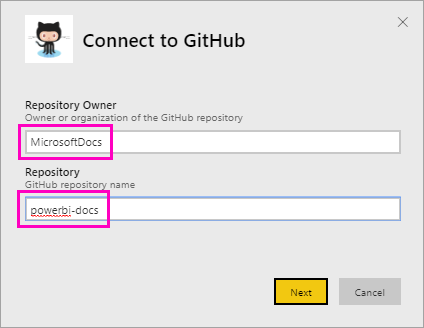
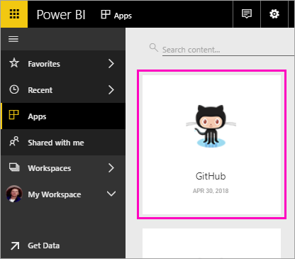
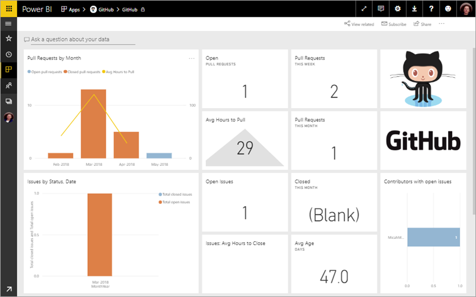
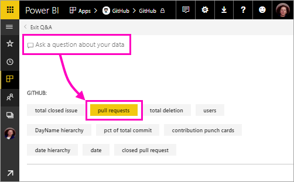
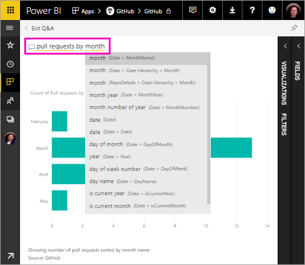
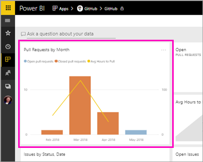

# Tutorial: Connect to the online service GitHub with Power BI
In this tutorial, you connect to real data in the GitHub service. You'll connect to the Power BI content public repository (also known as repo) and see data for contributions, issues, pull requests, and active users. Power BI starts by using your credentials to connect to the service, and then creates a Power BI app with a dashboard and a set of Power BI reports that automatically show your data and provide visual insights about your business.

In this tutorial, you'll complete the following steps:

> [!div class="checklist"]
> * Sign up for a GitHub account, if you don't have one yet 
> * Sign in to your Power BI account, or sign up, if you don't have one yet
> * Open the Power BI service and go to AppSource
> * Find the GitHub app in AppSource
> * Enter the information for the Power BI public GitHub repo
> * View the dashboad and report that Power BI has created with GitHub data
> * Clean up resources by deleting the app

If you're not signed up for Power BI, [sign up for a free trial](https://app.powerbi.com/signupredirect?pbi_source=web) before you begin.

## Prerequisites

To complete this tutorial, you need a GitHub account. 

- 

## How to connect
1. Sign in to the Power BI service (http://powerbi.com). 
2. In the left navigation pane, select **Apps**, then **Get apps**.
   
    

3. Select **Apps**, type **github** in the search box > **Get it now**.
   
    

4. Enter the repository name and repository owner of the repo. The URL for this repo is https://github.com/MicrosoftDocs/powerbi-docs, so **Repository Owner** is **MicrosoftDocs**, and **Repository** is **powerbi-docs**. 
   
    

5. Enter the GitHub credentials you created. Power BI might skip this step if you're already signed in to GitHub in your browser. 

6. For **Authentication Method**, select **oAuth2** \> **Sign In**.

7. Follow the Github authentication screens. Grant Power BI permission to the GitHub data.
   
   Now Power BI can connect with GitHub and connect to the data.  The data is refreshed once a day.

8. After Power BI imports the data, select the new GitHub tile. 
 
    

8. Select the global navigaton icon to minimize the left navigation, so you have more room for the dashboard.

    

10. Select the tile to open the GitHub dashboard.

    

    This is live data, so the values may be different.

11. Put your cursor in **Ask a question about your data**, then select **pull requests**. 

    

12. Type **by month**.
 
    

     Power BI creates a bar chart showing the number of pull requests per month.

13. Select **Exit Q&A**, then select the  combo column-and-line chart Pull Requests by Month to open the related report.

    
   

**What now?**

* [Select a tile](service-dashboard-tiles.md) to open the underlying report.
* While your dataset will be schedule to refreshed daily, you can change the refresh schedule or try refreshing it on demand using **Refresh Now**

## What's included
The following data is available from GitHub in Power BI:     

| Table name | Description |
| --- | --- |
| Contributions |The contributions table gives the total additions, deletions and commits authored by the contributor aggregated per week. The top 100 contributors are included. |
| Issues |List all issues for the selected repo and it contains calculations like total and average time to close an issue, Total open issues,  Total closed issues. This table will be empty when there are no issues in the repo. |
| Pull requests |This table contains all the Pull Requests for the repo and who pulled the request. It also contains calculations around how many open, closed and total pull requests, how long it took to pull the requests and how long the average pull request took. This table will be empty when there are no issues in the repo. |
| Users |This table provides a list of GitHub users or contributors who have made contributions, filed issues or solved Pull requests for the repo selected. |
| Milestones |It has all the Milestones for the selected repo. |
| DateTable |This tables contains dates from today and for years in the past that allow you to analyze your GitHub data by date. |
| ContributionPunchCard |This table can be used as a contribution punch card for the selected repo. It shows commits by day of week and hour of day. This table is not connected to other tables in the model. |
| RepoDetails |This table provides details for the repo selected. |

## System requirements
* The GitHub account that has access to the repo.  
* Permission granted to the Power BI for GitHub app during first login. See details below on revoking access.  
* Sufficient API calls available to pull and refresh the data.  

### De-authorize Power BI
To de-authorize Power BI from being connected to your GitHub repo you can Revoke access in GitHub. For more details see this [GitHub help](https://help.github.com/articles/keeping-your-ssh-keys-and-application-access-tokens-safe/#reviewing-your-authorized-applications-oauth) topic.

## Finding parameters
You can determine the owner and repository by looking at the repository in GitHub itself:

The first part "Azure" is the owner and the second part "azure-sdk-for-php" is the repository itself.  You see these same two items in the URL of the repository:

    <https://github.com/Azure/azure-sdk-for-php> .

## Troubleshooting
If necessary, you can verify your GitHub credentials.  

1. In another browser window, go to the GitHub web site and log in to GitHub. You can see you’re logged in, in the upper-right corner of the GitHub site.    
2. In GitHub, navigate to the URL of the repo you plan to access in Power BI. For example: https://github.com/dotnet/corefx.  
3. Back in Power BI, try connecting to GitHub. In the Configure GitHub dialog box, use the names of the repo and repo owner for that same repo.  

## Next steps
* [Get started with Power BI](service-get-started.md)
* [Get data](service-get-data.md)

Connect to the [GitHub content pack](https://app.powerbi.com/getdata/services/github) or read more about the [GitHub integration](https://powerbi.microsoft.com/integrations/github) with Power BI.

