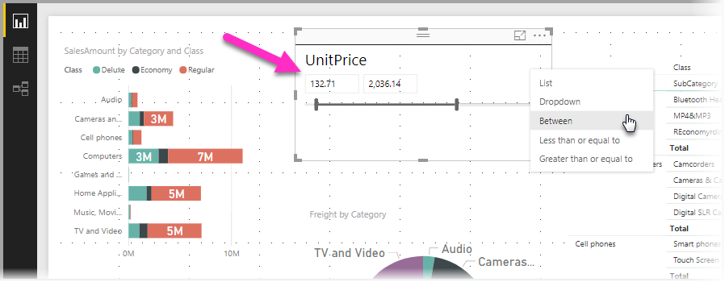
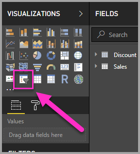
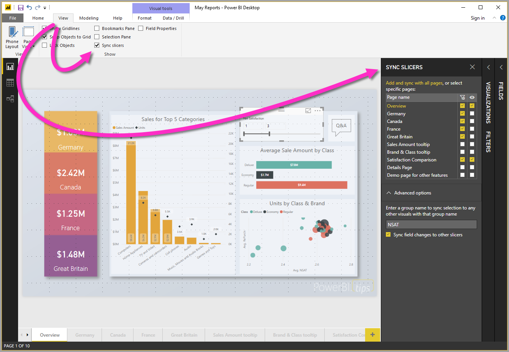
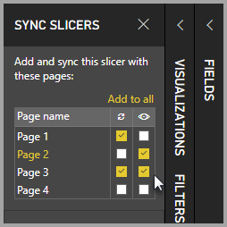
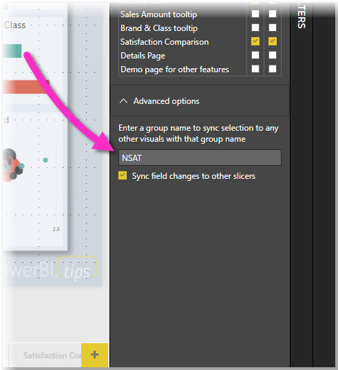
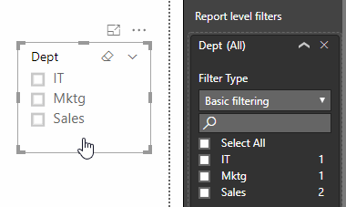

# Using slicers Power BI Desktop

You can use a **slicer** in **Power BI Desktop** to filter the results of visuals on your report page. And with slicers, you can easily adjust the filter that's applied by interacting with the slicer itself. You can also specify options for how your slicer appears, and how you interact with it. The following image shows a slicer, with its *type* drop-down visible. 

A slicer can be shown from one of various types:

* List
* Dropdown
* Between
* Less than or equal to
* Greater than or equal to

You can add a slicer to a report by clicking on the **slicer** visual in the **Visualizations** pane.

Slicers behave similarly in both **Power BI Desktop** and the **Power BI service**. For an article  about using slicers, see [slicers in the Power BI service](power-bi-visualization-slicers.md).

## Synchronize slicers across report pages

In **Power BI Desktop** you can synchronize slicers across multiple report pages. To synchronize slicers, in the **View** pane in the ribbon, select **Sync slicers**. When you synchronize slicers, the **Sync Slicers** pane appears, as shown in the following image.

In the **Sync Slicers** pane, you can specify how the slicer should be synchronized across report pages. You can specify whether each slicer should be **applied** to each individual report page, and whether the slicer should be **visible** on each individual report page.

For example, you can place a slicer on **Page 2** of your report, as shown in the following image. You can then select whether that slicer should *apply* to each selected page, and whether that slicer should be *visible* on each selected page in the report. You can apply any combination of those, for each slicer. 

Using the **Add to all** link in the pane applies the selected slicer to all pages in the report.

Note that the selections shown on the **Sync Slicers** pane applies to the *selected slicer* only. You can apply multiple slicers to various pages and use the pane to define how each slicer is individually applied across the various pages in your report. 

While your selection of slicers can be synchronized, other selections such as styling, editing, and deleting are *not* synchronized. 

## Advanced options for slicers

You can also apply a **group name** to a collection of slicers in the **Advanced options** section of the **Sync slicers** pane, and have slicers that share the same group be synchronized across pages. 

This feature lets you create a custom group of slicers to keep synchronized. A default name is provided, but you can use any name you prefer. 

The group name provides additional flexibility with slicers. You can create separate groups to sync slicers that use the same field, or put slicers that use different fields into the same group. 

## How filtering affects selection in slicers

If you make a selection in a slicer and then apply a filter that would normally remove the selected item, it remains at the bottom of the list of items in the slicer. If the filter is removed, the selection is still there in the slicer. You'll notice that if you unselect the item from the slicer it disappears from the list.

## Next steps

You might also be interested in the following articles:

* [Slicers in the Power BI service](power-bi-visualization-slicers.md)
* [Use the numeric range slicer in Power BI Desktop](../desktop-slicer-numeric-range.md)
* [Use a relative date slicer and filter in Power BI Desktop](desktop-slicer-filter-date-range.md)

