# ArcGIS Maps in Power BI Desktop

[!INCLUDE [power-bi-visuals-desktop-banner](../includes/power-bi-visuals-desktop-banner.md)]

This tutorial is written from the point of view of a person creating an ArcGIS Map for Power BI. Once a *designer* shares an ArcGIS Map for Power BI map with a colleague, that colleague can view and interact with the map but not save changes. To learn more about viewing an ArcGIS map, see [Interacting with ArcGIS Maps for Power BI](power-bi-visualizations-arcgis.md).

The combination of ArcGIS maps and Power BI takes mapping beyond the presentation of points on a map to a whole new level. Choose from base maps, location types, themes, symbol styles, and reference layers to create gorgeous informative map visualizations. The combination of authoritative data layers on a map with spatial analysis conveys a deeper understanding of the data in your visualization.

 While you cannot create an ArcGIS Maps for Power BI map on a mobile device, you can view and interact with it. See [Interacting with ArcGIS maps](power-bi-visualizations-arcgis.md).

> [!TIP]
> GIS stands for Geographic Information Systems.

The example below uses a dark gray canvas to show regional sales as a heatmap against a demographic layer of 2016 median disposable income. As you'll see as you read on, using  ArcGIS Maps for Power BI offers almost limitless enhanced mapping capability, demographic data, and even-more compelling map visualizations so you can tell your best story.

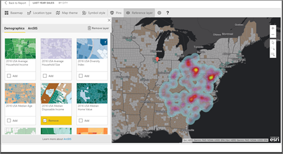

> [!TIP]
> Visit [esri's page on ArcGIS Maps for Power BI](https://www.esri.com/powerbi) to see many examples and read testimonials. And then see esri's [ArcGIS Maps for Power BI Getting Started page](https://doc.arcgis.com/en/maps-for-powerbi/get-started/about-maps-for-power-bi.htm).

## User consent
ArcGIS Maps for Power BI is provided by Esri (www.esri.com). Your use of ArcGIS Maps for Power BI is subject by Esri's terms and privacy policy. Power BI users wishing to use the ArcGIS Maps for Power BI visuals, need to accept the consent dialog.

**Resources**

[Terms](https://go.microsoft.com/fwlink/?LinkID=826322)

[Privacy Policy](https://go.microsoft.com/fwlink/?LinkID=826323)

[ArcGIS Maps for Power BI product page](https://www.esri.com/powerbi)

 

## Prerequisites

This tutorial uses Power BI Desktop and the PBIX [Retail Analysis sample](http://download.microsoft.com/download/9/6/D/96DDC2FF-2568-491D-AAFA-AFDD6F763AE3/Retail%20Analysis%20Sample%20PBIX.pbix
). ArcGIS Maps for Power BI can also be created using the Power BI service. 

1. From the upper left section of the menu bar, select **File** \> **Open**
   
2. Find the **Retail Analysis sample PBIX file** saved on your local machine.

1. Open the **Retail Analysis Sample** in report view .

1. Select  to add a new page.

   
## Create an ArcGIS Maps for Power BI map visualization

Watch Will create a few different visualizations and then use the steps below to try it out yourself using the [Retail Analysis sample .PBIX file](../sample-datasets.md) file.
   > [!NOTE]
   > This video uses an older version of Power BI Desktop.
   > 
   > 
<iframe width="560" height="315" src="https://www.youtube.com/embed/EKVvOZmxg9s" frameborder="0" allowfullscreen></iframe>
 
1. Select the ArcGIS Maps for Power BI icon from the Visualizations pane.
   
    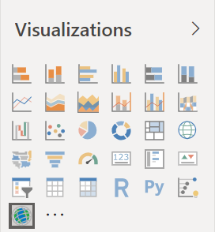
4. Power BI adds an empty template to the report canvas. For this tutorial we'll be using the free version.
   
   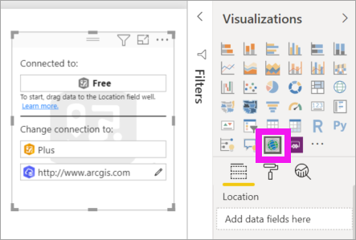

1. From the **Fields** pane, drag a data field to the **Location** or **Latitude** and/or **Longitude** buckets. In this example we're using **Store > City**.
   
   > [!NOTE]
   > ArcGIS Maps for Power BI will automatically detect if the fields you've selected are best viewed as a shape or a point on a map. You can adjust the default in the settings (see below).
   > 
   > 
   
    

3. From the **Fields** pane, drag a measure to the **Size** bucket to adjust how the data is shown. In this example we're using **Sales > Last Year Sales**.
   
    

You've created your first ArcGIS Map for Power BI map. Now, let's refine and format our map using base maps, location types, themes, and more.

## Settings and formatting for ArcGIS Maps for Power BI
To access **ArcGIS Maps for Power BI** formatting features:

1. Access additional features by selecting **More actions** (...) in the upper right corner of the visualization and choosing **Edit**.
   
   
   
   The visualization expands and the available features display across the top. Each feature, when selected, opens a task pane that provides detailed options. 
   
   
   

> [!TIP]
> **Esri** provides [comprehensive documentation](https://go.microsoft.com/fwlink/?LinkID=828772) on the feature set of **ArcGIS Maps for Power BI**.

### Base maps
Four base maps are provided: Dark Gray Canvas, Light Gray Canvas, OpenStreetMap, and Streets.  *Streets* is the ArcGIS standard base map.

To apply a base map select it in the task pane.

### Location type
ArcGIS Maps for Power BI automatically detect the best way to show data on the map. It selects from points or boundaries. The Location type options allow you to fine tune these selections.

**Boundaries** will only work if your data contains standard geographic values. ArcGIS Maps for Power BI automatically figures out the shape to show on the map. Standard geographic values include countries, provinces, zip codes, etc. But just like with GeoCoding, Power BI may not detect that a field should be a boundary by default, or it may not find a boundary for your data.  

### Map theme
Four map themes are provided. Power BI automatically selects either **Location only** or **Size** themes, based on the field(s) you added to the **Location** and **Size** buckets. Our map has defaulted to **Size**, since we added fields to both buckets. Try out the other themes and return to **Size** before moving on to the next step.  

<table>
<tr><th>Theme</th><th>Description</th>
<tr>
<td>Location Only</td>
<td>Plots data points or filled boundaries on the map based on the field you added to the Location bucket.</td>
</tr>
<tr>
<td>Heat Map</td>
<td>Plots the intensity of data on the map. Areas of higher activity or value are represented by stronger and glowing colors. </td>
</tr>
<tr>
<td>Size</td>
<td>Plots data points on the map based on the field you added to the Size bucket.</td>
</tr>
<tr>
<td>Clustering</td>
<td>Points within the specified cluster radius are grouped into a single symbol that represents the number of points in that area of the map. </td>
</tr>
</table>

### Symbol style
Symbol styles enable you to fine tune how data is presented on the map. Symbol styles are context sensitive based on the selected Location type and Map theme. The example below shows Map theme set to **Size** and several adjustments to transparency, style and size. 

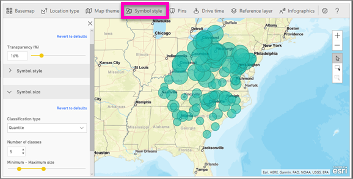

### Pins
Call attention to points on your map by adding pins.  

1. Select the **Pins** tab.
2. Type keywords (such as addresses, places, and point of interest), in the search box and select from the dropdown. A symbol appears on the map, and the map automatically zooms to the location. Search results are saved as location cards in the Pins pane. You can save up to 10 location cards.
   
   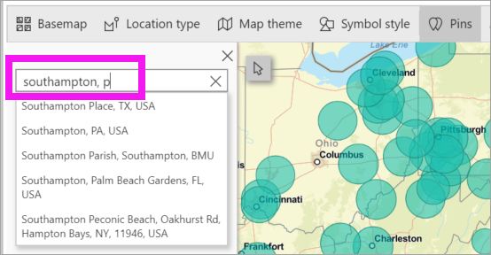
3. Power BI adds a pin to that location and you can change the color of the pin.
   
   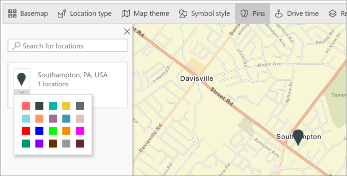
4. Add and delete pins.
   
   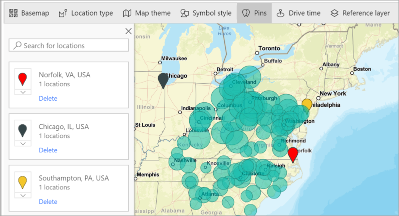

### Drive time
The Drive time pane lets you select a location and then determine what other map features are within a specified radius or driving time.  
    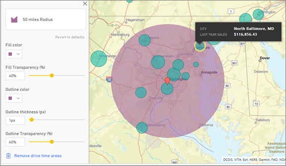

1. Select the single select tool and choose the pin for the Charlotte Douglas airport.

   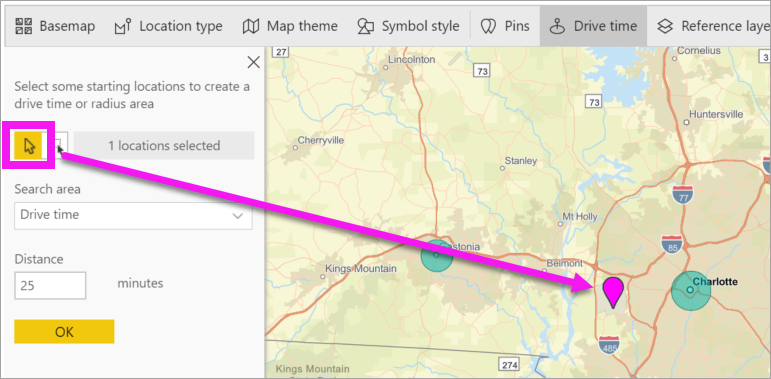
   
   > [!TIP]
   > It's easier to select a location if you zoom in on the map. You can zoom using the + icon or the scroll on your mouse.
   > 
   > 
2. Let's say you're flying into the Charlotte Douglas airport for a few days and want to figure out which stores are within a reasonable driving distance. Change Search area to **Drive time** and Distance to **25** minutes. Select OK.    
   
    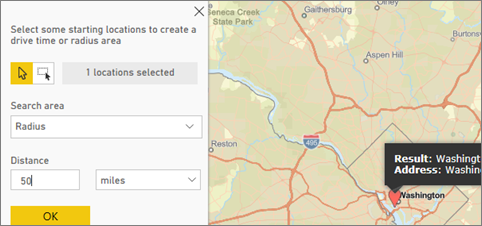

    

3. There are two stores within a 25 minutes drive. The radius is shown in purple. Select any location to display its details. Optionally, format the radius by changing color and outline.
   
    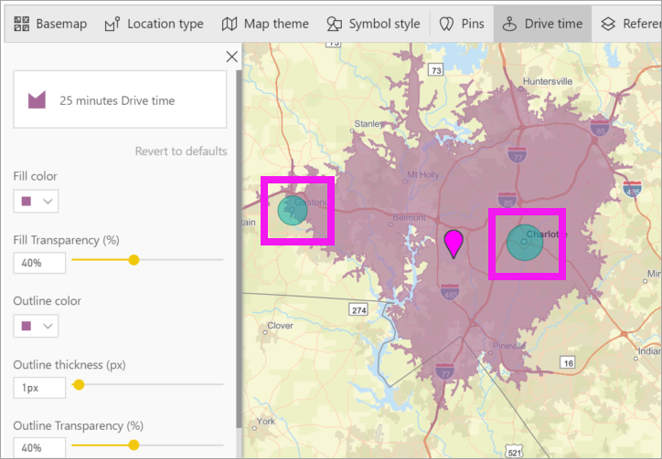

### Reference Layer
#### Reference layer - Demographics
ArcGIS Maps for Power BI provides a selection of demographic layers that help contextualize data from Power BI.

1. Select the **Reference layer** tab and choose **Demographics**.
2. Each layer listed has a checkbox. Add a checkmark to add that layer to the map.  In this example we've added average household income. 
   
    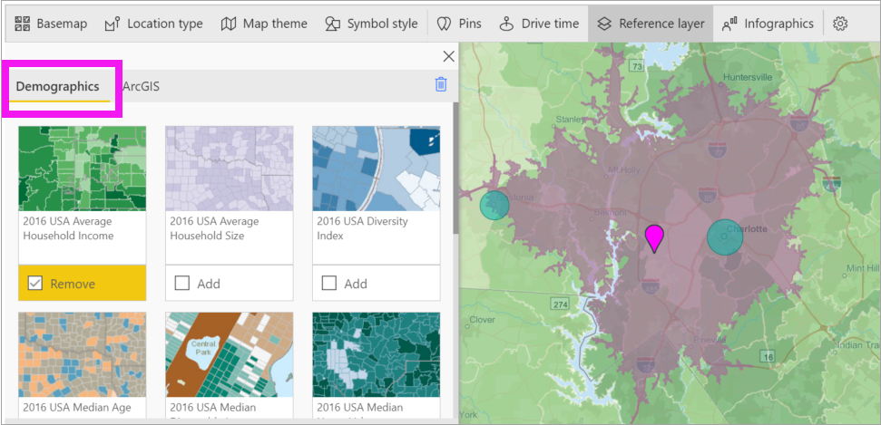
3. Each layer is interactive as well. Hover over a bubble to see the details. Click a shaded area to see details in the form of charts. Here we've selected the zip code 28227 and there are two charts for us to view.
   
    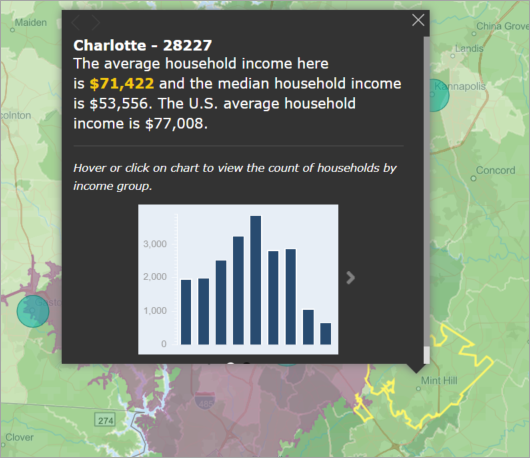

#### Reference layer - ArcGIS
ArcGIS Online provides the ability for organizations to publish public web maps. Additionally, Esri provides a curated set of web maps through Living Atlas. In the ArcGIS tab, you can search all public web maps or Living Atlas maps, and add them to the map as reference layers.

1. Select the **Reference layer** tab and choose **ArcGIS**.
2. Enter search terms and then select a map layer. In this example we've chosen USA Congressional districts.
   
    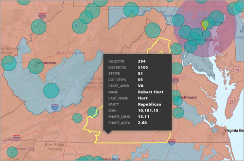
3. To see the details, select a shaded area to open the *Select from reference layer*: Use the reference layer selection tool to selection boundaries or objects on the reference layer.

 

## Selecting Data points
ArcGIS Maps for Power BI allows five selection modes to help you select your data accurately and quickly.

Change the selection mode by hovering your cursor over the single selection tool icon shown in the below image. This will expand the hidden bar to show additional tools:

Each tool has a unique role in allowing you to select your data: 

 Select individual data points.

 Draws a rectangle on the map and selects the contained data points.

 Allows boundaries or polygons within reference layers to be used to select contained data points.

 Allows you to select data using a buffer layer.

 Allows you to select data points that are similar to each other.

> [!NOTE]
> A maximum of 250 data points can be selected at a time.
> 
> 

 

## Getting help
**Esri** provides [comprehensive documentation](https://go.microsoft.com/fwlink/?LinkID=828772) on the feature set of **ArcGIS Maps for Power BI**.

You can ask questions, find the latest information, report issues, and find answers on the Power BI [community thread related to **ArcGIS Maps for Power BI**](https://go.microsoft.com/fwlink/?LinkID=828771).

If you have a suggestion for an improvement, please submit it to [Power BI's ideas list](https://ideas.powerbi.com).

 

## Managing use of ArcGIS Maps for Power BI within your organization
Power BI provides the ability for designers, tenant administrators, and IT administrators to manage the use of ArcGIS Maps for Power BI. Below you will find steps each role can take. 

### Designer options
In Power BI Desktop, designers can disable ArcGIS Maps for Power BI on the security tab. Select **File** > **Options and settings** and then select **Options** > **Security**. When disabled, ArcGIS Maps will not load by default.

### Tenant admin options
In PowerBI.com, tenant administrators can turn off ArcGIS Maps for Power BI for all users. Select **Settings** > **Admin Portal** > **Tenant settings**. When disabled, Power BI will no longer display the ArcGIS Maps for Power BI icon in the visualizations pane.

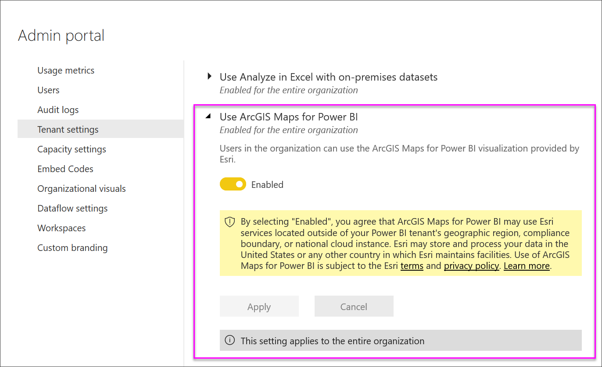

### IT Administrator options
Power BI Desktop supports using **Group Policy** to disable ArcGIS Maps for Power BI across an organization's deployed computers.

<table>
<tr><th>Attribute</th><th>Value</th>
</tr>
<tr>
<td>key</td>
<td>Software\Policies\Microsoft\Power BI Desktop&lt;/td&gt;
</tr>
<tr>
<td>valueName</td>
<td>EnableArcGISMaps</td>
</tr>
</table>

A value of 1 (decimal) enables ArcGIS Maps for Power BI.

A value of 0 (decimal) disable ArcGIS Maps for Power BI.

## Considerations and Limitations
ArcGIS Maps for Power BI is available in the following services and applications:

<table>
<tr><th>Service/App</th><th>Availability</th></tr>
<tr>
<td>Power BI Desktop</td>
<td>Yes</td>
</tr>
<tr>
<td>Power BI service (app.powerbi.com)</td>
<td>Yes</td>
</tr>
<tr>
<td>Power BI mobile applications</td>
<td>Yes</td>
</tr>
<tr>
<td>Power BI publish to web</td>
<td>No</td>
</tr>
<tr>
<td>Power BI Embedded</td>
<td>No</td>
</tr>
<tr>
<td>Power BI service embedding (PowerBI.com)</td>
<td>No</td>
</tr>
</table>

In services or applications where ArcGIS Maps for Power BI is not available, the visualization will show as an empty visual with the Power BI logo.

When geocoding street addresses, only the first 1500 addresses are geocoded. Geocoding place names or countries are not subject to the 1500 address limit.

 

**How do ArcGIS Maps for Power BI work together?**
ArcGIS Maps for Power BI is provided by Esri (www.esri.com). Your use of ArcGIS Maps for Power BI is subject by Esri's [terms](https://go.microsoft.com/fwlink/?LinkID=8263222) and [privacy policy](https://go.microsoft.com/fwlink/?LinkID=826323). Power BI users wishing to use the ArcGIS Maps for Power BI visuals, need to accept the consent dialog (see User Consent for details).  Using Esri’s ArcGIS Maps for Power BI is subject to Esri’s Terms and Privacy Policy, which are also linked to from the consent dialog. Each user must consent prior to using ArcGIS Maps for Power BI for the first time. Once the user accepts the consent, data bound to the visual is sent to Esri’s services at least for geocoding, meaning transforming location information into latitude and longitude information that can be represented in a map. You should assume any data bound to the data visualization can be sent to Esri’s services. Esri provides services like base maps, spatial analytics, geocoding, etc. The ArcGIS Maps for Power BI visual interacts with these services using an SSL connection protected by a certificate provided and maintained by Esri. Additional information about ArcGIS Maps for Power BI can be obtained from Esri’s [ArcGIS Maps for Power BI product page](https://www.esri.com/powerbi).

When a user signs up for a Plus subscription offered by Esri through ArcGIS Maps for Power BI, they are entering into an direct relationship with Esri. Power BI does not send personal information about the user to Esri. The user signs in to and trusts an Esri provided AAD application using their own AAD identity. By doing so, the user is sharing their personal information directly with Esri. Once the user adds Plus content to an ArcGIS Maps for Power BI visual, other Power BI users also need a Plus subscription from Esri to view or edit that content. 

For technical detailed questions about how Esri’s ArcGIS Maps for Power BI works, reach out to Esri through their support site.

**What data is sent to Esri?**
You can read about what data is transferred to Esri on their [documentation site](https://doc.arcgis.com/en/maps-for-powerbi/get-started/data-transfer.htm).

**Is there any charge for using ArcGIS Maps for Power BI?**

The ArcGIS Map for Power BI is provided by **Esri** at no additional cost. You must consent to the user agreement.  

**I'm getting an error message in Power BI Desktop about my cache being full**

This is a bug that is being addressed.  In the meantime, to clear your cache, please try to delete files at this location: C:\Users\\AppData\Local\Microsoft\Power BI Desktop\CEF and then restart Power BI.

**Does ArcGIS Maps for Power BI support Esri Shapefiles?**

ArcGIS Maps for Power BI automatically detects standard boundaries like countries/regions, states/provinces, and zip/postal codes. If you need to provide your own shapes you can do so using the [Shape Maps for Power BI Desktop](desktop-shape-map.md).

**Can I view my ArcGIS maps offline?**

No, Power BI needs network connectivity to display the maps.

**Can I connect to my ArcGIS Online account from Power BI?**

Not yet. [Vote for this idea](https://ideas.powerbi.com/forums/265200-power-bi-ideas/suggestions/9154765-arcgis-geodatabases) and we'll send you an email when we start working on this feature.  

## Next steps
[Interacting with an ArcGIS map that has been shared with you](power-bi-visualizations-arcgis.md)

[Blog post announcing availability of ArcGIS maps for Power BI](https://powerbi.microsoft.com/blog/announcing-arcgis-maps-for-power-bi-by-esri-preview/)

More questions? [Try asking the Power BI Community](http://community.powerbi.com/)

