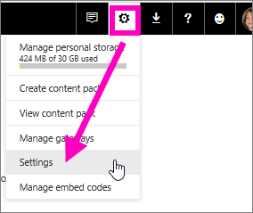
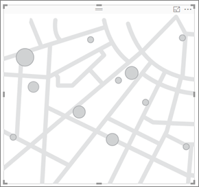
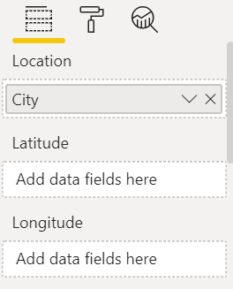
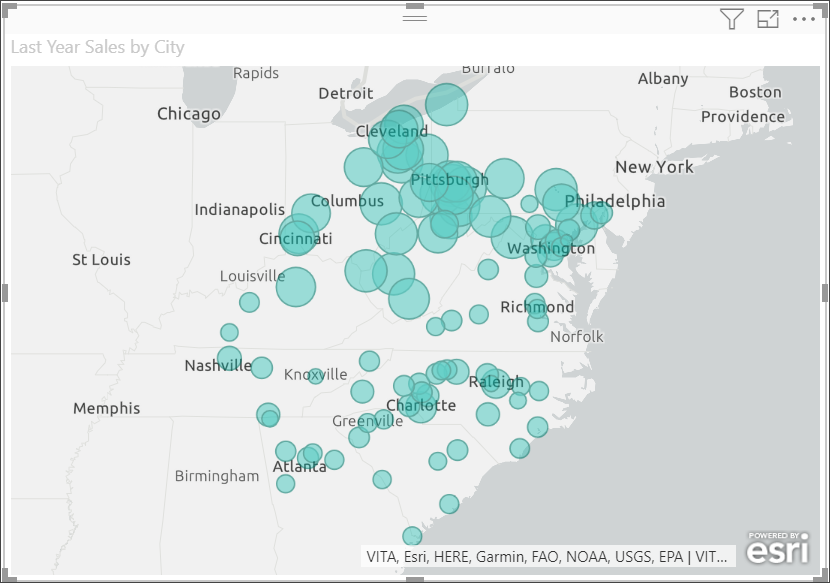
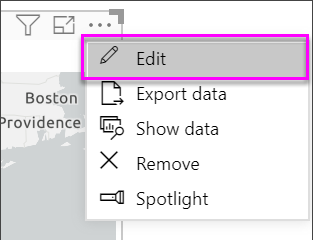
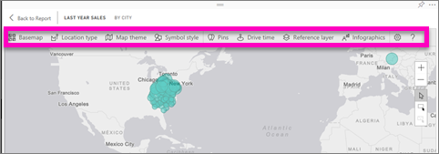
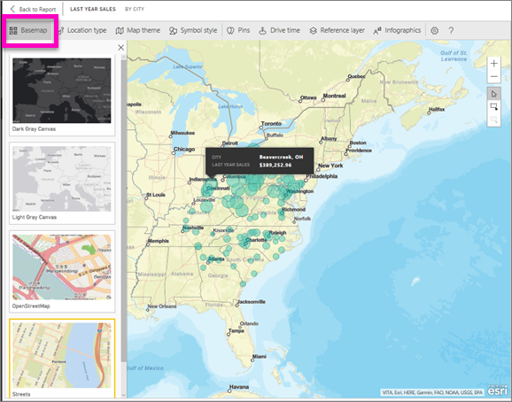
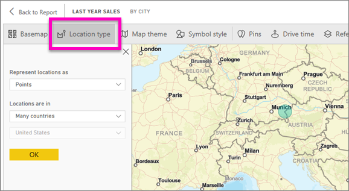
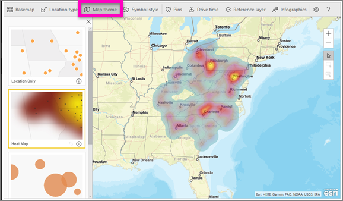
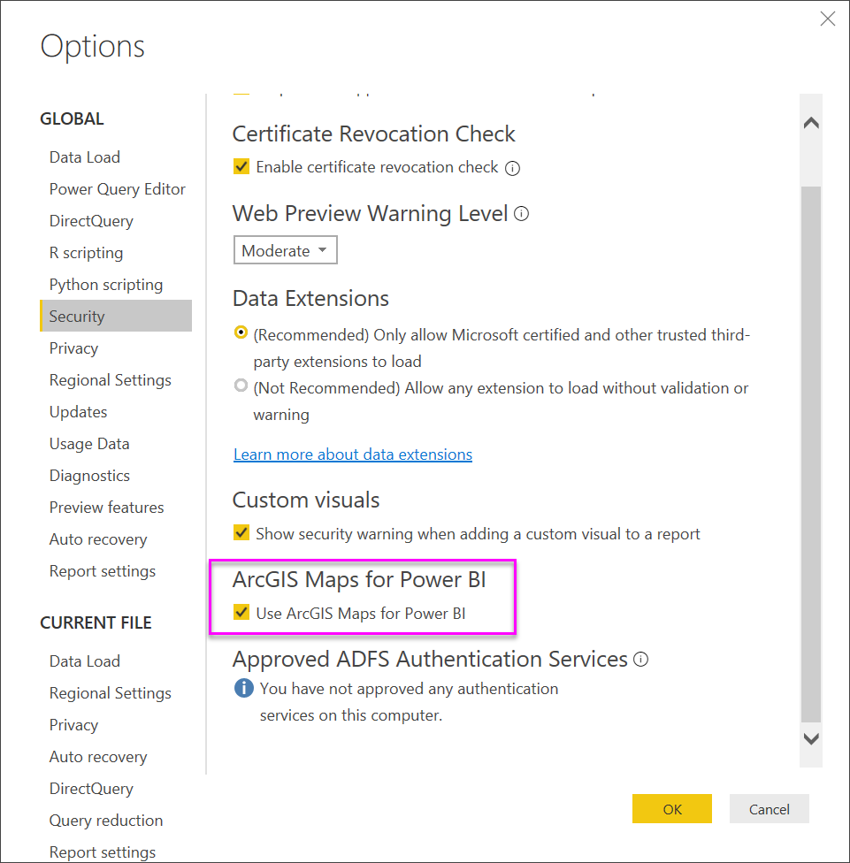

# ArcGIS maps in Power BI service and Power BI Desktop by Esri
This tutorial is written from the point of view of a person creating an ArcGIS map. Once a creator shares an ArcGIS map with a colleague, that colleague can view and interact with the map but not save changes. To learn more about viewing an ArcGIS map, see [Interacting with ArcGIS maps](power-bi-visualizations-arcgis.md).

The combination of ArcGIS maps and Power BI takes mapping beyond the presentation of points on a map to a whole new level. Choose from base maps, location types, themes, symbol styles, and reference layers to create gorgeous informative map visualizations. The combination of authoritative data layers on a map with spatial analysis conveys a deeper understanding of the data in your visualization.

 While you cannot create an ArcGIS maps on a mobile device, you can view and interact with it. See [Interacting with ArcGIS maps](power-bi-visualizations-arcgis.md).

> [!TIP]
> GIS stands for Geographic Information Systems.

The example below uses a dark gray canvas to show regional sales as a heatmap against a demographic layer of 2016 median disposable income. As you'll see as you read on, using  ArcGIS maps offers almost limitless enhanced mapping capability, demographic data, and even-more compelling map visualizations so you can tell your best story.

> [!TIP]
> Visit [esri's page on Power BI](https://www.esri.com/powerbi) to see many examples and read testimonials. And then see esri's [ArcGIS Maps for Power BI Getting Started page](https://doc.arcgis.com/en/maps-for-powerbi/get-started/about-maps-for-power-bi.htm).

## User consent
ArcGIS Maps for Power BI is provided by Esri (www.esri.com). Your use of ArcGIS Maps for Power BI is subject by Esri's terms and privacy policy. Power BI users wishing to use the ArcGIS Maps for Power BI visuals, need to accept the consent dialog.

**Resources**

[Terms](https://go.microsoft.com/fwlink/?LinkID=826322)

[Privacy Policy](https://go.microsoft.com/fwlink/?LinkID=826323)

[ArcGIS Maps for Power BI product page](https://www.esri.com/powerbi)

 

## Enable ArcGIS map
ArcGIS maps are currently available in Power BI service, Power BI Desktop, and Power BI mobile. This article provides instructions for the service and for Desktop.

### Enable the ArcGIS map ***in Power BI service (app.powerbi.com)***
This tutorial uses the [Retail Analysis sample](../sample-retail-analysis.md). To enable **ArcGIS Maps for Power BI**:

1. From the top right section of the menubar, select the cog icon and open **Settings**
   
    
2. Select the **ArcGIS Maps for Power BI** checkbox. You'll need to restart Power BI after you make the selection.
   
    
3. Open a report in [Editing view](../consumer/end-user-reading-view.md) and select the ArcGIS Maps for Power BI icon from the Visualizations pane.
   
    
4. Power BI adds an empty ArcGIS map template to the report canvas.
   
   

 

## Create an ArcGIS map visual
Watch Will create a few different ArcGIS map visualizations and then use the steps below to try it out yourself using the [Retail Analysis sample](../sample-datasets.md).

<iframe width="560" height="315" src="https://www.youtube.com/embed/EKVvOZmxg9s" frameborder="0" allowfullscreen></iframe>

1. From the **Fields** pane, drag a data field to the **Location** or **Latitude** and/or **Longitude** buckets. In this example we're using **Store > City**.
   
   > [!NOTE]
   > ArcGIS Maps for Power BI will automatically detect if the fields you've selected are best viewed as a shape or a point on a map. You can adjust the default in the settings (see below).
   > 
   > 
   
    
2. Convert the visualization to an ArcGIS map by selecting the template from the Visualizations pane .
3. From the **Fields** pane, drag a measure to the **Size** bucket to adjust how the data is shown. In this example we're using **Sales > Last Year Sales**.
   
    

## Settings and formatting for ArcGIS maps
To access **ArcGIS Maps for Power BI** formatting features:

1. Access additional features by selecting the ellipses in the top right corner of the visualization and choosing **Edit**,
   
   
   
   The available features display across the top of the visualization. Each feature, when selected, opens a task pane that provides detailed options. 
   
   
   
   > [!NOTE]
   > For more information about the settings and features, see **Detailed documentation** below.
   > 
   > 
2. To return to the report, select **Back to Report** from the top-left corner of your report canvas.

 

## Detailed documentation
**Esri** provides [comprehensive documentation](https://go.microsoft.com/fwlink/?LinkID=828772) on the feature set of **ArcGIS Maps for Power BI**.

## Features overview
### Base Maps
Four base maps are provided: Dark Gray Canvas, Light Gray Canvas, OpenStreetMap, and Streets.  Streets is ArcGIS's standard base map.

To apply a base map select it in the task pane.

### Location type
ArgGIS Maps for Power BI automatically detects the best way to show data on the map. It selects from Points or Boundaries. The Location type options allow you to fine tune these selections.

**Boundaries** will only work if your data contains standard geographic values. Esri automatically figures out the shape to show on the map. Standard geographic values include countries, provinces, zip codes, etc. But just like with GeoCoding, Power BI may not detect the field should be a boundary by default, or it may not have a boundary for your data.  

### Map theme
Four map themes are provided. Location Only and Size themes are automatically chosen based on the fields you bind to the location and added to the **Size** bucket in the Power BI Fields pane. We're currently using **Size**, so let's change to **Heat map**.  

<table>
<tr><th>Theme</th><th>Description</th>
<tr>
<td>Location Only</td>
<td>Plots data points or filled boundaries on the map based on the settings in Location Type.</td>
</tr>
<tr>
<td>Heat Map</td>
<td>Plots an intensity plot of data on the map.</td>
</tr>
<tr>
<td>Size</td>
<td>Plots data points on the map based that are sized based on the value in the size bucket in the fields pane.</td>
</tr>
<tr>
<td>Clustering</td>
<td>Plot the count of data points in regions on the map. </td>
</tr>
</table>

### Symbol style
Symbol styles enable you to fine tune how data is presented on the map. Symbol styles are context sensitive based on the selected Location type and Map theme. The example below shows Location type set to **Size** and several adjustments to transparency, style and size.

### Pins
Call attention to points on your map by adding pins.  

1. Select the **Pins** tab.
2. Type keywords (such as addresses, places, and point of interest), in the search box and select from the dropdown. A symbol appears on the map, and the map automatically zooms to the location. Search results are saved as location cards in the Pins pane. You can save up to 10 location cards.
   
   
3. Power BI adds a pin to that location and you can change the color of the pin.
   
   
4. Add and delete pins.
   
   

### Drive time
The Drive time pane lets you select a location and then determine what other map features are within a specified radius or driving time.  
    

1. Select the **Drive time** tab and choose the single or multi select tool. Single select the pin for Washington D.C.
    
   
   > [!TIP]
   > It's easier to select a location if you zoom in on the map (using the + icon).
   > 
   > 
2. Let's say you're flying into Washington D.C. for a few days and want to figure out which stores are within a reasonable driving distance. Change Search area to **Radius** and Distance to **50** miles and select OK.    
   
    
3. The radius is shown in purple. Select any location to display its details. Optionally, format the radius by changing color and outline.
   
    

### Reference Layer
#### Reference layer - Demographics
ArcGIS Maps for Power BI provides a selection of demographic layers that help contextualize data from Power BI.

1. Select the **Reference layer** tab and choose **Demographics**.
2. Each layer listed has a checkbox. Add a checkmark to add that layer to the map.  In this example we've added average household income. 
   
    
3. Each layer is interactive as well. Just as you can hover over a bubble to see the details, you can click a shaded area on the map to see the details. 
   
    

#### Reference layer - ArcGIS
ArcGIS Online provides the ability for organizations to publish public web maps. Additionally, Esri provides a curated set of web maps through Living Atlas. In the ArcGIS tab, you can search all public web maps or Living Atlas maps, and add them to the map as reference layers.

1. Select the **Reference layer** tab and choose **ArcGIS**.
2. Enter search terms and then select a map layer. In this example we've chosen USA Congressional districts.
   
    
3. To see the details, select a shaded area to open the *Select from reference layer*: Use the reference layer selection tool to selection boundaries or objects on the reference layer.

 

## Selecting Data points
ArcGIS Maps for Power BI allows three selection modes.

Change the selection mode using switch:

 Select individual data points.

 Draws a rectangle on the map and selects the contained data points.

 Allows boundaries or polygons within reference layers to be used to select contained data points.

> [!NOTE]
> A maximum of 250 data points can be selected at a time.
> 
> 

 

## Getting help
**Esri** provides [comprehensive documentation](https://go.microsoft.com/fwlink/?LinkID=828772) on the feature set of **ArcGIS Maps for Power BI**.

You can ask questions, find the latest information, report issues, and find answers on the Power BI [community thread related to **ArcGIS Maps for Power BI**](https://go.microsoft.com/fwlink/?LinkID=828771).

If you have a suggestion for an improvement, please submit it to [Power BI's ideas list](https://ideas.powerbi.com).

 

## Managing use of ArcGIS Maps for Power BI within your organization
Power BI provides the ability for users, tenant administrators, and IT administrators to manage whether to use ArcGIS Maps for Power BI.

**User options**
In Power BI Desktop, users can stop using ArcGIS Maps for Power BI by disabling it on the security tab in **Options**. When disabled, ArcGIS Maps will not load by default.

In Power BI service, users can stop using ArcGIS Maps for Power BI by disabling it on the ArcGIS Maps for Power BI tab in user Settings. When disabled, ArcGIS Maps will not load by default.

**Tenant admin options**
In PowerBI.com, tenant administrators can prevent all tenant users from using ArcGIS Maps for Power BI by disabling. When this happens, Power BI will no longer see the ArcGIS Maps for Power BI icon in the visualizations pane.

**IT Administrator options**
Power BI Desktop supports using **Group Policy** to disable ArcGIS Maps for Power BI across an organization's deployed computers.

<table>
<tr><th>Attribute</th><th>Value</th>
</tr>
<tr>
<td>key</td>
<td>Software\Policies\Microsoft\Power BI Desktop&lt;/td&gt;
</tr>
<tr>
<td>valueName</td>
<td>EnableArcGISMaps</td>
</tr>
</table>

A value of 1 (decimal) enables ArcGIS Maps for Power BI.

A value of 0 (decimal) disable ArcGIS Maps for Power BI.

## Considerations and Limitations
ArcGIS Maps for Power BI is available in the following services and applications:

<table>
<tr><th>Service/App</th><th>Availability</th></tr>
<tr>
<td>Power BI Desktop</td>
<td>Yes</td>
</tr>
<tr>
<td>Power BI service (PowerBI.com)</td>
<td>Yes</td>
</tr>
<tr>
<td>Power BI mobile applications</td>
<td>Yes</td>
</tr>
<tr>
<td>Power BI publish to web</td>
<td>No</td>
</tr>
<tr>
<td>Power BI Embedded</td>
<td>No</td>
</tr>
<tr>
<td>Power BI service embedding (PowerBI.com)</td>
<td>No</td>
</tr>
</table>

In services or applications where ArcGIS Maps for Power BI is not available, the visualization will show as an empty visual with the Power BI logo.

When geocoding street addresses, only the first 1500 addresses are geocoded. Geocoding place names or countries is not subject to the 1500 address limit.

 

**How do ArcGIS Maps for Power BI work together?**
ArcGIS Maps for Power BI is provided by Esri (www.esri.com). Your use of ArcGIS Maps for Power BI is subject by Esri's [terms](https://go.microsoft.com/fwlink/?LinkID=8263222) and [privacy policy](https://go.microsoft.com/fwlink/?LinkID=826323). Power BI users wishing to use the ArcGIS Maps for Power BI visuals, need to accept the consent dialog (see User Consent for details).  Using Esri’s ArcGIS Maps for Power BI is subject to Esri’s Terms and Privacy Policy, which are also linked to from the consent dialog. Each user must consent prior to using ArcGIS Maps for Power BI for the first time. Once the user accepts the consent, data bound to the visual is sent to Esri’s services at least for geocoding, meaning transforming location information into latitude and longitude information that can be represented in a map. You should assume any data bound to the data visualization can be sent to Esri’s services. Esri provides services like base maps, spatial analytics, geocoding, etc. The ArcGIS Maps for Power BI visual interacts with these services using an SSL connection protected by a certificate provided and maintained by Esri. Additional information about ArcGIS Maps for Power BI can be obtained from Esri’s [ArcGIS Maps for Power BI product page](https://www.esri.com/powerbi).

When a user signs up for a Plus subscription offered by Esri through ArcGIS Maps for Power BI, they are entering into an direct relationship with Esri. Power BI does not send personal information about the user to Esri. The user signs in to and trusts an Esri provided AAD application using their own AAD identity. By doing so, the user is sharing their personal information directly with Esri. Once the user adds Plus content to an ArcGIS Maps for Power BI visual, other Power BI users also need a Plus subscription from Esri to view or edit that content. 

For technical detailed questions about how Esri’s ArcGIS Maps for Power BI works, reach out to Esri through their support site.

**Is there any charge for using ArcGIS Maps for Power BI?**

The ArcGIS Map for Power BI is available to all Power BI users at no additional cost. It is a component provided by **Esri** and your use is subject to the terms and privacy policy provided by **Esri** as noted earlier in this article.

**I'm getting an error message in Power BI Desktop about my cache being full**

This is a bug that is being addressed.  In the meantime, to clear your cache, please try to delete files at this location: C:\Users\\AppData\Local\Microsoft\Power BI Desktop\CEF and then restart Power BI.

**Does ArcGIS Maps for Power BI support Esri Shapefiles?**

ArcGIS Maps for Power BI automatically detects standard boundaries like countries/regions, states/provinces, and zip/postal codes. If you need to provide your own shapes you can do so using the [Shape Maps for Power BI Desktop (Preview)](desktop-shape-map.md).

**Can I view my ArcGIS maps offline?**

No, Power BI needs network connectivity to display the maps.

**Can I connect to my ArcGIS Online account from Power BI?**

Not yet. [Vote for this idea](https://ideas.powerbi.com/forums/265200-power-bi-ideas/suggestions/9154765-arcgis-geodatabases) and we'll send you an email when we start working on this feature.  

## Next steps
[Interacting with an ArcGIS map that has been shared with you](power-bi-visualizations-arcgis.md)

[Blog post announcing availability of ArcGIS maps for Power BI](https://powerbi.microsoft.com/blog/announcing-arcgis-maps-for-power-bi-by-esri-preview/)

More questions? [Try asking the Power BI Community](http://community.powerbi.com/)

