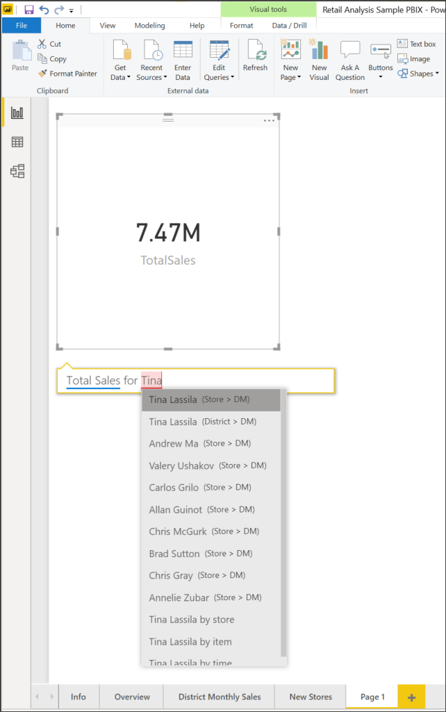
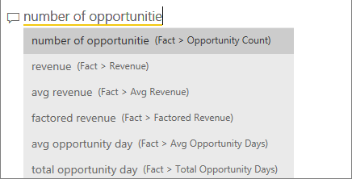
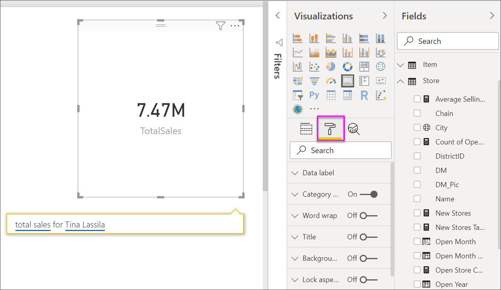
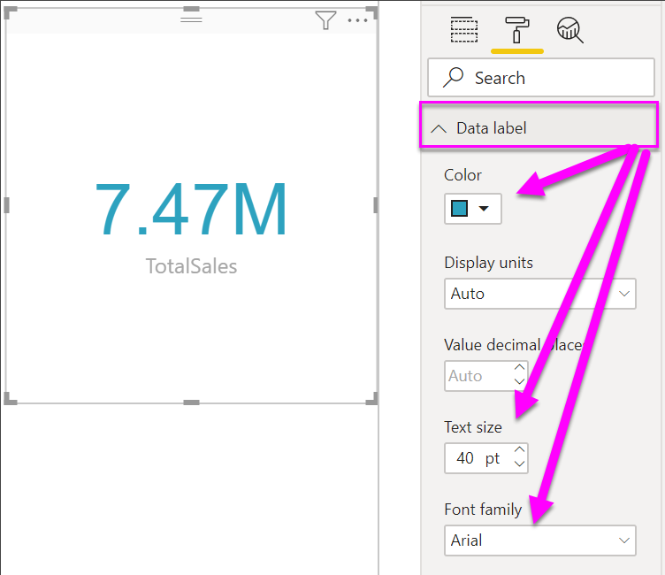
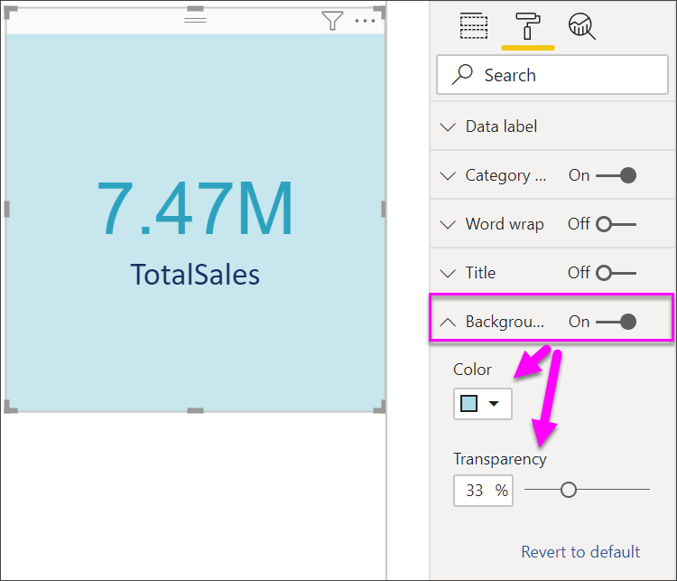
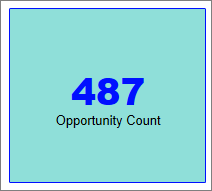

[!INCLUDE [power-bi-visuals-desktop-banner](includes/power-bi-visuals-desktop-banner.md)]

# Card visualizations
Sometimes a single number is the most important thing you want to track in your Power BI dashboard or report, such as total sales, market share year over year, or total opportunities. This type of visualization is called a *Card*. As with almost all of the native Power BI visualizations, Cards can be created using the report editor or Q&A.

## Create a card using the report editor
These instructions use the Retail Analysis sample PBIX file. To follow along, [download the sample](../sample-datasets.md) for Power BI Desktop.   

1. Start on a blank report page and select the **Store** \> **Open store count** field.

    Power BI creates a column chart with the one number.

   
2. In the Visualizations pane, select the Card icon.

## Create a card from the Q&A question box
The Q&A question box is the easiest way to make a Card. The Q&A question box is available in Power BI in Desktop report view. The steps below If you'd like to create a card using Q&A in Power BI Desktop, [follow these instructions](https://powerbi.microsoft.com/blog/power-bi-desktop-december-feature-summary/#QandA) for using Q&A for Desktop reports.

This example uses the [Opportunity Analysis sample PBIX file](../sample-opportunity-analysis.md) file.

1. At the top of your dashboard, select the **Ask a Question** icon. 

   

2. For example, type "number of opportunities" in the question box.

   

   The question box helps you with suggestions and restatements, and finally displays the total number.  

   

## Format a card
You have many options for changing labels, text, color and more. The best way to learn is to create a card and then explore the Formatting pane. Here are just a few of the formatting options available. 

The Formatting pane is available when interacting with the card in a report. If you make changes to a card in a report, re-pin it to see those changes on your dashboard. 

1. Start by selecting the paint roller icon to open the Formatting pane. 

    
2. With the card selected, expand **Data label** and change the color, size, and font family. If you had thousands of stores, you could use **Display units** to show the number of stores by thousands and control the decimal places as well. For example, 125.8K instead of 125,832.00.

3.  Expand **Category label** and change the color and size.

    

4. Expand **Background** and move the slider to On.  Now you can change the background color and transparency.

    

5. Continue to explore the formatting options until your card is exactly how you'd like it. 

    

## Considerations and troubleshooting
If you do not see a question box at all, contact your system or tenant administrator.    

## Next steps
[Combo charts in Power BI](power-bi-visualization-combo-chart.md)

[Visualization types in Power BI](power-bi-visualization-types-for-reports-and-q-and-a.md)
