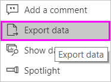
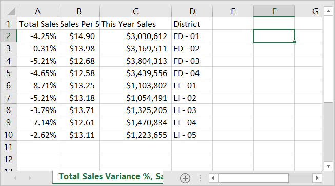
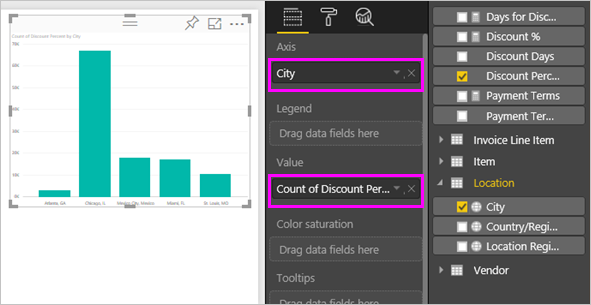
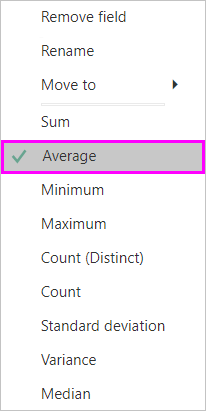
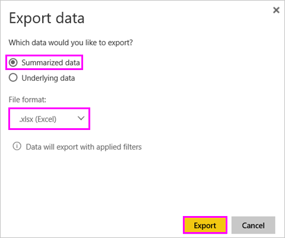
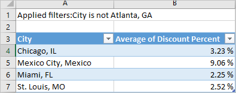

# Export data from visualizations
If you'd like to see the data that is used to create a visualization, you can display that data in Power BI or export that data to Excel as an .xlsx or .csv file.   

Watch Will export the data from one of the visualizations in his report, save it as an .xlsx file, and open it in Excel. Then follow the step-by-step instructions below the video to try it out yourself.

<iframe width="560" height="315" src="https://www.youtube.com/embed/KjheMTGjDXw" frameborder="0" allowfullscreen></iframe>

## From a visualization on a Power BI dashboard
1. Select the ellipses in the top right corner of the visualization.

    
2. Choose the  **Export data** icon.

    
3. The data is exported to a .csv file. If the visual is filtered, then the downloaded data will also be filtered.    
4. Your browser will prompt you to save the file.  Once saved, open the .csv file in Excel.

    

## From a visualization in a report
To follow along, open the [Procurement analysis sample report](../sample-procurement.md) in [Editing view](../consumer/end-user-reading-view.md). [Add a new blank report page](../power-bi-report-add-page.md). Then follow the steps below to add an aggregation and a visualization-level filter.

1. Create a new column chart.  From the Fields pane, select **Location > City** and **Invoice > Discount Percent**.  You may have to move **Discount Percent** into the Value well. 

    
2. Change the aggregation for **Discount Percent** from **Count** to **Average**. In the Value well, select the arrow to the right of **Discount Percent** (it may say **Count of Discount Percent**), and choose **Average**.

    
3. Add a filter to **City** to remove **Atlanta**.

   

   Now we're ready to try out both options for exporting data. 

4. Select the ellipses in the top right corner of the visualization. Choose  **Export data**.

   
5. In Power BI online, if your visualization has an aggregate (one example would be if you changed **Count** to *average*, *sum* or *minimum*),  you'll have two options: **Summarized data** and **Underlying data**. In Power BI Desktop, you'll only have the option for **Summarized data**. For help understanding aggregates, see [Aggregates in Power BI](../service-aggregates.md).
    
6. Select **Summarized data** > **Export** and choose either .xlsx or .csv. Power BI exports the data.  If you have applied filters to the visualization, the exported data will export as filtered. When you select  **Export**, your browser prompts you to save the file. Once saved, open the file in Excel.

   **Summarized data**: select this option if you want to export data for what you see in that visual.  This type of export shows you only the data (columns and measures) that you chose to create the visual.  If the visual has an aggregate, you'll export aggregated data. For example, if you have a bar chart showing 4 bars, you will get 4 rows of data. Summarized data is available as .xlsx and .csv.

   In this example, our Excel export shows one total for each city. Since we filtered out Atlanta, it is not included in the results.  The first row of our spreadsheet shows the filters that were used when extracting the data from Power BI.

   
7. Now try selecting **Underlying data** > **Export** and choosing .xlsx. Power BI exports the data. If you had applied filters to the visualization, the exported data will export as filtered. When you select  **Export**, your browser prompts you to save the file. Once saved, open the file in Excel.

   >[!WARNING]
   >Exporting underlying data allows users to see all the detailed data -- every column in the data. Power BI service administrators can turn this off for their organization. If you are a dataset owner, you can set proprietary columns to "hidden" so that they don't show up in the Field list in Desktop or Power BI service.

   **Underlying data**: select this option if you want to see the data in the visual ***and*** additional data from the model (see chart below for details).  If your visualization has an aggregate, selecting *Underlying data* removes the aggregate. When you select **Export**, the data is exported to an .xlsx file and your browser prompts you to save the file. Once saved, open the file in Excel.

   In this example, our Excel export shows one row for every single City row in our dataset, and the discount percent for that single entry. In other words, the data is flattened and not aggregated. The first row of our spreadsheet shows the filters that were used when extracting the data from Power BI.  

   

## Export underlying data details
What you see when you select **Underlying data** can vary. Understanding these details may require the help of your Admin or IT department. In Power BI Desktop or service, in the reporting view, a *measure* displays  in the Fields list with a calculator icon . Measures are created in Power BI Desktop not Power BI service.

| Visual contains |                                                                              What you'll see in export                                                                              |
|-----------------|-------------------------------------------------------------------------------------------------------------------------------------------------------------------------------------|
|   Aggregates    |                                                 the *first* aggregate and non-hidden data from the entire table for that aggregate                                                  |
|   Aggregates    | related data - if the visual uses data from other data tables that are  *\*\*related*\* to the data table that contains the aggregate (as long as that relationship is \*:1 or 1:1) |
|    Measures     |                                      All measures in the visual *and* all measures from any data table containing a measure used in the visual                                      |
|    Measures     |                                       All non-hidden data from tables that contain that measure (as long as that relationship is \*:1 or 1:1)                                       |
|    Measures     |                                      All data from all tables that are related to table(s) containing the measures via a chain of \*:1 of 1:1)                                      |
|  Measures only  |                                                   All non-hidden columns from all related tables (in order to expand the measure)                                                   |
|  Measures only  |                                                             Summarized data for any duplicate rows for model measures.                                                              |

### Set the export options
Power BI report designers control the types of data export options that are available for their consumers. The choices are:
- Allow export of only summarized (this is the default for reports) 
- Allow exporting of summarized and underlying data  
- Don't allow exporting of any data  

1. To set these options, start in Power BI Desktop.

2. From the upper left corner, select **File** > **Options and Settings** > **Options**. 

3. Under **Current file** select **Report settings**.

    

4. Make your selection from the **Export data** dropdown.

You can also update this setting in Power BI service.  

It is important to note that if the Power BI admin portal settings conflict with the report settings for export data, the admin settings will override the export data settings. 

## Limitations and considerations
* The maximum number of rows that can be exported from **Power BI Desktop** and **Power BI service** to .csv is 30,000.
* The maximum number of rows that can be exported to .xlsx is 150,000.
* Export using *Underlying data* will not work if the data source is an Analysis Services live connection and the version is older than 2016 and the tables in the model do not have a unique key.  
* Export using *Underlying data* will not work if the *Show items with no data* option is enabled for the visualization being exported.
* When using DirectQuery, the maximum amount of data that can be exported is 16 MB. This may result in exporting less than the maximum number of rows, especially if there are many columns, data that is difficult to compress, and other factors that increase file size and decrease number of rows exported.
* If the visual uses data from more than one data table, and no relationship exists for those tables in the data model, only data for the first table is exported. 
* Custom visuals and R visuals, are not currently supported.
* Export data is not available for users outside of your organization who are using a dashboard that has been shared with them. 
* In Power BI, a field (column) can be renamed by double-clicking the field and typing a new name.  This new name is referred to as an *alias*. It is possible that a Power BI report can end up with duplicate field names but Excel does not allow duplicates.  So when the data is exported to Excel, the field aliases revert to their original field (column) names.  
* If there is unicode character in the .csv file, the text in Excel may not display properly. Although, opening it in Notepad will work fine. Examples of unicode characters are currency symbols and foreign words. The workaround for this is to import the csv into Excel, instead of opening the csv directly. To do this:

  1. Open Excel
  2. From the **Data** tab, select **Get external data** > **From text**.
* Power BI admins have the ability to disable the export of data.

## Next steps
[Dashboards in Power BI](../consumer/end-user-dashboards.md)  
[Power BI - Basic Concepts](../consumer/end-user-basic-concepts.md)

More questions? [Try asking the Power BI Community](http://community.powerbi.com/)

