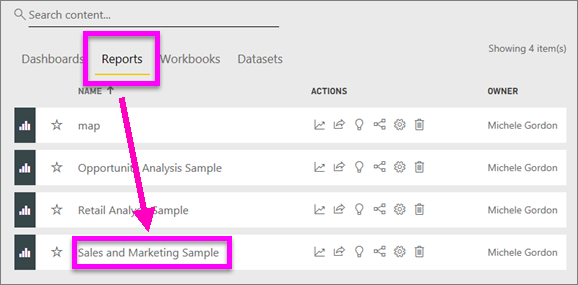
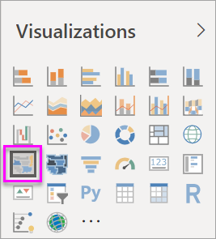
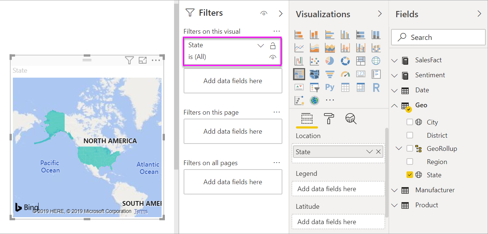
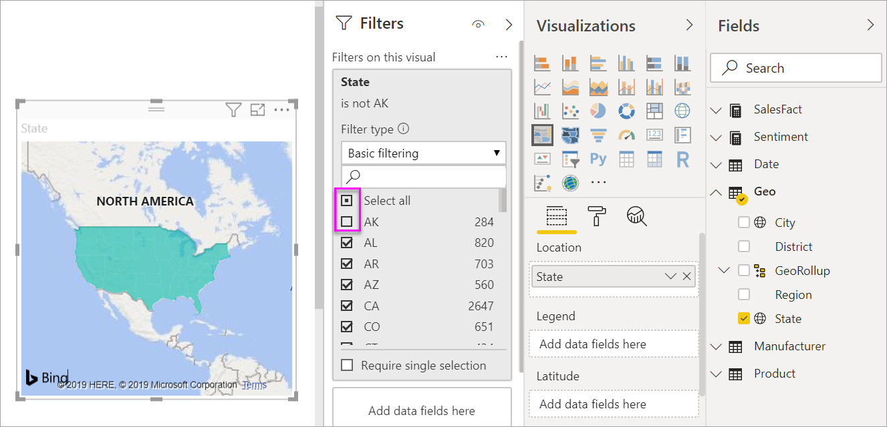
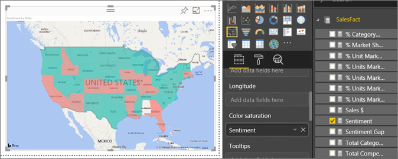
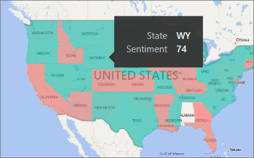
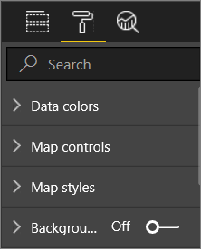
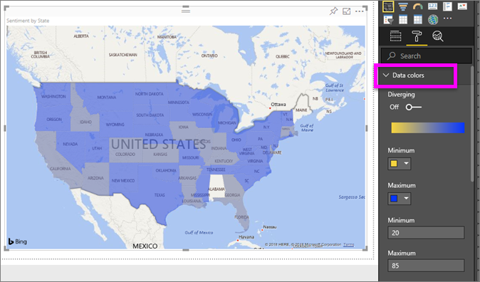
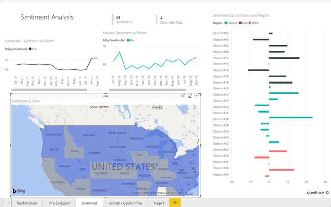
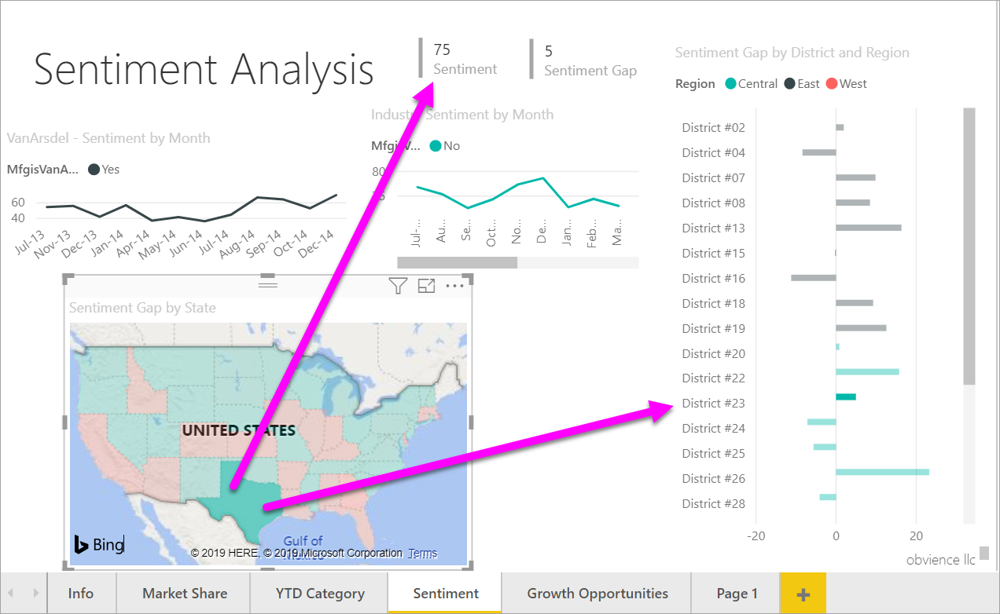

# Filled maps (choropleths) in Power BI
A filled map uses shading or tinting or patterns to display how a value differs in proportion across a geography or region.  Quickly display these relative differences with shading that ranges from light (less-frequent/lower) to dark (more-frequent/more).    

## What is sent to Bing
Power BI integrates with Bing to provide default map coordinates (a process called geo-coding). When you create a map visualization in Power BI service or Power BI Desktop, the data in the **Location**, **Latitude**, and **Longitude** buckets (that is being used to create that visualization) is sent to Bing.

You, or your administrator, may need to update your firewall to allow access to the URLs Bing uses for geocoding.  Those URLs are:
- https://dev.virtualearth.net/REST/V1/Locations    
- https://platform.bing.com/geo/spatial/v1/public/Geodata    
- https://www.bing.com/api/maps/mapcontrol

For more information about the data being sent to Bing, and for tips to increase your geo-coding success, see [Tips and tricks for map visualizations](power-bi-map-tips-and-tricks.md).

## When to use a filled map
Filled maps are a great choice:

* to display quantitative information on a map.
* to show spatial patterns and relationships.
* when your data is standardized.
* when working with socioeconomic data.
* when defined regions are important.
* to get an overview of the distribution across the geographic locations.

### Prerequisites
- Power BI service or Power BI Desktop
- Sales and Marketing Sample

To follow along, the tutorial uses Power BI service, not Power BI Desktop.

## Create a basic filled map
In this video, Kim creates a basic map and converts it to a filled map.

<iframe width="560" height="315" src="https://www.youtube.com/embed/ajTPGNpthcg" frameborder="0" allowfullscreen></iframe>

### Get data and add a new blank page to the report
1. To create your own filled map, [download the Sales and Marketing sample](../sample-datasets.md) by signing in to Power BI and selecting **Get Data \> Samples \> Sales and Marketing \> Connect**.
2. When the success message appears, close it and select the **Reports** tab. Then choose **Sales and Marketing Sample** to open the report.

   
3. Power BI opens the report. Select **Edit report** to open the report in [Editing View](../service-interact-with-a-report-in-editing-view.md).

4. Add a new page by selecting the yellow plus sign at the bottom of the report canvas.

    

### Create a filled map
1. From the Fields pane, select the **Geo** \> **State** field.    

   
5. [Convert the chart](power-bi-report-change-visualization-type.md) to a filled map. Notice that **State** is now in the **Location** well. Bing Maps uses the field in the **Location** well to create the map.  The location can be a variety of valid locations: countries, states, counties, cities, zip codes or other postal codes etc. Bing Maps provides filled map shapes for locations around the world. Without a valid entry in the Location well, Power BI cannot create the filled map.  

   
6. Filter the map to display only the continental United States.

   a.  At the bottom of the Visualizations pane, look for the **Filters** area.

   b.  Hover over **State** and click the expand chevron  
   

   c.  Place a check mark next to **All** and remove the check mark next to **AK**.

   
7. Select **SalesFact** \> **Sentiment** to add it to the **Color saturation** well. The field in the **Color saturation** well controls the map shading.  
   
8. The filled map is shaded in green and red, with red representing the lower sentiment numbers and green representing the higher, more-positive sentiment.  Here I've highlighted the state of Wyoming (WY) and see that Sentiment is very good, 74.  
   
9. [Save the report](../service-report-save.md).
##    Adjust the color formatting
Power BI gives you plenty of control over the appearance of your filled map.
1. Select the paintroller icon to open the Formatting pane.

    

2. Select **Data colors** to display color options.
3. Set the Minimum and Maximum colors to yellow and blue. And add Minimum and Maximum values, based on your data. Play around with these controls until you get the look you want. 

    

## Highlighting and cross-filtering
For information about using the Filters pane, see [Add a filter to a report](../power-bi-report-add-filter.md).

Highlighting a location in a filled Map cross-filters the other visualizations on the report page... and vice versa.

1. To follow along, first save this report by selecting **File > Save**. 

2. Copy the filled map using CTRL-C.

3. From the bottom of the report canvas, select the **Sentiment** tab to open the Sentiment report page.

    

4. Move and resize the visualizations on the pageto make some room, then CTRL-V paste the filled map from the previous report.

   

5. On the filled map, select a state.  This highlights the other visualizations on the page. Selecting **Texas**, for example, shows me that Sentiment is 74, Texas is in the Central District \#23.   
   
2. Select a data point on the VanArsdel - Sentiment by Month line chart. This filters the filled map to show Sentiment data for VanArsdel and not their competition.  
   

## Considerations and troubleshooting
Map data can be ambiguous.  For example, there's a Paris, France, but there's also a Paris, Texas. Your geographic data is probably stored in separate columns – a column for city names, a column for state or province names, etc. – so Bing may not be able to tell which Paris is which. If your dataset already contains latitude and longitude data, Power BI has special fields to help make the map data unambiguous. Just drag the field that contains your latitude data into the Visualizations \> Latitude area.  And do the same for your longitude data.    

If you have permissions to edit the dataset in Power BI Desktop, watch this video for help addressing map ambiguity.

<iframe width="560" height="315" src="https://www.youtube.com/embed/Co2z9b-s_yM" frameborder="0" allowfullscreen></iframe>

If you do not have access to latitude and longitude data, [follow these instructions to update your dataset](https://support.office.com/article/Maps-in-Power-View-8A9B2AF3-A055-4131-A327-85CC835271F7).

For more help with Map visualizations, see [Tips and tricks for map visualizations](../power-bi-map-tips-and-tricks.md).

## Next steps

[Shape map](desktop-shape-map.md)

[Visualization types in Power BI](power-bi-visualization-types-for-reports-and-q-and-a.md)