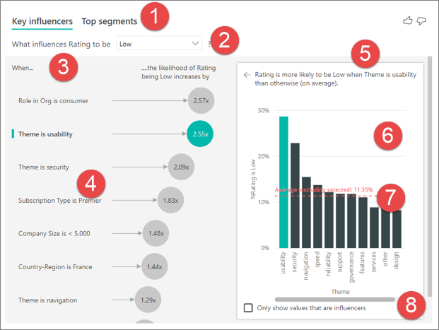
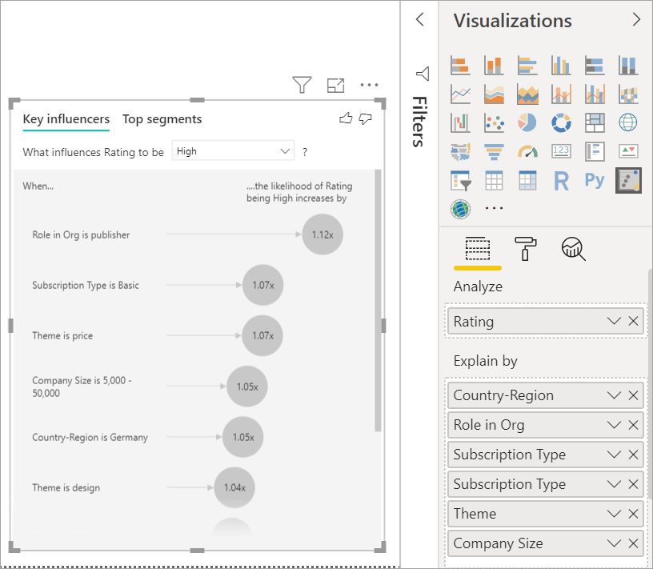
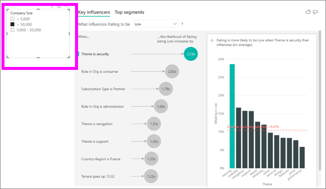
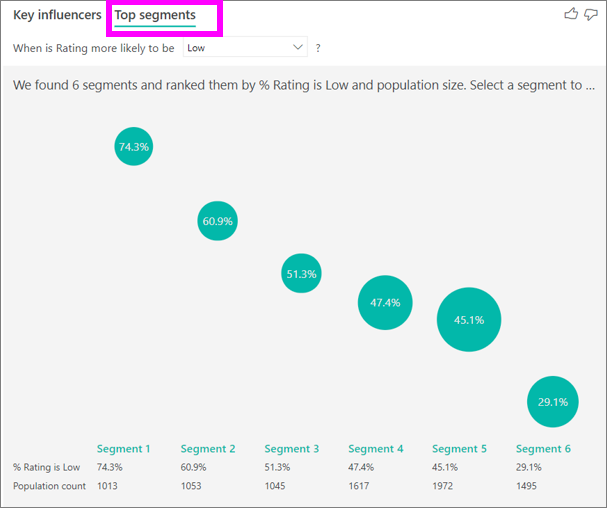
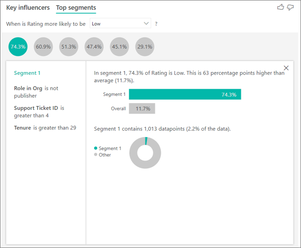
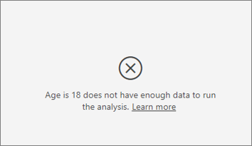
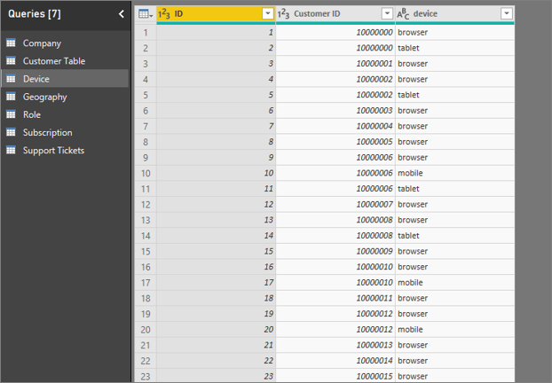
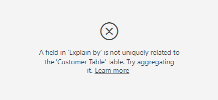
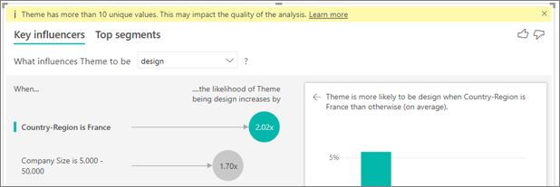
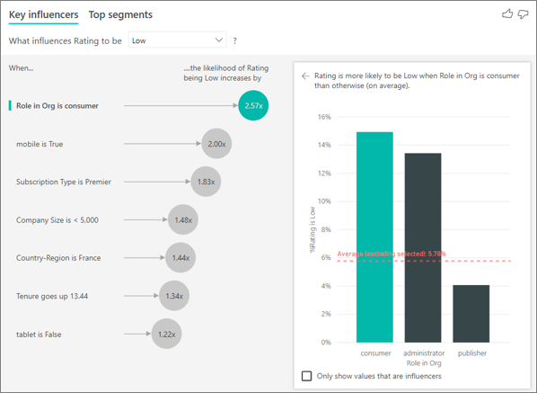

# Key influencers visualization
The key influencers visual helps you understand the factors that drive a metric you're interested in. It analyzes your data, ranks the factors that matter, and displays them as key influencers. For example, you might be interested in figuring out what influences employee turnover, or churn. One factor might be employment contract length, and another factor might be employee age. 
 
## When to use key influencers 
The key influencers visual is a great choice if you want to: 
- See which factors affect the metric being analyzed.
- Contrast the relative importance of these factors. For example, do short-term contracts have more impact on churn than long-term contracts? 

## Key influencer requirements 
The metric you analyze must be a categorical field.

## Features of the key influencers visual

    

1. **Tabs**: Select a tab to switch between views. **Key influencers** shows you the top contributors to the selected metric value. **Top segments** shows you the top segments that contribute to the selected metric value. A *segment* is made up of a combination of values. For example, one segment might be consumers who've been customers for at least 20 years and live in the west region. 

2. **Drop-down box**: The value of the metric under investigation. In this example, look at the metric **Rating**. The selected value is **Low**.

3. **Restatement**: It helps you interpret the visual in the left pane.

4. **Left pane**: The left pane contains one visual. In this case, the left pane shows a list of the top key influencers.

5. **Restatement**: It helps you interpret the visual in the right pane.

6. **Right pane**: The right pane contains one visual. In this case, the column chart displays all the values for the key influencer **Theme** that was selected in the left pane. The specific value of **usability** from the left pane is shown in green. All the other values for **Theme** are shown in black.

7. **Average line**: The average is calculated for all the other possible values for **Theme** except **usability**. So the calculation applies to all the values in black. It tells you what percentage of the other **Themes** gave you a low rating. In other words, when a rating is given by a customer, that customer also describes the reason or theme for the rating. Some themes are usability, speed, and security. 

   **Theme is usability** is the second-highest key influencer for a low rating, according to the visual in the left pane. If you average all the other themes and their contribution to a rating of **Low**, you get the result shown in red. Of all the other themes given, only 11.35% are higher than **usability**.

8. **Check box**: **Only show values that are influencers**.

## Create a key influencers visual 
 
Watch this video to learn how to create a key influencers visual. Then follow these steps to create one. 

<iframe width="560" height="315" src="https://www.youtube.com/embed/fDb5zZ3xmxU" frameborder="0" allow="accelerometer; autoplay; encrypted-media; gyroscope; picture-in-picture" allowfullscreen></iframe>

Your Product Manager wants to figure out which factors lead customers to leave negative reviews about your cloud service. To follow along, open the [Customer Feedback PBIX file](https://github.com/Microsoft/powerbi-desktop-samples/blob/master/2019/customerfeedback.pbix) in Power BI Desktop. You also can download the [Customer Feedback Excel file for Power BI service or Power BI Desktop](https://github.com/Microsoft/powerbi-desktop-samples/blob/master/2019/customerfeedback.xlsx). 

> [!NOTE]
> The Customer Feedback data set is based on [Moro et al., 2014] S. Moro, P. Cortez, and P. Rita. "A Data-Driven Approach to Predict the Success of Bank Telemarketing." *Decision Support Systems*, Elsevier, 62:22-31, June 2014. 

1. Open the report, and select the **Key influencers** icon.  

    

2. Move the metric you want to investigate into the **Analyze** field. The **Analyze** field supports categorical, or noncontinuous, variables only. To see what drives a customer rating of the service to be **Low**, select **Customer Table** > **Rating**. 
3. Move fields that you think might influence **Rating** into the **Explain by** field. You can move in as many fields as you want. In this case, start with:
    - Country-Region 
    - Role in Org 
    - Subscription Type 
    - Company Size 
    - Theme     
1. To focus on the negative ratings, select **Low** in the **What influences Rating to be** drop-down box.  

    

The analysis runs on the table level of the field that's being analyzed. In this case, it's the **Rating** metric. This metric is defined at a customer level. Each customer has given either a high score or a low score. All the explanatory factors must be defined at the customer level for the visual to make use of them. 

In the previous example, all of the explanatory factors have either a one-to-one or a many-to-one relationship with the metric. For example, each score has exactly one theme associated with it. This theme was the main theme of the customer review. Similarly, customers come from one country, have one membership type, and perform one role in their organization. The explanatory factors are already attributes of a customer, and no transformations are needed. The visual can make immediate use of them. 

Later on in the tutorial, you look at more complex examples that have one-to-many relationships. In those cases, the columns have to first be aggregated down to the customer level before you can run the analysis.  

Measures and aggregates used as explanatory factors are also evaluated at the table level of the **Analyze** metric. Some examples are shown later in this article. 

## Interpret categorical key influencers 
Let's take a look at the key influencers for low ratings. 

### Top single factor that influences the likelihood of a low rating

The organization in this example has three roles: consumer, administrator, and publisher. Being a consumer is the top factor that contributes to a low rating. 

More precisely, your consumers are 2.57 times more likely to give your service a negative score. The key influencer chart lists **Role in Org is consumer** first in the list on the left. By selecting **Role in Org is consumer**, Power BI shows additional details in the right pane. The comparative effect of each role on the likelihood of a low rating is shown.
  
- 14.93% of consumers give a low score. 
- On average, all other roles give a low score 5.78% of the time.
- Consumers are 2.57 times more likely to give a low score compared to all other roles. See the difference between the green bar and the red dotted line. 

### Second single factor that influences the likelihood of a low rating

The key influencers visual compares and ranks factors from many different variables. The second influencer has nothing to do with **Role in Org**. Select the second influencer in the list, which is **Theme is usability**. 

The second most important factor is related to the theme of the customer’s review. Customers who commented about the usability of the product were 2.21 times more likely to give a low score compared to customers who commented on other themes, such as reliability, design, or speed. 

Between the visuals, the average, which is shown by the red dotted line, changed from 5.78% to 11.34%. The average is dynamic because it's based on the average of all other values. In the case of the first influencer, the average excluded the customer role. In the case of the second influencer, it excluded the usability theme. 
 
Select the **Only show values that are influencers** check box to filter by using only the influential values. In this case, they're the roles that drive a low score. Twelve themes are reduced to the four that Power BI identified as the themes that drive low ratings. 

## Interact with other visuals 
 
Every time you select a slicer, filter, or other visual on the canvas, the key influencers visual reruns its analysis on the new portion of data. For example, you can move **Company Size** into the report and use it as a slicer. Use it to see if the key influencers for your enterprise customers are different than the general population. An enterprise company size is larger than 50,000 employees.
 
Selecting **>50,000** reruns the analysis, and you can see that the influencers changed. For large enterprise customers, the top influencer for low ratings has a theme related to security. You might want to investigate further to see if there are specific security features your large customers are unhappy about. 

## Interpret continuous key influencers 
 
So far, you've seen how to use the visual to explore how different categorical fields influence low ratings. It's also possible to have continuous factors such as age, height, and price go into the **Explain by** field. Let’s look at what happens when **Tenure** is moved from the Customer table into **Explain by**. Tenure depicts how long the customer has used the service. 
 
As **Tenure** increases, the likelihood of receiving a lower rating also increases. This trend suggests that the longer-term customers are more likely to give a negative score. This is an interesting insight, and one that you might want to follow up on later.  
 
The visualization shows that every time tenure goes up by 13.44 months, on average the likelihood of a low rating increases by 1.23 times. In this case, 13.44 months depict the standard deviation of tenure. So the insight you receive looks at how increasing tenure by a standard amount, which is the standard deviation of tenure, affects the likelihood of receiving a low rating. 
 
The scatter plot on the right side plots the average percent of low ratings for each value of tenure and highlights the slope with a trend line.

## Interpret measures and aggregates as key influencers 
 
You can use measures and aggregates as explanatory factors inside your analysis. For example, you might want to see what effect the count of customer support tickets or the average duration of an open ticket has on the score you receive. 
 
In this case, you want to see if the number of support tickets that a customer has influences the score they give. Now you bring in **Support Ticket ID** from the Support Ticket table. Because a customer can have multiple support tickets, you must aggregate the ID to the customer level. Aggregation is important because the analysis runs on the customer level, so all drivers must be defined at that level of granularity. 
 
Let's look at the count of IDs. Each customer row has a count of support tickets associated with it. In this case, as the count of support tickets increases, the likelihood of the rating being low goes up 5.51 times. The visual on the right shows the average number of support tickets by different **Rating** values evaluated at the customer level. 

## Interpret the results: Top segments 
 
You can use the **Key influencers** tab to assess each factor individually. You also can use the **Top segments** tab to see how a combination of factors affects the metric that you're analyzing. 
 
Top segments initially show an overview of all the segments that Power BI discovered. The following example shows that six segments were found. These segments are ranked by the percent of low ratings within the segment. Segment 1, for example, has 74.3% customer ratings that are low. The higher the bubble, the higher the proportion of low ratings. The size of the bubble represents how many customers are within the segment. 

Selecting a bubble drills into the details of that segment. If you select Segment 1, for example, you find that it's made up of relatively established customers. They've been customers for over 29 months and have more than four support tickets. Finally, they're not publishers, so they're either consumers or administrators.  
 
In this group, 74.3% of the customers gave a low rating. The average customer gave a low rating 11.7% of the time, so this segment has a significantly larger proportion of low ratings. It's 63 percentage points higher. Segment 1 also contains approximately 2.2% of the data, so it represents an addressable portion of the population. 

## Considerations and troubleshooting 
 
**What are the limitations for the preview?** 
 
The key influencers visual is currently in public preview, and it has some limitations. Functionality that's currently not available includes: 
- Analyzing metrics that are aggregates or measures.
- Consuming the visual in Power BI Embedded.
- Consuming the visual on Power BI mobile apps.
- RLS support.
- Direct Query support.
- Live Connection support.
 
**I see an error that no influencers or segments were found. Why is that?**  

This error occurs when you included fields in **Explain by** but no influencers were found. 
- You included the metric you were analyzing in both **Analyze** and **Explain by**. Remove it from **Explain by**. 
- Your explanatory fields have too many categories with few observations. This situation makes it hard for the visualization to determine which factors are influencers because it’s hard to generalize based on only a few observations.
- Your explanatory factors have a sufficient number of observations to make generalizations, but the visualization didn't find any meaningful correlations to report back on.
 
**I see an error that the metric I'm analyzing doesn't have enough data to run the analysis on. Why is that?**  

The visualization works by looking at patterns in the data for one group compared to other groups. For example, it looks for customers who gave low ratings compared to customers who gave high ratings. If the data in your model has very few observations, patterns are hard to find. If the visualization doesn’t have enough data to find meaningful influencers, it indicates that more data is needed to run the analysis. 

We recommend that you have at least 100 observations for the selected state, which is customers churning. You also need at least 10 observations for the states you use for comparison, which is customers not churning.  
 
**I see an error that a field in *Explain by* isn't uniquely related to the table that contains the metric I'm analyzing. Why is that?**
 
The analysis runs on the table level of the field that's being analyzed. For example, if you analyze customer feedback for your service, you might have a table that tells you whether a customer gave a high rating or a low rating. In this case, your analysis is running at the customer table level. 

If you have a related table that's defined at a more granular level than the table that contains your metric, you see this error. Here's an example: 
 
- You analyze what drives customers to give low ratings of your service.
- You want to see if the device on which the customer is consuming your service influences the reviews they give.
- A customer can consume the service in multiple different ways.
- In the following example, customer 10000000 uses both a browser and a tablet to interact with the service.

If you try to use the device column as an explanatory factor, you see the following error: 

This error appears because the device isn't defined at the customer level. One customer can consume the service on multiple devices. For the visualization to find patterns, the device must be an attribute of the customer. In this case, there are several solutions that depend on your understanding of the business: 
 
- You can change the summarization of devices to count, for example, if the number of devices might affect the score that a customer gives. 
- You can pivot the device column to see if consuming the service on a specific device influences a customer’s rating.
 
In this example, we pivoted the data to create new columns for browser, mobile, and tablet. You can now use these specific devices in **Explain by**. All devices turn out to be influencers, and the browser has the largest effect on customer score.

More precisely, customers who don't use the browser to consume the service are 3.79 times more likely to give a low score than those who do. Lower down in the list, in the case of mobile the inverse is true. Customers who use the mobile app are more likely to give a low score than those who don’t.  

**I see a warning that measures weren't included in my analysis. Why is that?** 

The analysis runs on the table level of the field that's being analyzed. If you analyze customer churn, you might have a table that tells you whether a customer churned or not. In this case, your analysis runs at the customer table level.
 
Measures and aggregates are by default analyzed at the table level. If there were a measure for average monthly spending, it would be analyzed at the customer table level.  

If the customer table doesn't have a unique identifier, you can't evaluate the measure and it's ignored by the analysis. To avoid this situation, make sure the table with your metric has a unique identifier. In this case, it's the customer table and the unique identifier is customer ID. It’s also easy to add an index column by using Power Query.
 
**I see a warning that the metric I'm analyzing has more than 10 unique values and that this amount might affect the quality of my analysis. Why is that?**  

The AI visualization is optimized to analyze categories. For example, Churn is Yes or No and Customer Satisfaction is High, Medium, or Low. Increasing the number of categories to analyze means there are fewer observations per category. This situation makes it harder for the visualization to find patterns in the data. 

To find stronger influencers, we recommend that you group similar values into a single unit. For example, if you have a metric for price, you're likely to obtain better results by grouping similar prices into High, Medium, and Low categories vs. using individual price points. 

**There are factors in my data that look like they should be key influencers, but they aren't. How can that happen?**

In the following example, customers who are consumers drive low ratings, with 14.93% of ratings that are low. The administrator role also has a high proportion of low ratings, at 13.42%, but it isn't considered an influencer. 

The reason for this determination is that the visualization also considers the number of data points when it finds influencers. The following example has over 29,000 consumers and 10 times fewer administrators, about 2,900. Only 390 of them gave a low rating. The visual doesn’t have enough data to determine whether it found a pattern with administrator ratings or if it’s just a chance finding.  

**How do you calculate key influencers?**

Behind the scenes, the AI visualization uses [ML.NET](https://dotnet.microsoft.com/apps/machinelearning-ai/ml-dotnet) to run a logistic regression to calculate the key influencers. A logistic regression is a statistical model that compares different groups to each other. 

If you wanted to see what drives low ratings, the logistic regression looks at how customers who gave a low score differ from those who gave a high score. If you have multiple categories, such as high, neutral, and low scores, you look at how those customers who gave a low rating differ from the customers who didn't give a low rating. In this case, how do the customers who gave a low score differ from those who gave a high rating or a neutral rating? 
 
The logistic regression searches for patterns in the data and looks for how customers who gave a low rating might differ from those who gave a high rating. It might find, for example, that customers with more support tickets give a higher percentage of low ratings than those with few or no support tickets.
 
The logistic regression also considers how many data points are present. For example, if customers who play an admin role give proportionally more negative scores but there are only a few administrators, this factor isn't considered influential. This determination is made because there aren't enough data points available to infer a pattern. A statistical test, known as a Wald test, is used to determine whether a factor is considered an influencer. The visual uses a p-value of 0.05 to determine the threshold. 

**How do you calculate segments?**

Behind the scenes, the AI visualization uses [ML.NET](https://dotnet.microsoft.com/apps/machinelearning-ai/ml-dotnet) to run a decision tree to find interesting subgroups. The objective of the decision tree is to end up with a subgroup of data points that's relatively high in the metric you're interested in. In this example, it's customers who gave a low rating. 

The decision tree takes each explanatory factor and tries to reason which factor gives it the best *split*. For example, if you filter the data to include only large enterprise customers, will that separate out customers who gave a high rating vs. a low rating? Or perhaps is it better to filter the data to include only customers who commented about security? 

After the decision tree does a split, it takes the subgroup of data and determines the next best split for that data. In this example, the subgroup is customers who commented on security. After each split, it also considers whether it has enough data points for this group to be representative enough to infer a pattern from or whether it's an anomaly in the data and not a real segment. Another statistical test is applied to check for the statistical significance of the split condition with p-value of 0.05. 

After the decision tree finishes running, it takes all the splits, such as security comments and large enterprise, and creates Power BI filters. This combination of filters is packaged up as a segment in the visual. 
 
**Why do certain factors become influencers or stop being influencers as I move more fields into the *Explain by* field?**

The visualization evaluates all explanatory factors together. A factor might be an influencer by itself, but when it's considered with other factors it might not. Suppose you want to analyze what drives a house price to be high, with bedrooms and house size as explanatory factors:

- By itself, more bedrooms might be a driver for house prices to be high.
- Including house size in the analysis means you now look at what happens to bedrooms while keeping house size constant.
- If house size is fixed at 1,500 square feet, it's unlikely that continuously increasing the number of bedrooms will dramatically increase the house price. 
- Bedrooms might not be as important of a factor as it was before house size was considered. 

## Next steps
- [Combo charts in Power BI](power-bi-visualization-combo-chart.md)
- [Visualization types in Power BI](power-bi-visualization-types-for-reports-and-q-and-a.md)
