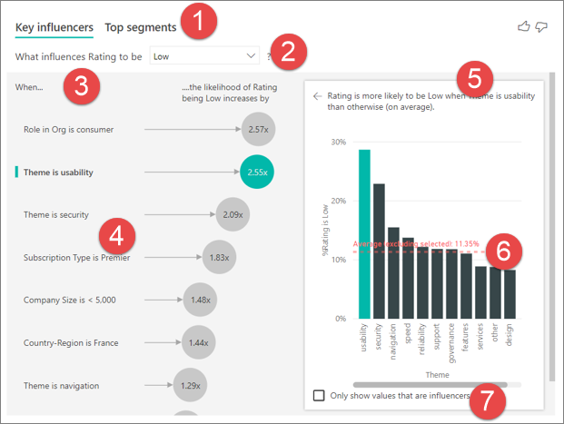
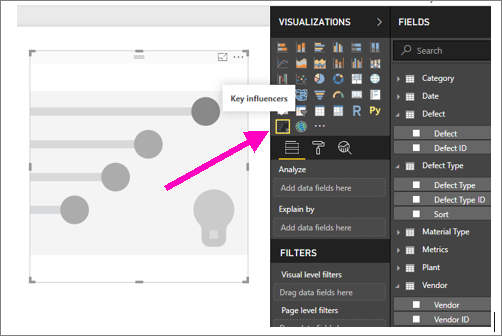
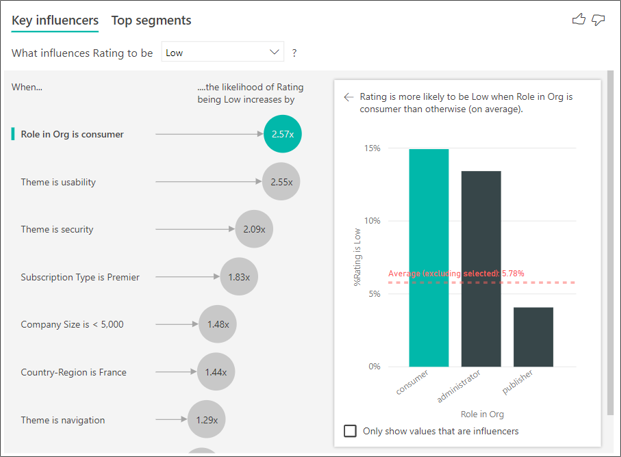
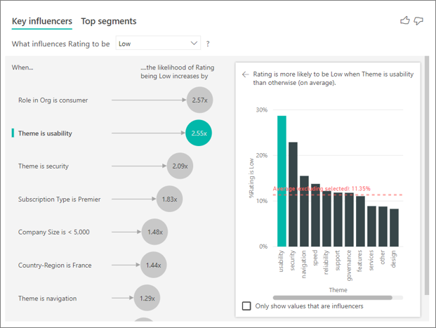
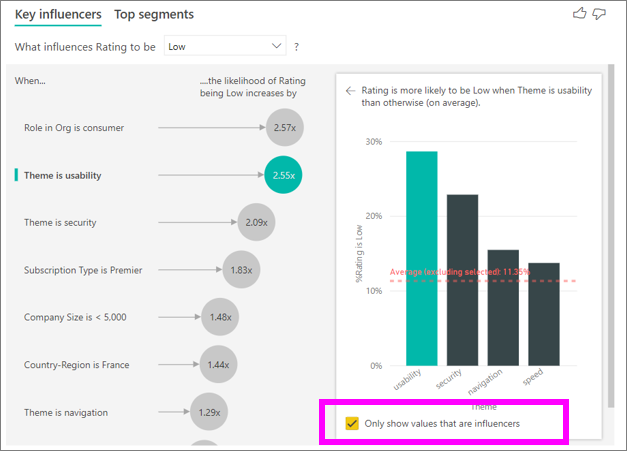
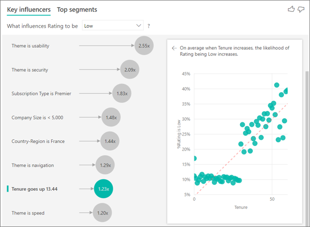
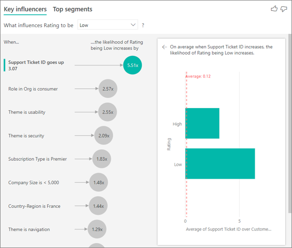
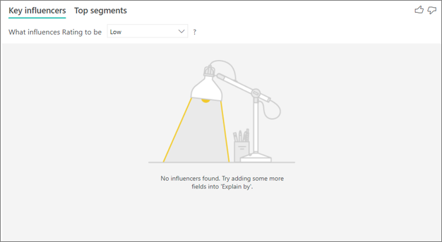
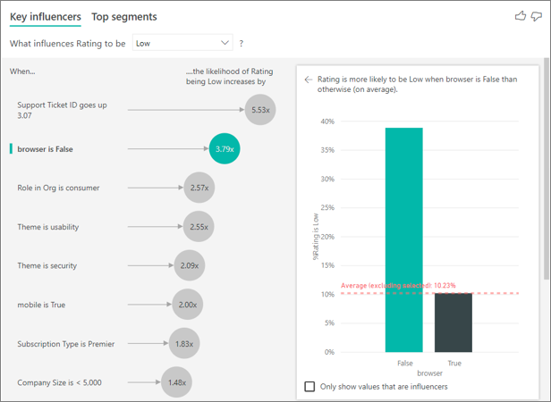
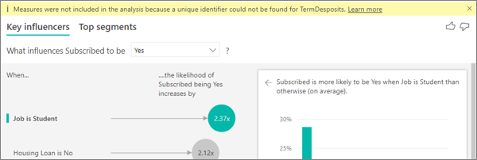

# Key influencers visualization
The key influencers visual helps you understand the factors that  drive a metric you are interested in. It analyzes your data, ranks the factors that matter, and displays them as key influencers. For example, you're interested in figuring out what influences employee turnover (churn). One factor may be employment contract length and another may be employee age. 
 
## When to use key influencers? 
The key influencer visual is a great choice: 
- To see which factors impact the metric being analyzed.

- To contrast the relative importance of these factors. For example, do short-term contracts have more impact on churn than long-term contracts? 

## Key influencer requirements 
The metric you are analyzing must be a categorical field.    

## Features of the key influencer visual

       

    1. Tabs
    2. Question being investigated
    3. Restatement
    4. left pane
    5. Restatement and right pane
    6. Average line
    7. Checkbox

## Create a key influencers visual 
 
Watch this video to learn how to create a key influencers visual and then follow the steps below to create one yourself. 

<iframe width="560" height="315" src="https://www.youtube.com/embed/fDb5zZ3xmxU" frameborder="0" allow="accelerometer; autoplay; encrypted-media; gyroscope; picture-in-picture" allowfullscreen></iframe>

Our Product Manager wants to figure out which factors lead customers to leave negative reviews about our cloud service.  To follow along, open the [Customer Feedback PBIX file](https://github.com/Microsoft/powerbi-desktop-samples/blob/master/2019/customerfeedback.pbix) in Power BI Desktop. You can also download the [Customer Feedback Excel file for Power BI service or Power BI Desktop](https://github.com/Microsoft/powerbi-desktop-samples/blob/master/2019/customerfeedback.xlsx). 

> [!NOTE]
> The Customer Feedback dataset is based on [Moro et al., 2014] S. Moro, P. Cortez and P. Rita. A Data-Driven Approach to Predict the Success of Bank Telemarketing. Decision Support Systems, Elsevier, 62:22-31, June 2014 

1. Open the report and select the key influencers icon.  

    

2. Drag the metric you want to investigate into the **Analyze** field. The **Analyze** field supports categorical (non-continuous) variables only. Since we are interested in looking at what drives a customer rating of our service to be ‘Low’, we select **Customer Table** > **Rating**.    
3. Next, drag fields that you think could influence **Rating** into the **Explain By** well. You can drag in as many fields as you’d like. In this case, we are starting out with: 
    - Country-Region 
    - Role in Org 
    - Subscription Type 
    - Company Size 
    - Theme     
4. Since we're interested in negative ratings, select **Low** in the dropdown for **What influences Rating to be**.  

    

The analysis runs on the table level of the field being analyzed. In this case, we are interested in the **Rating** metric, which is defined at a customer level (each customer has either given a high score or low score). All our explanatory factors have to be defined at the customer level for the visual to make use of them. 

In the example above, all of our explanatory factors have either a one-to-one or many-to-one relationship with our metric. For example, each score has exactly one theme associated with it (what was the main theme of the customer review). Similarly, customers come from one country, have one membership type and one role in their organization. Our explanatory factors are therefore already attributes of a customer and no transformations are needed – the visual can make immediate use of them. 

Later on in the tutorial we will look at more complex examples where we have one-to-many relationships. In those cases, the columns have to first be aggregated down to the customer level before the analysis can be ran.  

Measures and aggregates used as explanatory factors are also evaluated at the table level of the **Analyze** metric and we will see some examples later in this article. 

## Interpreting categorical key influencers 
Let's take a look at our key influencers for low ratings. 

### Top single factor influencing likelihood of a low rating

In our organization, we have three roles: consumers, administrators, and publishers. We see that being a consumer is the top factor contributing to a low rating. 

More precisely, our consumers are 2.57x more likely to give us a negative score. The key influencer chart lists **Role in Org is consumer** first in the list on the left. By selecting **Role in Org is consumer**, Power BI shows us additional details on the right side -- the comparative impact of each **role** on likelihood of a low rating.
  
- 14.93% of consumers give a low score  
- On average, all other roles give a low score 5.78% of the time 
- Consumers are therefore 2.57x more likely to give a low score compared to all other roles (difference between green bar and red dotted line) 

### Second single factor influencing likelihood of a low rating

The key influencers visual is able to compare and rank factors from many different variables.  Our second influencer has nothing to do with **Role in Org**.  Select the second influencer in the list; **Theme is usability**. 

Here we see that the second most important factor is related to the theme of the customer’s review. Customers who commented about the *usability* of the product were 2.21x more likely to give a low score compared to customers who commented on other themes, such as reliability, design, or speed. 

You can see between the visuals that the average (red dotted line) has changed from 5.78% to 11.34%. The average is dynamic as it is based on the average of all other values. In the case of the first influencer, the average excluded the customer role whilst in the case of the second, it excluded the usability theme. 
 
Ticking the box at the bottom of the visual will result in the visual filtering to only the influential values (in this case roles that drive a low score). We therefore go from looking at 12 themes to the 4 the visualization believes to be driving low ratings. 

## Interacting with other visuals 
 
Every time a user clicks on a slicer, filter or another visual on the canvas the Key influencers visual reruns its analysis on the new portion of data. For example, let’s drag Company Size into the report and use it as a slicer. We want to see if the key influencers for our enterprise customers (company size is larger than 50,000) are different than the general population.  
 
Selecting >50,000 reruns the analysis and we can see that the influencers have changed. For large enterprise customers, the top influencer for low scores is reviews associated with security. We may want to dig into this insight more and see if there are specific security features our large customers might be unhappy about. 

Deselecting the slicer reruns the analysis and surfaces back the original influencers. 

## Interpreting continuous key influencers 
 
So far we have used the visual to explore how different categorical fields influence low ratings. It is also possible to have continuous factors (for example, age, height, price) go into ‘Explain by’. Let’s look at what happens if we drop ‘Tenure’ from the Customer table into ‘Explain by’. Tenure depicts how long the customer has been using the service. 
 
We find that as **Tenure** increases, the likelihood of receiving a lower rating also increases. This trend suggests that our longer term customers are in fact more likely to give a negative score, which is an interesting insight and one I may want to follow up on later.  
 
The visualization tells us that every time tenure goes up by 13.44 months, on average the likelihood of a low rating increases by 1.23x. In this case, 13.44 months depict the standard deviation of tenure. So the insight we receive looks at how increasing tenure by a standard amount (the standard deviation of tenure) impacts the likelihood of receiving a low rating. 
 
The scatterplot on the right-hand side plots the average % of low ratings for each value of tenure and includes a trend line to highlight the slope.  

## Interpreting measures/aggregate as key influencers 
 
Finally, users are also able to use measures and aggregates as explanatory factors inside their analysis. For example, we may want to see what impact the count of customer support tickets or the average duration of an open ticket has on the score we receive. 
 
In this case, we want to see if the number of support tickets a customer has influences the score they give us. We are going to bring in the support ticket ID from the Support Ticket table. Since a customer can have multiple support tickets, we need to aggregate the ID to the customer level. This aggregation is important, because we are running the analysis on the customer level and so all drivers need to be defined at that level of granularity. 
 
We are going to look at the count of IDs (so each customer row will have a count of support tickets associated with them). In this case we see that as the count of support tickets increase, the likelihood of the rating being low goes up 5.51x. The right-hand side visual shows us the average number of support tickets by different Rating values (evaluated at the customer level). 

## Interpreting the results: top segments 
 
Whilst the ‘Key influencers’ tab allows users to assess each factor individually, users can switch over to ‘Top segments’ to see how a combination of factors impacts the metric they are analyzing. 
 
Top segments initially show an overview of all the segments that have been discovered by Power BI. In the example below we can see that six segments have been found. These segments are ranked by the % of low ratings within the segment. We see that segment 1, for example, has 74.3% customer ratings that are lows.  The higher the bubble, the higher the proportion of low ratings. The size of the bubble of the other hand represents how many customers are within the segment. 

Selecting a bubble drills into the details of that segment. If we select Segment 1 for example, we find that it is made up of relatively established customer (have been with us for over 29 months) that have a high number of support tickets (greater than 4). Finally, they are not publishers (so they are either consumers or administrators).  
 
In this group, 74.3% have given a low rating. The average customer gives a low rating 11.7% of the time so this segment has a significantly larger proportion of low ratings (63 percentage points higher). We also find segment 1 contains approximately 2.2% of the data so it represents an addressable portion of the population. 

## Considerations and troubleshooting 
 
**What are the limitations for preview?** 
 
The Key influencers visual is currently in public preview, and  there are several limitations users should be aware of. Functionality that is currently not available includes: 
- Analyzing metrics that are aggregates/measures 
- Consuming the visual in embedded 
- Consuming the visual on Power BI mobile 
- RLS support 
- Direct Query support 
- Live Query support 
 
**I am seeing an error that no influencers/segments have been found. Why is that?** [2052264] 

This error occurs when you have included fields in **Explain by** but no influencers have been found.   
- You included the metric you were analyzing in both ‘Analyze’ and ‘Explain by’ (you should remove it from **Explain by**) 
- Your explanatory fields have too many categories with few observations. This makes it hard for the visualization to determine which factors are influencers as it’s hard to generalize things based on a handful of observations 
- Your explanatory factors have a sufficient number of observations to make generalizations but the visualization did not find any meaningful correlations to report back on 
 
**I see an error that the metric I am analyzing does not have enough data to run the analysis on. Why is that?** [2052270] 

The visualization works by looking at patterns in the data for one group (for example, customers who gave low ratings) compared to other groups (for example, customers who gave high ratings). If the data in your model has very few observations, it is hard to find patterns. If the visualization doesn’t have enough data to find meaningful influencers it will indicate more data is needed to run the analysis. We recommend having at least 100 observations for the selected state (customers churning) and at least 10 observations for the states you are using for comparison (customers not churning).  
 
**I am seeing an error that a field in ‘Explain by’ is not uniquely related to the table containing the metric I am analyzing. Why is that?** [2052334] 
 
The analysis runs on the table level of the field being analyzed. For example, if you are analyzing customer feedback for your service you might have a table which tells you whether a customer gave a high rating or a low rating. In this case, your analysis would be running at the customer table level. 

If you have a related table that is defined at a more granular level than the table that contains your metric, you will hit this error. Let’s illustrate this through an example: 
 
- You are analyzing what drives customers to give low ratings of your service 
- You are interested in seeing if the device on which the customer is consuming your service influence the reviews they give 
- A customer can consume the service in multiple different ways   
- In the example below, customer 10000000 uses both a browser and tablet to interact with the service 

If you try to use the device column as an explanatory factor you will see the following error: 

This is because device is not defined at the customer level – one customer can consume the service on multiple devices. For the visualization to find patterns, the device needs to become an attribute of the customer. In this case I have several solutions depending on my understanding of the business: 
 
- I can change the summarization of device to, for example, count if I believe the number of devices could have an impact on the score a customer gives 
- I can pivot the device column to see if consuming the service on a specific device influences a customer’s rating  
 
In this example I pivoted my data to create new columns for ‘browser, ‘mobile and ‘tablet. I can now use these in ‘Explain by’. We find that all devices turn out to be influencers with the browser having the largest impact on customer score. 

More precisely, customers who do not use the browser to consume the service are 3.79x more likely to give a low score than those who do. We see lower down in the list that in the case of mobile the inverse is true. Customers who use the mobile app are more likely to give a low score than those who don’t.  

**I see a warning that measures were not included in my analysis. Why is that?** [2052261] 

The analysis runs on the table level of the field being analyzed. If you are analyzing customer churn you might have a table which tells you whether a customer churned or not. In this case, your analysis would be running at the customer table level.
 
Measures and aggregates are by default analyzed at that table level. If we had a measure for ‘Average monthly spending’ that would be analyzed at the customer table level.  

If the customer table does not have a unique identifier, we are not able to evaluate the measure and it is ignored by the analysis. In order to avoid this, ensure the table with your metric (in this case the customer table) has a unique identifier (for example, customer ID). It’s also very easy to add an index column using Power Query.
 
**I see a warning that the metric I am analyzing has more than 10 unique values and that this may impact the quality of my analysis. Why is that?** [2052272] 

The AI visualization is optimized for analyzing categories (for example, Churn is ‘Yes’ or ‘No’, Customer Satisfaction is ‘High’, ‘Medium’ or ‘Low’ etc.) Increasing the number of categories to analyze means we have fewer observations per category which makes it harder for the visualization to find patterns in the data. 

In order to find stronger influencers, we recommend grouping similar values into a single unit. For example, if you have a metric for price, it is likely you will obtain better results by grouping similar prices into something like ‘High’, ‘Medium’, ‘Low’ buckets, vs. using individual price points. 

**There are factors in my data that look like they should be key influencers but they are not. How can that happen?**

In the example below we see that customers who are consumers drive low ratings (14.93% ratings are low). Interestingly, the administrator role also has a high proportion of low ratings (13.42%) but is not considered an influencer. 

The reason behind this is the visualization also takes into consideration the number of datapoints when finding influencers. In the example below we have over 29,000 consumers and 10 times fewer administrators (about 2,900). Furthermore, only 390 of them gave a low rating. The visual therefore doesn’t have enough data to determine whether it has truly found a patter with administrator ratings of if it’s just a chance finding.  

**How do you calculate key influencers?**

Behind the scenes, the AI visualization runs a logistic regression to calculate the key influencers. A logistic regression is a statistical model that compares different groups to each other. If we were looking at what drives low ratings, the logistic regression would look at how customers who gave a low score differ from those who gave a high score. If we had multiple categories (high score, neutral score, low score) we would look at how those who gave a low rating differ from customers who did not give a low rating (how do they differ from those who gave a high rating OR a neutral rating). 
 
The logistic regression searches for patterns in the data, looking for how for customers who gave a low rating might differ from those that gave a high rating. It might find, for example, that customers who have more support tickets give a much higher % of low ratings than those who have few or no support tickets.
 
The logistic regression also takes into consideration how many datapoints are present. If for example customers who play an admin role give proportionally more negative scores but there are only a handful of administrators, it will not be considered an influential factor. This is because there are not enough datapoints available to infer a pattern. A statistical test (Wald test) is used to determine whether a factor is considered an influencer. The visual uses a p-value of 0.05 to determine the threshold. 
 
**How do you calculate segments?**

Behind the scenes the AI Visualization runs a decision tree to find interesting subgroups. The objective of the decision tree is to end up with a subgroup of datapoints that is relatively high in the metric we are interested in (for example, customers who gave a low rating). 

The decision tree takes each explanatory factor and tries to reason which factor will give it the best ‘split’. For example, if we filter the data to include only large enterprise customers, will that separate out customers who gave us a high rating vs. low rating? Or perhaps it will be better if we filter the data to include only customers who commented about security? 

Once the decision tree does a split it takes that subgroup of data (for example, customers who commented on security) and tries to figure out what would be the next best split just for that data. After each split it also takes into consideration whether it has enough datapoints for this to be a representative group to infer a pattern from or whether it could just be an anomaly in the data, and therefore not a real segment. (Another statistical test is applied to check for the statistical significance of the split condition, with p-value of 0.05). 

Once the decision tree finishes running, it takes all the splits (security comments, large enterprise) and creates Power BI filters. This combination of filters is packaged up as a segment in the visual. 
 
**Why do certain factors become influencers/stop being influencers as I drag more fields into ‘Explain By’?**

The visualization evaluates all explanatory factors together. This means that whilst by itself a factor might be an influencer, when taken into consideration with other factors it might not. Imagine we were analyzing what drives a house price to be high with bedrooms and house size as explanatory factors: 
- By itself, more bedrooms may be a driver for house prices to be high 
- Including house size in the analysis means we now look at what happens to bedrooms whilst keeping house size constant 
- If we fix house size at 1500 sq. ft, it is unlikely that continuously increasing the number of bedrooms will dramatically increase the house price 
Bedrooms might not be as important of a factor as it was before house size was considered. 

## Next steps
[Combo charts in Power BI](power-bi-visualization-combo-chart.md)

[Visualization types in Power BI](power-bi-visualization-types-for-reports-and-q-and-a.md)
