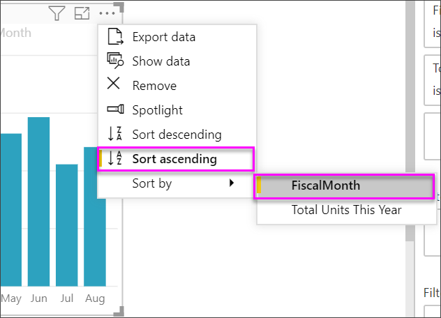
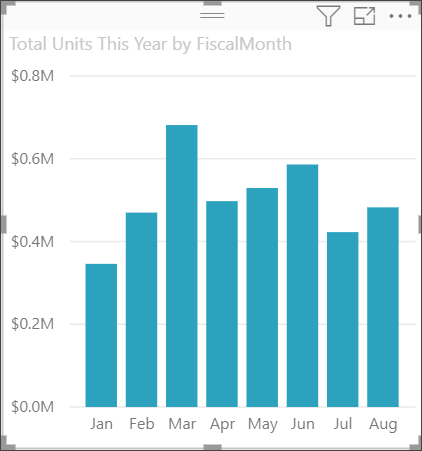
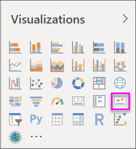
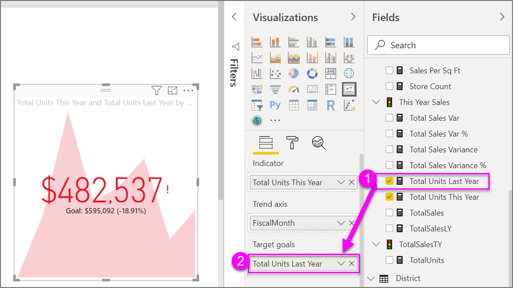

# Key Performance Indicator (KPI) visuals

A Key Performance Indicator (KPI) is a visual cue that communicates the amount of progress made toward a measurable goal. For more about KPIs, see [Key Performance Indicators (KPIs) in PowerPivot](/previous-versions/sql/sql-server-2012/hh272050(v=sql.110)).

Watch Will show you how to create single metric visuals: gauges, cards, and KPIs.

<iframe width="560" height="315" src="https://www.youtube.com/embed/xmja6EpqaO0?list=PL1N57mwBHtN0JFoKSR0n-tBkUJHeMP2cP" frameborder="0" allowfullscreen></iframe>

## When to use a KPI

KPIs are a great choice:

* To measure progress. Answers the question, "What am I ahead or behind on?"

* To measure distance to a goal. Answers the question, "How far ahead or behind am I?"

## KPI requirements

A designer bases a KPI visual on a specific measure. The intention of the KPI is to help you evaluate the current value and status of a metric against a defined target. A KPI visual requires a *base* measure that evaluates to a value, a *target* measure or value, and a *threshold* or *goal*.

A KPI dataset needs to contain goal values for a KPI. If your dataset doesn't contain goal values, you can create them by adding an Excel sheet with goals to your data model or PBIX file.

## Prerequisites

If you're not signed up for Power BI, [sign up for a free trial](https://app.powerbi.com/signupredirect?pbi_source=web) before you begin.

* [Power BI Desktop](https://powerbi.microsoft.com/get-started/) - it's free!

* [The Retail Analysis Sample PBIX file](http://download.microsoft.com/download/9/6/D/96DDC2FF-2568-491D-AAFA-AFDD6F763AE3/Retail%20Analysis%20Sample%20PBIX.pbix)

## How to create a KPI

To follow along, open the [Retail Analysis .PBIX file](http://download.microsoft.com/download/9/6/D/96DDC2FF-2568-491D-AAFA-AFDD6F763AE3/Retail%20Analysis%20Sample%20PBIX.pbix) in Power BI Desktop. You'll create a KPI that measures the progress you've made toward a sales goal.

1. Open the **Retail Analysis Sample** in report view .

1. Select  to add a new page.

1. From the **Fields** pane, select **Sales > Total Units This Year**.  This value will be the indicator.

1. Add **Time > FiscalMonth**.  This value will represent the trend.

1. In the upper-right corner of the visual, select the ellipsis and check that Power BI sorted the columns in ascending order by **FiscalMonth**.

    > [!IMPORTANT]
    > Once you convert the visualization to a KPI, there's **no** option to sort. You must sort it correctly now.

    

    Once sorted correctly, your visual will look like this:

    

1. Convert the visual to a KPI by selecting the **KPI** icon from the **Visualization** pane.

    

1. To add a goal, drag **Total Units Last Year** to the **Target goals** field.

    

1. Optionally, format the KPI by selecting the paint roller icon to open the Formatting pane.

    * **Indicator** - controls the indicator’s display units and decimal places.

    * **Trend axis** - when set to **On**, the visual shows the trend axis as the background of the KPI visual.  

    * **Target goals** - when set to **On**, the visual shows the goal and the distance from the goal as a percentage.

    * **Color coding > Direction** - people consider some KPIs better for *higher* values and consider some better for *lower* values. For example, earnings versus wait time. Typically a higher value of earnings is better versus a higher value of wait time. Select **high is good** and, optionally, change the color settings.

KPIs are also available in the Power BI service and on your mobile devices. It gives you the option to be always connected to your business's heartbeat.

## Considerations and troubleshooting

If your KPI doesn't look like the one above, it may be because you didn't sort by **FiscalMonth**. KPIs don't have a sort option. You'll need to start again and sort by **FiscalMonth** *before* you convert your visualization to a KPI.

## Next steps

* [Tips and Tricks for Power BI Map visualizations](power-bi-map-tips-and-tricks.md)

* [Visualization types in Power BI](power-bi-visualization-types-for-reports-and-q-and-a.md)

More questions? [Try the Power BI Community](http://community.powerbi.com/)
