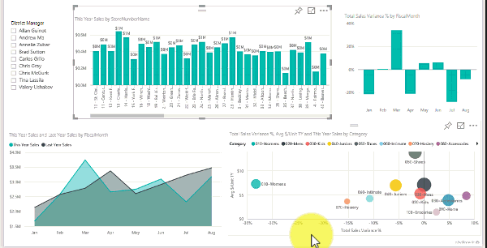
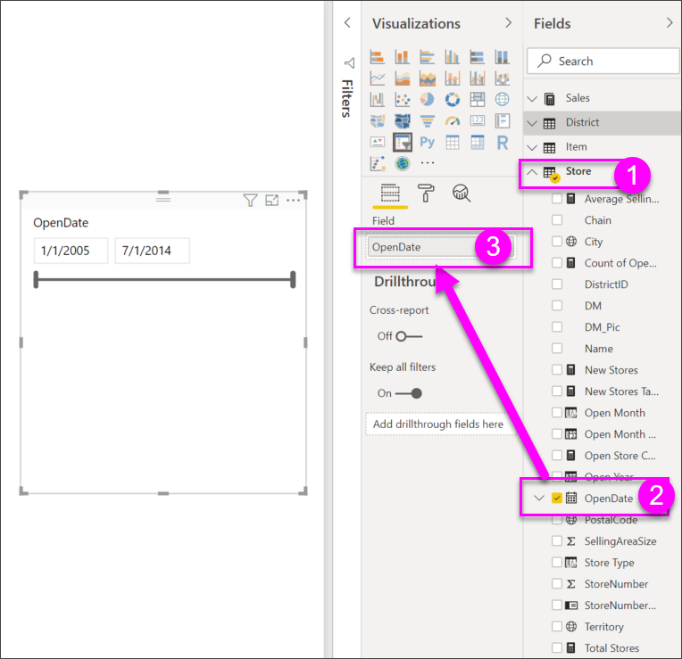
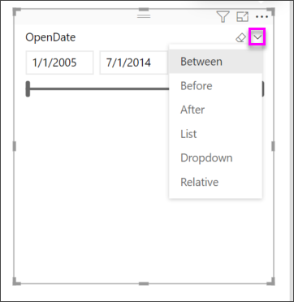
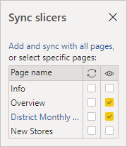
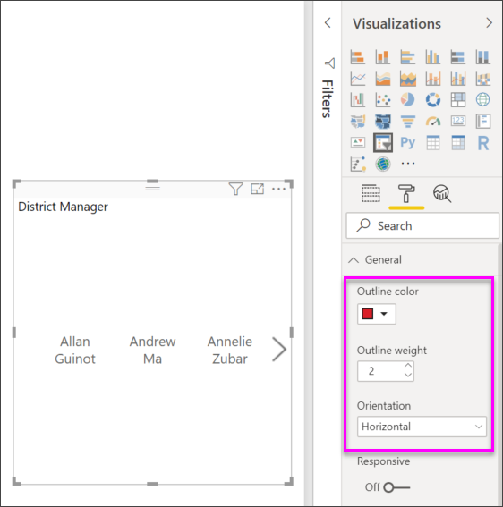

# Slicers in Power BI

[!INCLUDE [power-bi-visuals-desktop-banner](../includes/power-bi-visuals-desktop-banner.md)]

You want your report readers to be able to look at overall sales metrics, but also highlight performance for individual District Managers and different time frames. You could create separate reports or comparative charts, or you could use slicers. A slicer is an alternate way of filtering that narrows the portion of the dataset shown in the other visualizations in a report. 

This tutorial uses the free [Retail Analysis Sample](../sample-retail-analysis.md) to walk you through creating, formatting, and using list and date range slicers. Have fun discovering ways to format and use slicers. 

## When to use a slicer
Slicers are a great choice when you want to:

* Display commonly-used or important filters on the report canvas for easier access.
* Make it easier to see the current filtered state without having to open a drop-down list. 
* Filter by columns that are unneeded and hidden in the data tables.
* Create more focused reports by putting slicers next to important visuals.

Power BI slicers have the following limitations:

- Slicers do not support input fields.
- Drilldown is not supported for slicers.
- Slicers do not support visual level filters.

## Create slicers

**Create a new slicer to filter data by District Manager**

This tutorial uses the [Retail Analysis sample PBIX file](http://download.microsoft.com/download/9/6/D/96DDC2FF-2568-491D-AAFA-AFDD6F763AE3/Retail%20Analysis%20Sample%20PBIX.pbix).

1. From the upper left section of the menubar, select **File** > **Open**
   
2. Find your copy of the **Retail Analysis sample PBIX file**

1. Open the **Retail Analysis sample PBIX file** in report view .

1. Select  to add a new page.

2. On the Overview page, with nothing selected on the canvas, select the **Slicer** icon  in the **Visualizations** pane to create a new slicer. 
3. With the new slicer selected, from the Fields pane, select **District** > **DM** to populate the slicer. The new slicer is a list with selection boxes before the names. 
    
    
    
4. Resize and drag the slicer and other elements on the canvas to make room for the slicer. Note that the slicer items are cut off if you resize the slicer too small. 
5. Select names on the slicer and note the effects on the other visualizations on the page. Select names again to deselect them, and hold down the **Ctrl** key to select more than one name. Selecting all names has the same effect as selecting none. 

6. Alternately, select the paint roller icon to format your slicer. There are simply too many options to describe them all here - so experiment and create a slicer that works for you. In the examples below, the first slicer has been converted to a dropdown to conserve space and the option to "Select all" has been added.  The second slicer has been formatted with colors, fonts sizes, and only allows a single selection.

   
>[!TIP]
>List slicer items are sorted in ascending order by default. To reverse the sort order to descending, select the ellipsis (**...**) in the top right corner of the slicer and choose **Sort descending**.

**To create a new slicer to filter data by date range**

1. With nothing selected on the canvas, drop down **Store** in the Fields pane, and drag **OpenDate** to the **Values** well in the Visualizations pane to create a new visualization.
2. With the new visualization selected, select the **Slicer** icon to convert the new visualization to a slicer. This slicer is a slider control with the date range populated.
    
    

    
4. Resize and drag the slicer and other elements on the canvas to make room for the slicer. Note that the slider resizes with the slicer size, but it disappears and the dates are cut off if you resize the slicer too small. 
4. Select different date ranges with the slider, or select a date field to type in a value or pop up a calendar for more precise selection. Note the effects on the other visualizations on the page.
    
    >[!NOTE]
    >Numeric and date/time data types produce range slider slicers by default. Starting with the February 2018 Power BI update, whole number data type range sliders now snap to whole number values rather than showing decimal places. 

5. To change the slicer type, with the slicer selected, hover over the upper-right area of the slicer, drop down the carat that appears, and choose one of the other options, such as **List** or **Before**. Note how the slicer appearance and selection options change. 
 
    

For more about creating date and numeric range slicers, watch the following video and see [Use the numeric range slicer in Power BI Desktop](../desktop-slicer-numeric-range.md).
   > [!NOTE]
   > This video uses an older version of Power BI Desktop.
   > 
   > 
<iframe width="560" height="315" src="https://www.youtube.com/embed/zIZPA0UrJyA" frameborder="0" allowfullscreen></iframe> 

## Control which page visuals are affected by slicers
By default, slicers on report pages affect all the other visualizations on that page, including each other. As you choose values in the list and date sliders you just created, note the effects on the other visualizations. The filtered data is an intersection of the values selected in both slicers. 

You can use **Visual interactions** to exclude some page visualizations from being affected by others. On the **Overview** page, the "Total Sales Variance by FiscalMonth and District Manager" chart shows overall comparative data for District Managers by Month, which you want to keep visible at all times. You can use **Visual interactions** to keep slicer selections from filtering this chart. 

1. With the District Manager slicer on the **District Monthly Sales** page selected:
    - In Power BI Desktop, select the **Format** menu under **Visual Tools** and select **Edit interactions**.
   
   Filter controls  appear above all the other visuals on the page. Initially, all the **Filter** icons are selected.
   
2. Select the **None** icon above the **Total Sales Variance by FiscalMonth and District Manager** chart to make the slicer stop filtering it. 
3. Select the **Month** slicer, and again select the **None** icon above the **Total Sales Variance by FiscalMonth and District Manager** chart to make this slicer stop filtering it. Now, as you select names and date ranges in the slicers, the Total Sales Variance by FiscalMonth and District Manager chart is unchanged. 

See [Visual interactions in a Power BI report](../service-reports-visual-interactions.md) for more information about editing interactions.

## Sync and use slicers on other pages
Starting with the February 2018 Power BI update, you can sync a slicer and use it on any or all pages in a report. 

In the current report, the **District Monthly Sales** page also has a **District Manager** slicer, but what if we also wanted that slicer on the **Overview** page? The **New Stores** page also has a slice, but it only provides **Store Name** information. With the **Sync slicer** pane we can sync the **District Manager** slicer to these pages, so that slicer selections on any page affect visualizations on all three pages.

1. On the **View** menu, select **Sync slicers** in Power BI Desktop.

    

1.  The **Sync Slicers** pane appears between the **Filters** and **Visualizations** pane.  

    

1. On the **District Monthly Sales** page, select the **District Manager** slicer. 
    
    
    
3. In the **Sync** column, select the **New Stores** page and the **Overview** page to sync the **District Monthly Sales** slicer to those pages. 
    
3. In the **Visible** column, select the **New Stores** page and **Overview** page. Your **Sync slicers** pane should now look like the image below:

    

1. Observe the effects of syncing the slicer and making it visible on the other pages. On the **District Monthly Sales** page, the **District Manager** slicer now shows the same selections as the one on the **Overview** page. On the **New Stores** page, the selections in the **District Manager** slicer affect the selections that are available in the **Store Name** slicer. 
    
    >[!TIP]
    >Although the slicer initially appears on the synced pages at the same size and position as on the original page, you can move, resize, and format synced slicers on the various pages independently. 

>[!NOTE]
>If you sync a slicer to a page but do not make it visible on that page, slicer selections made on the other pages still filter the data on the page.
 
## Format slicers
Different formatting options are available depending on the slicer type. By using **Horizontal** orientation, **Responsive** layout, and **Item** coloring, you can produce buttons or tiles rather than standard list items, and make slicer items resize to fit different screen sizes and layouts.  

1. With the **District Manager** slicer selected on any page, in the **Visualizations** pane, select the **Format** icon  to display the formatting controls. 
    
    
    
2. Select the drop-down arrows next to each category to display and edit the options. 

### General options
1. Select red under **Outline color** and change **Outline weight** to "2". This sets the color and thickness of the header and item outlines or underlines, when enabled. 
2. Under **Orientation**, **Vertical** is the default. Select **Horizontal** to produce a slicer with horizontally arranged tiles or buttons, and scroll arrows to access items that do not fit in the slicer.
    
    
    
3. Turn on **Responsive** layout to change the size and arrangement of slicer items according to viewscreen and slicer size. For list slicers, responsive layout is only available in horizontal orientation, and prevents items from being cut off on small screens. For range slider slicers, responsive formatting changes the style of the slider and provides more flexible resizing. Both types of slicers become filter icons at very small sizes. 
    
    
    
    >[!NOTE]
    >Responsive layout changes may override specific heading and item formatting that you set. 
    
4. Set the slicer position and size with numeric precision under **X Position**, **Y Position**, **Width**, and **Height**, or move and resize the slicer directly on the canvas. Experiment with different item sizes and arrangements, and note how the responsive formatting changes accordingly.  

    

See [Create a responsive slicer you can resize in Power BI](../power-bi-slicer-filter-responsive.md) for more about horizontal orientation and responsive layout.

### Selection controls options (list slicers only)
1. **Show Select All** is **Off** by default. Turn it to **On** to add a **Select All** item to the slicer that selects or deselects all items when toggled. When all items are selected, clicking or tapping one item deselects it, allowing an "is-not"-type filter. 
    
    
    
2. **Single Select** is **On** by default. Clicking or tapping each item selects it, and holding down the **Ctrl** key while clicking or tapping selects multiple items. Turn **Single Select** to **Off** to allow selecting multiple items without holding down the **Ctrl** key. Clicking or tapping each item again deselects it. 

### Title options
The **Title** is **On** by default, showing the data field name at the top of the slicer. 
1. Format the title text to make the **Font color** red, **Text size** 14 pt, center **Alignment** and **Font family** Arial Black. 

### Item options (list slicers only)
1. Format item text and background to make the **Font color** black, **Background** light red, **Text size** 10 pt, and **Font family** Arial. 
2. Under **Outline**, choose **Frame** to draw a border around each item with the size and color you set under **General** options. 
    
    
    
    >[!TIP]
    >- With **Orientation > Horizontal**, deselected items show the chosen text and background colors, while selected items use the system default, usually black background with white text.
    >- With **Orientation > Vertical**, items always show the set colors, and selection boxes are always black when selected. 

### Date/numeric inputs and Slider options (range slider slicers only)
- Date/numeric input options are the same as the **Item** options for list slicers, except there is no **Outline** or underline.
- Slider options allow you to set the color of the range slider, or turn the slider to **Off**, leaving only the numeric inputs.

### Other formatting options
The other formatting options are off by default. When turned **On**: 
- **Background:** Adds a background color to the overall slicer and sets its transparency.
- **Lock aspect:** Retains the shape of the slicer if it is resized.
- **Border:** Adds a 1-pixel border around the slicer and sets its color. (This slicer border is separate from and unaffected by the General Outline settings.) 

## Next steps
[Visualization types in Power BI](power-bi-visualization-types-for-reports-and-q-and-a.md)

[Tables in Power BI](power-bi-visualization-tables.md)

